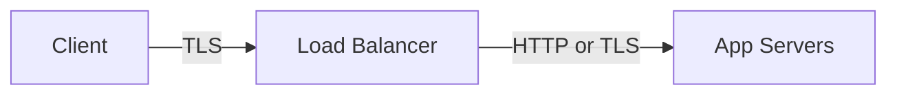
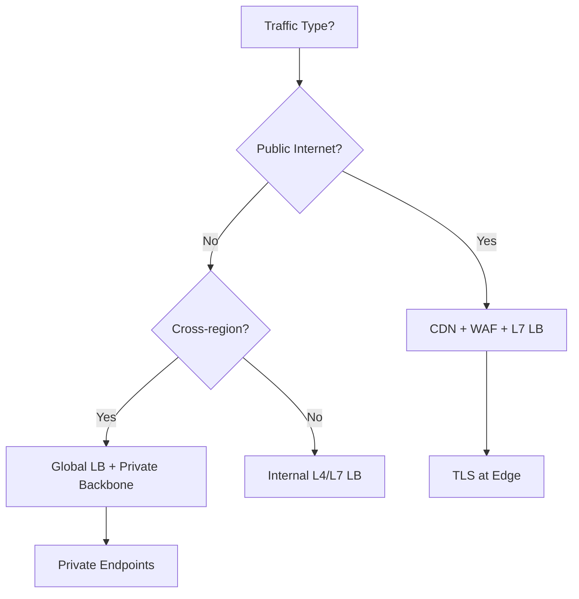

# Networking Fundamentals for Architects — Deep Dive

> Referenced in: Weeks 9, 13, 16, 19, 20, 28, 33 | **Interview target:** 40+ questions

## Why Architects Must Know Networking

Cloud architecture is networking architecture. Every VNet, VPC, load balancer, API gateway, and service mesh decision is a networking decision. Senior developers can ignore TCP; architects cannot.

## Topic Map

| Topic | Level | Status |
|-------|-------|--------|
| OSI & TCP/IP model | Fundamentals | ✅ |
| DNS (resolution, TTL, routing policies) | Fundamentals | ✅ |
| HTTP/1.1 vs HTTP/2 vs HTTP/3 | Intermediate | ✅ |
| TLS/SSL (handshake, certificates, mTLS) | Intermediate | ✅ |
| Load balancing (L4 vs L7, algorithms) | Intermediate | ✅ |
| CDN & edge networking | Advanced | ✅ |
| Private networking (VPN, ExpressRoute, Direct Connect) | Advanced | ✅ |
| Service mesh networking | Expert | ✅ |

---

## 1. OSI Model — Architect-Relevant Layers

| Layer | Name | Cloud Examples |
|-------|------|----------------|
| 7 | Application | HTTP, gRPC, DNS queries |
| 4 | Transport | TCP, UDP — port-based routing |
| 3 | Network | IP, routing, VNet/VPC subnets |
| 2 | Data Link | MAC (abstracted in cloud) |

**Interview classic:** "What happens when you type a URL?" — DNS → TCP handshake → TLS → HTTP request → response render.

---

## 2. DNS Deep Dive

```
Browser cache → OS cache → Recursive resolver → Root → TLD → Authoritative
```

| Concept | Architect Use |
|---------|---------------|
| TTL | Lower for failover (60s), higher for stability (3600s) |
| CNAME vs A/AAAA | Alias to CDN/LB vs direct IP |
| Private DNS zones | Azure Private DNS, Route 53 private hosted zones |
| Split-horizon | Internal vs external name resolution |

**Failover:** DNS failover alone is weak (TTL propagation delay). Combine with health-checked LB (Route 53, Traffic Manager, Front Door).

---

## 3. HTTP Evolution

| Version | Characteristics | Architect Impact |
|---------|-----------------|------------------|
| HTTP/1.1 | Head-of-line blocking | Many connections needed |
| HTTP/2 | Multiplexing, binary | Single connection per origin — better for microservices gateways |
| HTTP/3 | QUIC over UDP | Faster on lossy networks; CDN support growing |

**gRPC:** HTTP/2 based — requires L7 LB that supports HTTP/2 (most modern LBs do).

---

## 4. TLS Termination



| Terminate at LB | End-to-end TLS |
|-----------------|----------------|
| Simpler cert management | Stronger security |
| LB inspects HTTP headers | Cert on every instance |
| Common for public web | Required for some compliance |

**mTLS:** Both client and server present certificates — service mesh default pattern.

---

## 5. Load Balancing

### L4 vs L7

| | L4 (Transport) | L7 (Application) |
|---|----------------|------------------|
| Routes on | IP + port | HTTP path, host, headers |
| Examples | Azure ILB, NLB, TCP proxy | App Gateway, ALB, Front Door |
| Use | Non-HTTP, extreme throughput | Routing, WAF, sticky sessions |

### Algorithms

- **Round robin** — default, even distribution
- **Least connections** — long-lived connections
- **Consistent hash** — session affinity by client IP or cookie

---

## 6. CDN & Edge

- Cache static assets at edge PoPs
- Dynamic site acceleration for API (limited)
- WAF at edge (CloudFront + WAF, Azure Front Door)
- **Cache invalidation** — architect purge strategy on deploy

---

## 7. Private & Hybrid Connectivity

| Option | Azure | AWS | When |
|--------|-------|-----|------|
| Site-to-site VPN | VPN Gateway | Site-to-Site VPN | Quick hybrid, moderate bandwidth |
| Dedicated | ExpressRoute | Direct Connect | Production, predictable latency |
| Hub model | Hub-spoke VNet | Transit Gateway | Multi-VPC/VNet enterprise |

---

## 8. Service Mesh Networking

- Sidecar proxy (Envoy) intercepts all traffic
- mTLS automatic between services
- Traffic splitting for canary (90/10)
- **Cost:** Operational complexity — adopt when 10+ services need observability + security

---

## Architecture Decision Framework



---

## Key Interview Questions

1. Explain end-to-end what happens when you type a URL
2. L4 vs L7 load balancing — when to use each?
3. How does TLS termination at a load balancer affect security?
4. DNS failover vs health-check-based failover
5. Why HTTP/2 matters for microservices architectures
6. Hub-spoke vs mesh networking for 5 teams
7. Private Link / PrivateLink vs public endpoints

## Related Weeks

- [Week 13 — Azure Networking](../../../weeks/week-13/README.md)
- [Week 19 — AWS Networking](../../../weeks/week-19/README.md)
- [Week 28 — Linux Networking](../../../weeks/week-28/README.md)
- [Cross-cutting index](../README.md) | [Docs hub](../../README.md)
