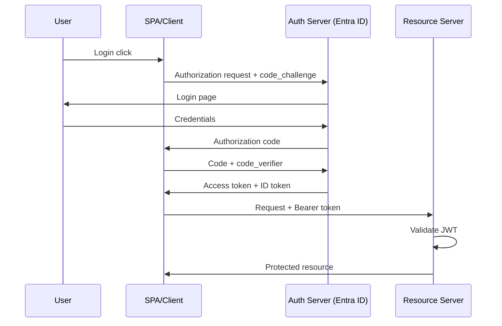

# Security Architecture — Deep Dive

> Referenced in: Weeks 12, 14, 16, 20, 32, 41 | **Interview target:** 50+ questions

## Topic Map

| Topic | Level | Status |
|-------|-------|--------|
| Authentication vs Authorization | Fundamentals | ✅ |
| OAuth 2.0 flows (auth code, client credentials, PKCE) | Intermediate | ✅ |
| OpenID Connect (OIDC) | Intermediate | ✅ |
| JWT structure, validation, pitfalls | Intermediate | ✅ |
| Zero Trust architecture | Advanced | ✅ |
| OWASP Top 10 (2021) | Intermediate | ✅ |
| Secrets management (Key Vault, Secrets Manager) | Intermediate | ✅ |
| mTLS for service-to-service | Advanced | ✅ |
| Security in CI/CD (SAST, DAST, dependency scanning) | Advanced | ✅ |

---

## 1. Authentication vs Authorization

| | Authentication (AuthN) | Authorization (AuthZ) |
|---|------------------------|------------------------|
| Question | Who are you? | What can you do? |
| Mechanism | Login, MFA, certificates | RBAC, ABAC, scopes, policies |
| Failure | 401 Unauthorized | 403 Forbidden |

**Architect rule:** Authenticate at the edge (API Gateway, App Gateway, APIM). Authorize in the service with policy engine or claims-based checks.

---

## 2. OAuth 2.0 + OIDC

### Authorization Code with PKCE (SPAs & mobile)



### Flow Selection

| Flow | Use Case | Never Use When |
|------|----------|----------------|
| Auth code + PKCE | User-facing apps | N/A for new apps |
| Client credentials | Service-to-service | User context needed |
| On-behalf-of | API → downstream API as user | Machine-only workloads |
| Device code | CLI, IoT | Interactive browser available |

---

## 3. JWT — Structure and Pitfalls

```
Header.Payload.Signature
```

| Claim | Purpose |
|-------|---------|
| `iss` | Issuer — must match metadata |
| `aud` | Audience — your API app ID |
| `exp` / `nbf` | Expiry validation mandatory |
| `roles` / `scp` | Authorization claims |

**Pitfalls architects must catch:**
- Accepting tokens without validating `aud` and `iss`
- Storing JWTs in localStorage (XSS risk) — prefer HttpOnly cookies or BFF pattern
- Long-lived access tokens without refresh rotation
- Trusting claims without signature verification

---

## 4. Zero Trust Architecture

**Principles (Microsoft / NIST aligned):**
1. Verify explicitly — every request authenticated and authorized
2. Least privilege access — just-in-time, just-enough
3. Assume breach — segment, encrypt, monitor

**Azure implementation stack:**
- Entra ID Conditional Access
- Private Link (no public data plane)
- Defender for Cloud + Sentinel
- PIM for admin roles

---

## 5. OWASP Top 10 (2021) — Architect Actions

| Risk | Architect Mitigation |
|------|---------------------|
| A01 Broken Access Control | Centralized authz, deny by default |
| A02 Cryptographic Failures | TLS 1.2+, CMK for sensitive data |
| A03 Injection | Parameterized queries, validation at boundary |
| A04 Insecure Design | Threat modeling in design phase |
| A05 Security Misconfiguration | IaC + policy-as-code, secure baselines |
| A06 Vulnerable Components | Dependabot, Snyk in CI |
| A07 Auth Failures | MFA, secure session management |
| A08 Integrity Failures | Signed artifacts, SBOM |
| A09 Logging Failures | Centralized audit, tamper-evident logs |
| A10 SSRF | Egress controls, metadata service protection |

---

## 6. Secrets Management

| Anti-pattern | Correct pattern |
|--------------|-----------------|
| Connection string in appsettings.json | Key Vault reference / Secrets Manager |
| SP client secret in GitHub vars forever | OIDC federation to Entra / IAM role |
| Shared admin password in wiki | PIM + break-glass procedure |

**Rotation:** Automate cert and secret rotation; document blast radius per secret.

---

## 7. mTLS for Service-to-Service

- Each service presents client certificate
- Mesh (Istio/Linkerd) or API Management can terminate or pass-through
- Use when: zero-trust internal network, regulatory requirements
- Skip when: managed identity + private link sufficient (simpler on Azure/AWS PaaS)

---

## 8. DevSecOps Pipeline

```
Developer PR
  → SAST (SonarQube, CodeQL)
  → Dependency scan (Snyk, Dependabot)
  → Build + unit tests
  → Container image scan (Trivy, Defender)
  → Deploy to staging
  → DAST (OWASP ZAP)
  → Manual/auto gate to prod
```

**Quality gates:** Block merge on critical/high CVEs; waiver process with expiry.

---

## Architect Security Checklist

- [ ] Authentication at the edge (API Gateway / App Gateway)
- [ ] Least-privilege RBAC for all services
- [ ] Managed identities over connection strings
- [ ] Secrets in Key Vault / Secrets Manager (never in code/config)
- [ ] TLS 1.2+ everywhere; mTLS for internal services where required
- [ ] Input validation at API boundary
- [ ] OWASP Top 10 addressed in threat model
- [ ] Security scanning in CI/CD pipeline
- [ ] Audit logging for sensitive operations
- [ ] Zero Trust: verify explicitly, least privilege, assume breach

---

## Interview Questions (Sample)

1. Difference between OAuth and OIDC?
2. How do you secure a SPA calling multiple APIs?
3. When would you use mTLS vs managed identity?
4. How do you handle secret rotation without downtime?
5. Walk through threat modeling for a payment API.

## Related Weeks

- [Week 12 — Azure Identity](../../../weeks/week-12/README.md)
- [Week 14 — Azure Security](../../../weeks/week-14/README.md)
- [Cross-cutting index](../README.md) | [Docs hub](../../README.md)
