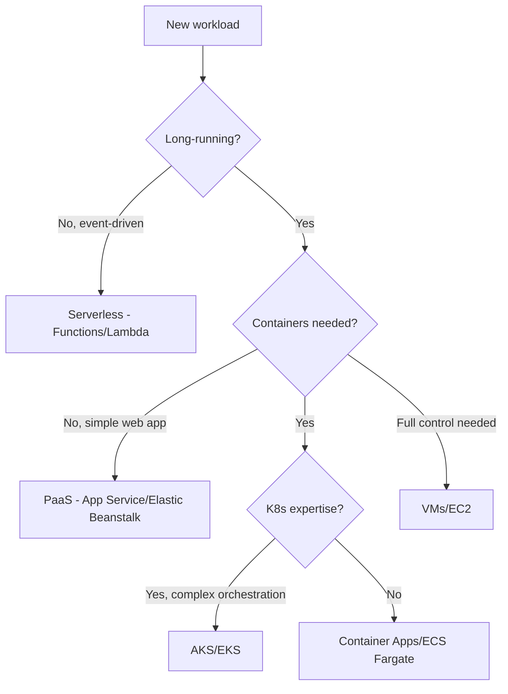

# Architecture Decision Frameworks

> Use these when stuck between options in labs, case studies, and interviews.

## 1. The "It Depends" Framework

Never say "it depends" without structure. Use **FARCS**:

| Letter | Dimension | Questions |
|--------|-----------|-----------|
| **F** | Functional requirements | What must the system do? |
| **A** | Scale (users, data, throughput) | How big today? In 2 years? |
| **R** | Reliability (SLA, RTO, RPO) | What happens when it fails? |
| **C** | Cost (build, run, maintain) | Budget? Team size? |
| **S** | Skills (team, org) | What does the team know? |

```
Answer = f(Requirements, Scale, Reliability, Cost, Skills)
```

---

## 2. Compute Selection Decision Tree



---

## 3. Database Selection Matrix

| Requirement | SQL Server | PostgreSQL | Cosmos DB | Redis | Blob/S3 |
|-------------|-----------|------------|-----------|-------|---------|
| ACID transactions | ✅ | ✅ | ⚠️ Limited | ❌ | ❌ |
| Complex joins | ✅ | ✅ | ❌ | ❌ | ❌ |
| Global distribution | ⚠️ | ⚠️ | ✅ | ✅ | ✅ |
| Schema flexibility | ⚠️ | ✅ JSONB | ✅ | ❌ | ❌ |
| Sub-ms reads | ❌ | ❌ | ✅ | ✅ | ❌ |
| Cost at scale | $$ | $ | $$$ | $ | $ |

---

## 4. Sync vs Async Communication

| Factor | Synchronous (REST/gRPC) | Asynchronous (Queue/Event) |
|--------|------------------------|------------------------------|
| Coupling | Tight (caller waits) | Loose (fire and forget) |
| Consistency | Immediate | Eventual |
| Failure handling | Retries, circuit breaker | Dead letter queue, replay |
| Complexity | Lower | Higher (ordering, idempotency) |
| **Choose sync when** | User waiting for response | — |
| **Choose async when** | Background processing, fan-out | — |

---

## 5. Monolith vs Microservices

| Signal | Stay Monolith | Decompose |
|--------|--------------|-----------|
| Team size | < 10 developers | > 20 developers |
| Deployment frequency | Weekly is fine | Need daily per module |
| Domain complexity | Simple, unified | Distinct bounded contexts |
| Scale needs | Uniform scaling | Independent scaling per module |
| Operational maturity | Low | CI/CD, monitoring, K8s in place |

**Rule of thumb:** Start monolith. Extract services when you have **concrete pain**, not hypothetical scale.

---

## 6. Build vs Buy vs Managed

| Factor | Build | Buy (SaaS) | Managed (PaaS) |
|--------|-------|------------|----------------|
| Differentiation | Core competency | Commodity function | Infrastructure |
| Team capacity | Available | Limited | Limited |
| Time to market | Flexible | Fast | Fast |
| Control | Full | Low | Medium |
| **Example** | Custom pricing engine | Stripe for payments | Azure SQL for database |

---

## 7. Cloud Provider Selection (Azure vs AWS)

| Factor | Lean Azure | Lean AWS |
|--------|-----------|----------|
| Existing investment | Microsoft stack, M365, Entra ID | — |
| Team skills | .NET, C#, Visual Studio | — |
| Enterprise agreements | Microsoft EA in place | — |
| Service breadth | — | Widest catalog, mature services |
| Startup/SaaS ecosystem | — | Larger community, more examples |
| Multi-cloud mandate | Use both with abstraction layer | Use both with abstraction layer |

**For .NET architects:** Azure is the natural default. Learn AWS for marketability and multi-cloud literacy.

---

## 8. ADR Decision Process

1. **Identify** the decision (not every choice needs an ADR)
2. **Document** context and drivers
3. **List** 2–3 viable options
4. **Evaluate** against FARCS dimensions
5. **Decide** with explicit rationale
6. **Record** consequences (positive and negative)
7. **Review** in architecture board
8. **Revisit** when context changes

Template: [templates/adr-template.md](../../templates/adr-template.md)

---

Use these frameworks in every case study and system design interview.

---

**Navigation:** [Docs hub](../README.md) | [Glossary](glossary.md) | [Architecture documentation](../cross-cutting/architecture-documentation/README.md) | [SYLLABUS](../../SYLLABUS.md)
