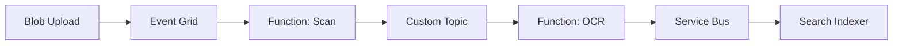

# Azure Top 50 — Part 3 (Q031–Q050)

> Networking, Messaging & Architecture Scenarios | [Part 1](azure-top-50-qa-part1.md) | [Part 2](azure-top-50-qa-part2.md)

---

## Section 5: Networking

## Q031: Hub-Spoke Network Topology

| Attribute | Value |
|-----------|-------|
| **Difficulty** | Advanced |
| **Category** | Azure Networking |
| **Frequency** | Very Common |
| **Week** | 13 |

### Question

Explain hub-spoke networking on Azure. Why use it?

### Short Answer

Hub VNet hosts shared services (Firewall, VPN Gateway, DNS). Spoke VNets host workloads, peered to hub. Centralized egress control, on-prem connectivity, and security inspection.

### Detailed Answer

```
                    On-Premises
                         |
                   [VPN Gateway]
                         |
              ┌───── Hub VNet ─────┐
              │  Azure Firewall    │
              │  DNS Private Zone  │
              └──┬──────┬──────┬──┘
                 |      |      |
            Spoke1  Spoke2  Spoke3
            (App1)  (App2)  (App3)
```

**Benefits:**
- Single point for internet egress (Firewall logging)
- Spoke isolation — compromise in one spoke doesn't flat-network all apps
- Shared ExpressRoute/VPN cost
- Central DNS for Private Link resolution

**vs VNet peering mesh:** N spokes = N×(N-1) peerings. Hub-spoke = N peerings.

**Architect:** Use Azure Virtual WAN for 20+ spokes at enterprise scale.

### Follow-up Questions

1. **Spoke-to-spoke traffic?** Through hub (Firewall inspects) or direct peering if performance critical (bypasses inspection).
2. **Cost?** Firewall ~$1.25/hr + processing; VPN Gateway ~$140+/month.

### Common Mistakes

- Flat single VNet for all production workloads
- Hub-spoke without Firewall — no egress filtering

---

## Q032: NSG vs Azure Firewall vs Application Gateway

| Attribute | Value |
|-----------|-------|
| **Difficulty** | Intermediate |
| **Category** | Azure Networking |
| **Frequency** | Common |
| **Week** | 13 |

### Question

When NSG, Azure Firewall, or Application Gateway?

### Short Answer

NSG: L3/L4 subnet/NIC rules. Application Gateway: L7 HTTP load balancing + WAF. Azure Firewall: centralized egress, FQDN filtering, threat intel.

### Detailed Answer

| Tool | Layer | Use Case |
|------|-------|----------|
| NSG | L4 | Allow 443 to app subnet, deny RDP from internet |
| App Gateway | L7 | URL routing, SSL termination, WAF for web apps |
| Azure Firewall | L3-L7 | Outbound FQDN rules, IDS/IPS, hub egress |

**Typical stack:** NSG on subnets (defense in depth) + App Gateway (web ingress) + Firewall (egress to internet from spokes).

---

## Q033: Azure Front Door vs Traffic Manager

| Attribute | Value |
|-----------|-------|
| **Difficulty** | Intermediate |
| **Category** | Azure Networking |
| **Frequency** | Common |
| **Week** | 13, 16 |

### Question

Front Door vs Traffic Manager?

### Short Answer

Front Door: L7 global load balancing, CDN, WAF, path-based routing. Traffic Manager: DNS-level routing only (no HTTP features). Prefer Front Door for modern web apps.

### Detailed Answer

**Traffic Manager:** DNS resolves to different regional endpoints (priority, weighted, performance, geographic). Client connects directly to region. No SSL termination at edge.

**Front Door:** Anycast edge, terminates SSL, caching, WAF, health probes, instant failover. Premium adds Private Link origins.

**Use Traffic Manager when:** Simple DNS failover, non-HTTP protocols, cost sensitivity.

**Use Front Door when:** Global web API, CDN, WAF required, active-active multi-region.

---

## Q034: VNet Integration for App Service

| Attribute | Value |
|-----------|-------|
| **Difficulty** | Intermediate |
| **Category** | Azure Networking |
| **Frequency** | Common |
| **Week** | 13 |

### Question

How does App Service VNet integration work? Why enable it?

### Short Answer

App Service routes outbound traffic through VNet to reach Private Link resources (SQL, Storage, Key Vault) without public endpoints.

### Detailed Answer

**Regional VNet integration:** App connects to subnet, outbound calls use VNet routes. Required for Private Link SQL access from App Service.

**Steps:**
1. Delegate subnet to `Microsoft.Web/serverFarms`
2. Enable VNet integration on App Service
3. Configure Private DNS zone for `privatelink.database.windows.net`
4. Connection string uses public FQDN — DNS resolves to private IP

**Architect:** Mandatory for production databases behind Private Link.

---

## Q035: ExpressRoute vs VPN Site-to-Site

| Attribute | Value |
|-----------|-------|
| **Difficulty** | Intermediate |
| **Category** | Hybrid Networking |
| **Frequency** | Occasional |
| **Week** | 13 |

### Question

ExpressRoute vs Site-to-Site VPN for hybrid connectivity?

### Short Answer

VPN: IPsec over internet, quick setup, lower cost, ~1.25 Gbps. ExpressRoute: private dedicated connection, predictable latency, up to 100 Gbps, SLA, higher cost.

### Detailed Answer

| Factor | S2S VPN | ExpressRoute |
|--------|---------|--------------|
| Setup time | Hours | Weeks/months |
| Bandwidth | ~1.25 Gbps | 50 Mbps–100 Gbps |
| Latency | Variable (internet) | Predictable |
| Cost | Low | High |
| Compliance | May need ER for no internet transit |

**Architect:** Start VPN for migration proof-of-concept. ExpressRoute for production hybrid at scale.

---

## Q036: DNS for Private Link

| Attribute | Value |
|-----------|-------|
| **Difficulty** | Advanced |
| **Category** | Azure DNS |
| **Frequency** | Common |
| **Week** | 13 |

### Question

How does DNS work with Private Link endpoints?

### Short Answer

Create Private DNS zone (e.g., `privatelink.database.windows.net`), link to VNet, auto-register or manual A record pointing to private IP. Apps use same public FQDN — resolves privately inside VNet.

### Detailed Answer

Without Private DNS: connection to `mydb.database.windows.net` resolves to public IP — fails if public access disabled.

With Private DNS zone linked to VNet: same FQDN resolves to `10.0.1.5` private IP.

**Hub-spoke:** Link Private DNS zone to hub AND spokes, or use Azure DNS private resolver for cross-VNet resolution.

### Common Mistakes

- Private Endpoint created but DNS not configured — "can't connect to SQL"
- Forgetting on-prem DNS forwarder for hybrid

---

## Q037: Load Balancer vs Application Gateway

| Attribute | Value |
|-----------|-------|
| **Difficulty** | Fundamentals |
| **Category** | Azure Networking |
| **Frequency** | Common |
| **Week** | 13 |

### Question

Azure Load Balancer vs Application Gateway?

### Short Answer

Load Balancer: L4 TCP/UDP, any protocol, internal or public. Application Gateway: L7 HTTP/S, URL routing, WAF, cookie affinity.

### Detailed Answer

**Standard Load Balancer:** Distribute TCP traffic to VMSS, AKS services (LoadBalancer type). Health probe on TCP/HTTP.

**Application Gateway:** Path-based routing (`/api` → backend pool A), SSL offload, autoscaling, WAF v2.

**AKS ingress:** Often App Gateway Ingress Controller (AGIC) or NGINX ingress with Load Balancer fronting.

---

## Q038: Network Watcher and Troubleshooting

| Attribute | Value |
|-----------|-------|
| **Difficulty** | Intermediate |
| **Category** | Operations |
| **Frequency** | Occasional |
| **Week** | 13 |

### Question

How do you troubleshoot "app can't reach database" on Azure?

### Short Answer

Checklist: NSG rules, Private Endpoint DNS, VNet integration enabled, Firewall egress rules, SQL firewall (if public), connection string, Managed Identity permissions.

### Detailed Answer

**Diagnostic order:**
1. `nslookup mydb.database.windows.net` from app — private or public IP?
2. Network Watcher Connection Troubleshoot — source to destination
3. NSG flow logs — is traffic denied?
4. App Service → VNet integration status
5. Key Vault / SQL audit logs for auth failures vs network failures
6. TCP test from Kudu console (`tcpping`)

**Architect:** Document standard runbook — saves hours in incidents.

---

## Section 6: Integration & Messaging

## Q039: Service Bus vs Event Grid vs Event Hubs

| Attribute | Value |
|-----------|-------|
| **Difficulty** | Advanced |
| **Category** | Azure Messaging |
| **Frequency** | Very Common |
| **Week** | 15 |

### Question

Compare Service Bus, Event Grid, and Event Hubs.

### Short Answer

Service Bus: enterprise messaging (queues, topics, transactions). Event Grid: reactive event routing (push, lightweight). Event Hubs: high-throughput event streaming (millions/sec).

### Detailed Answer

| Service | Pattern | Throughput | Ordering | Use Case |
|---------|---------|------------|----------|----------|
| Service Bus | Queue/Topic | Thousands/sec | FIFO (sessions) | Order processing, commands |
| Event Grid | Pub/sub push | 10M events/sec | Per partition | Blob created, resource events |
| Event Hubs | Streaming log | Millions/sec | Partition order | Telemetry, clickstream, Kafka API |

**Decision tree:**
- "Process this order message once" → **Service Bus Queue**
- "Notify 5 services something happened" → **Event Grid** or **Service Bus Topic**
- "Ingest 1M events/sec for analytics" → **Event Hubs**

### Common Mistakes

- Event Hubs for business command processing (wrong tool)
- Service Bus for blob upload notifications (Event Grid is native)

---

## Q040: Service Bus Sessions and Ordering

| Attribute | Value |
|-----------|-------|
| **Difficulty** | Advanced |
| **Category** | Azure Messaging |
| **Frequency** | Occasional |
| **Week** | 15 |

### Question

How do you guarantee message ordering in Azure Service Bus?

### Short Answer

Enable sessions on queue/topic. Messages with same SessionId processed FIFO by one consumer at a time.

### Detailed Answer

```csharp
// Sender sets SessionId = OrderId
message.SessionId = orderId.ToString();

// Receiver accepts session
var receiver = client.AcceptSessionAsync(sessionId);
```

**Use cases:** Order lifecycle events must process in sequence per order. Financial transaction ordering.

**Limitation:** Reduces parallelism — one consumer per session. Design session key for parallelism (per order, not global).

---

## Q041: Dead Letter Queue Handling

| Attribute | Value |
|-----------|-------|
| **Difficulty** | Intermediate |
| **Category** | Azure Messaging |
| **Frequency** | Common |
| **Week** | 15 |

### Question

What is the Service Bus dead letter queue? How do you handle it?

### Short Answer

DLQ stores messages that failed max delivery attempts or expired. Monitor DLQ depth, alert on growth, build replay tool with idempotency.

### Detailed Answer

**Messages go to DLQ when:**
- Max delivery count exceeded (poison message)
- TTL expired
- Session cannot be accepted

**Architect requirements:**
1. Alert when DLQ count > 0
2. Dashboard in App Insights / Grafana
3. Replay procedure with deduplication
4. Root cause analysis for poison messages (bad schema, bug)
5. Never silently ignore DLQ

---

## Q042: Event Grid Architecture Pattern

| Attribute | Value |
|-----------|-------|
| **Difficulty** | Intermediate |
| **Category** | Azure Integration |
| **Frequency** | Common |
| **Week** | 15 |

### Question

Design an event-driven architecture using Event Grid for a document processing pipeline.

### Short Answer

Blob upload → Event Grid system topic → triggers Function (virus scan) → custom event → Function (OCR) → Service Bus → downstream services.

### Detailed Answer



**Benefits:** Decoupled, serverless scale, pay per event. Event Grid guarantees at-least-once delivery — handlers must be idempotent.

---

## Q043: API Management Role in Architecture

| Attribute | Value |
|-----------|-------|
| **Difficulty** | Intermediate |
| **Category** | Azure Integration |
| **Frequency** | Common |
| **Week** | 15 |

### Question

Why add Azure API Management in front of microservices?

### Short Answer

Single entry point for auth, rate limiting, versioning, developer portal, request transformation, and analytics — without baking cross-cutting concerns into every service.

### Detailed Answer

**APIM policies:**
- JWT validation (Entra ID)
- Rate limit: 1000 calls/min per subscription key
- Route `/v1/orders` → order-service, `/v1/payments` → payment-service
- Cache GET responses
- Log to App Insights

**Architect:** External/partner APIs always through APIM. Internal service-to-service can use gRPC direct.

---

## Q044: Logic Apps vs Functions vs App Service

| Attribute | Value |
|-----------|-------|
| **Difficulty** | Intermediate |
| **Category** | Azure Integration |
| **Frequency** | Occasional |
| **Week** | 15 |

### Question

When Logic Apps vs Azure Functions for integration?

### Short Answer

Logic Apps: low-code connectors, BPM workflows, enterprise integration with SAP/Salesforce. Functions: code-first, complex logic, developer-owned CI/CD.

### Detailed Answer

**Logic Apps:** 400+ connectors, visual designer, integration specialist friendly. Standard vs Consumption pricing.

**Functions:** Full C# control, unit tests, complex transformations. Preferred for dev teams.

**Hybrid:** Logic App orchestrates, calls Functions for custom code steps.

---

## Q045: Idempotency in Message Processing

| Attribute | Value |
|-----------|-------|
| **Difficulty** | Advanced |
| **Category** | Distributed Systems |
| **Frequency** | Common |
| **Week** | 15, 21 |

### Question

How do you ensure idempotent message processing with Service Bus?

### Short Answer

Store processed message ID in database with unique constraint. Check before processing. Use business idempotency key (orderId + eventType). At-least-once delivery requires idempotent handlers.

### Detailed Answer

```csharp
public async Task HandleAsync(OrderCreatedMessage msg)
{
    if (await _processedStore.ExistsAsync(msg.MessageId))
        return; // already processed

    await _orderService.CreateAsync(msg.Order);
    await _processedStore.MarkProcessedAsync(msg.MessageId);
}
```

**Architect:** Mandate idempotency in messaging standards. Combine with Outbox pattern for publish consistency.

---

## Q046: Claim Check Pattern on Azure

| Attribute | Value |
|-----------|-------|
| **Difficulty** | Advanced |
| **Category** | Enterprise Integration |
| **Frequency** | Occasional |
| **Week** | 15 |

### Question

Explain the Claim Check pattern using Azure services.

### Short Answer

Store large payload in Blob Storage, pass message with blob URI only. Service Bus message stays small; consumer retrieves payload from blob.

### Detailed Answer

1. API uploads 50MB file to Blob
2. Publishes Service Bus message: `{ "blobUri": "...", "correlationId": "..." }`
3. Processor Function downloads from Blob, processes, deletes or archives

**Why:** Service Bus max message 256KB (Standard) / 100MB (Premium). Avoids message size limits and reduces broker memory pressure.

---

## Section 7: Architecture Scenarios

## Q047: Multi-Region Active-Active Design

| Attribute | Value |
|-----------|-------|
| **Difficulty** | Expert |
| **Category** | Architecture Scenario |
| **Frequency** | Common |
| **Week** | 16 |

### Question

Design active-active multi-region Azure architecture for 99.99% SLA.

### Short Answer

Front Door routes by latency/geo to regional App Services, regional SQL with geo-replication or Cosmos multi-write, Service Bus geo-DR, shared state in Redis with geo-replication, config in App Configuration.

### Detailed Answer

**Components:**
- **Front Door Premium:** Global load balancing + WAF + health probes
- **Regional stacks:** App Service + Azure SQL (geo-secondary readable) per region
- **Data:** Cosmos multi-region writes OR SQL failover group with read replicas in each region
- **Cache:** Azure Cache for Redis Enterprise with active geo-replication
- **Messaging:** Service Bus Premium with geo-disaster recovery alias
- **Config:** Azure App Configuration with geo-replication

**Challenges:** Data conflict resolution, session stickiness, deployment synchronization across regions.

**Cost:** ~2x single region minimum. Justify with SLA and revenue at risk.

---

## Q048: Azure DR — RTO 1hr, RPO 15min

| Attribute | Value |
|-----------|-------|
| **Difficulty** | Expert |
| **Category** | DR / BCP |
| **Frequency** | Common |
| **Week** | 16, 42 |

### Question

Meet RTO 1 hour and RPO 15 minutes for a .NET API on Azure.

### Short Answer

SQL failover group (RPO < 5s), App Service multi-region with Front Door failover (RTO ~15 min automated), Infrastructure as Code for rapid rebuild, quarterly DR drills.

### Detailed Answer

| Component | DR Strategy | RTO | RPO |
|-----------|-------------|-----|-----|
| SQL | Auto-failover group | ~30 sec | < 5 sec |
| App | Warm standby region | ~15 min | 0 (stateless) |
| Storage | GRS / RA-GRS | ~1 hr | ~15 min |
| Secrets | Key Vault paired region | Minutes | 0 |
| DNS | Front Door automatic | Seconds | 0 |

**Runbook:** Document failover decision tree, communication plan, rollback criteria. Test quarterly — untested DR is wishful thinking.

---

## Q049: Reduce Azure Bill by 40%

| Attribute | Value |
|-----------|-------|
| **Difficulty** | Expert |
| **Category** | FinOps Scenario |
| **Frequency** | Common |
| **Week** | 16, 42 |

### Question

CFO demands 40% Azure cost reduction in 60 days without downtime.

### Short Answer

Phase 1 (week 1–2): Advisor recommendations, delete orphaned resources, right-size VMs/App Service, reserved instances for stable workloads. Phase 2: storage tiering, dev environment schedules, spot VMs for batch. No cutting prod redundancy.

### Detailed Answer

**Quick wins (10–20%):**
- Delete unattached disks, old snapshots, unused public IPs
- Downsize over-provisioned App Service plans (check CPU < 20%)
- Move dev/test to scheduled shutdown (nights/weekends)
- Cool/Archive blob tiers via lifecycle policy

**Medium term (15–25%):**
- 1-year reserved instances for SQL, App Service, VMs
- Azure Hybrid Benefit for Windows/SQL licenses
- Consolidate nonprod subscriptions

**Do NOT cut:**
- Prod redundancy (zones, geo-replication) if SLA requires
- Security (Defender, Sentinel) — false economy

**Governance:** Budget alerts, tagging enforcement, FinOps monthly review cadence.

---

## Q050: Azure Architecture Review — .NET SaaS Capstone

| Attribute | Value |
|-----------|-------|
| **Difficulty** | Expert |
| **Category** | Capstone Scenario |
| **Frequency** | Common |
| **Week** | 16 |

### Question

In 45 minutes, design Azure architecture for a B2B SaaS (.NET 8): 10K tenants, 99.95% SLA, SOC 2, $8K/month budget.

### Short Answer (framework)

Clarify → estimate → design → deep dive → DR → cost → trade-offs.

### Detailed Answer (model response)

**Clarify:** Tenants share app or isolated? Data isolation requirements? Peak RPS? Geographic scope?

**Estimate:** 10K tenants, ~500 concurrent users peak, ~200 RPS, 50GB data/year.

**Design:**
```
APIM → App Service (P1v3 × 2, zones) → Azure SQL (S3, elastic pool)
                     → Redis (session)
                     → Service Bus (async jobs)
                     → Blob (tenant files)
                     → Key Vault (MI)
                     → App Insights + Sentinel
```

**Multi-tenancy:** Shared database, `tenantId` column + row-level security OR schema-per-tenant for enterprise tier.

**SOC 2:** Private Link, encryption, audit logs, Defender, access reviews, PIM for admin.

**Budget fit:** P1v3×2 (~$300), SQL S3 (~$300), APIM Developer (~$50), misc (~$200) ≈ $850–1200/month base — room for growth within $8K.

**Trade-offs accepted:** Shared tenancy model for cost; dedicated tenant tier as premium upsell.

**DR:** SQL geo-replication, secondary region warm standby — document RTO/RPO.

### Architecture Perspective

Capstone interviews test **structured thinking** and **pragmatic trade-offs**, not memorized diagrams.

### Common Mistakes in Interviews

- Jumping to AKS without justification
- Ignoring budget constraint
- No mention of tenancy model or compliance

---

## Master Index — All 50 Questions

| Q# | Topic | Week |
|----|-------|------|
| Q001 | WAF pillars | 09 |
| Q002 | Subscriptions | 09 |
| Q003 | Zones vs regions | 09 |
| Q004 | RBAC vs Policy | 09 |
| Q005 | Tagging / FinOps | 09 |
| Q006 | IaaS/PaaS/SaaS | 09 |
| Q007 | ARM / IaC | 09 |
| Q008 | Composite SLA | 09 |
| Q009 | App Service vs Functions | 10 |
| Q010 | App Service vs AKS vs CA | 10 |
| Q011 | Deployment slots | 10 |
| Q012 | Functions plans | 10 |
| Q013 | Scale up vs out | 10 |
| Q014 | .NET 8 hosting | 10 |
| Q015 | Azure SQL vs VM | 11 |
| Q016 | Cosmos partition key | 11 |
| Q017 | Cosmos consistency | 11 |
| Q018 | Blob tiers | 11 |
| Q019 | Polyglot persistence | 11 |
| Q020 | SQL geo-replication | 11 |
| Q021 | Managed Identity types | 12 |
| Q022 | OAuth flows | 12 |
| Q023 | Key Vault integration | 12 |
| Q024 | Zero Trust | 14 |
| Q025 | Private Link vs endpoints | 13 |
| Q026 | Defender for Cloud | 14 |
| Q027 | WAF placement | 14 |
| Q028 | Conditional Access | 12 |
| Q029 | OWASP on Azure | 14 |
| Q030 | SP vs MI | 12 |
| Q031 | Hub-spoke | 13 |
| Q032 | NSG vs Firewall vs AppGW | 13 |
| Q033 | Front Door vs TM | 13 |
| Q034 | VNet integration | 13 |
| Q035 | ExpressRoute vs VPN | 13 |
| Q036 | Private DNS | 13 |
| Q037 | LB vs AppGW | 13 |
| Q038 | Network troubleshooting | 13 |
| Q039 | Service Bus vs Grid vs Hubs | 15 |
| Q040 | Service Bus sessions | 15 |
| Q041 | Dead letter queue | 15 |
| Q042 | Event Grid pipeline | 15 |
| Q043 | API Management | 15 |
| Q044 | Logic Apps vs Functions | 15 |
| Q045 | Idempotency | 15 |
| Q046 | Claim Check | 15 |
| Q047 | Multi-region active-active | 16 |
| Q048 | DR RTO/RPO | 16 |
| Q049 | Cost reduction 40% | 16 |
| Q050 | SaaS capstone | 16 |
