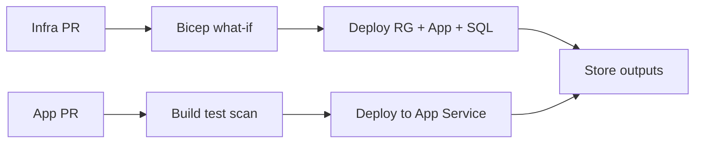

# DevOps Top 50 Interview Q&A — Detailed Answers (Part 2)

> **Premium bank** — CI/CD and Infrastructure as Code. Weeks 30–31.

| Section | Questions | Topics |
|---------|-----------|--------|
| [CI/CD Pipelines](#section-1-cicd-pipelines) | Q009–Q019 | Stages, GitHub Actions, Azure DevOps, deployment, security |
| [Infrastructure as Code](#section-2-infrastructure-as-code) | Q020–Q030 | Terraform, Bicep, state, drift, GitOps |

**Navigation:** [Part 1](devops-top-50-qa-part1.md) | [Part 3](devops-top-50-qa-part3.md) | [Index](devops-top-50-index.md)

---

## Section 1: CI/CD Pipelines

## Q009: CI/CD Pipeline Stages for .NET

| Attribute | Value |
|-----------|-------|
| **Difficulty** | Fundamentals |
| **Category** | CI/CD |
| **Frequency** | Very Common |
| **Week** | 30 |

### Question

What stages should a production CI/CD pipeline include for a .NET 8 microservice?

### Short Answer (30 seconds)

Restore → build → unit test → SAST/dependency scan → publish artifact → deploy dev → integration test → deploy staging → approval → deploy prod with health check. Fail fast at each stage. Same artifact promotes through all environments.

### Detailed Answer (3–5 minutes)

**Minimum viable pipeline:**

| Stage | Gate | Typical Duration |
|-------|------|------------------|
| Build | Compile success | 2 min |
| Unit test | 100% pass, coverage threshold | 3 min |
| Security scan | No critical CVEs | 2 min |
| Package | Docker image or zip artifact | 2 min |
| Deploy dev | Smoke test | 3 min |
| Integration test | API + contract tests | 5 min |
| Deploy staging | Full regression | 10 min |
| Prod approval | Manual or automated canary | — |
| Deploy prod | Health probe green | 5 min |

**Architect principles:**
- **Fail fast** — Don't deploy if unit tests fail
- **Immutable artifacts** — Tag `order-api:1.2.3` flows dev → prod
- **Parallelize** — Security scan alongside tests
- **Cache** — NuGet restore cache saves 60%+ CI time

```yaml
- run: dotnet restore --locked-mode
- run: dotnet build -c Release --no-restore
- run: dotnet test -c Release --no-build --collect:"XPlat Code Coverage"
```

### Architecture Perspective

Pipeline design reflects quality priorities. Skipping integration tests in CI means production becomes your test environment.

### Follow-up Questions

1. **Where do E2E tests run?**
   - Staging after deploy, not blocking every PR (too slow). Nightly or pre-prod gate.

2. **How long should CI take?**
   - Target < 15 min for PR feedback. Split fast (unit) and slow (integration) pipelines.

### Common Mistakes in Interviews

- Rebuilding for each environment (different binaries in prod)
- No security scanning stage
- Manual steps that should be automated (copy files to server)

---

## Q010: GitHub Actions for .NET Microservices

| Attribute | Value |
|-----------|-------|
| **Difficulty** | Fundamentals |
| **Category** | GitHub Actions |
| **Frequency** | Very Common |
| **Week** | 30 |

### Question

Design a GitHub Actions workflow for a .NET 8 API deploying to Azure App Service with OIDC authentication.

### Short Answer (30 seconds)

Use `actions/setup-dotnet`, run tests on PR, deploy to staging on main merge via `azure/login@v2` with OIDC (no stored secrets), environment protection rules on production, and `azure/webapps-deploy` with deployment slots.

### Detailed Answer (3–5 minutes)

```yaml
permissions:
  id-token: write
  contents: read

on:
  push:
    branches: [main]
  pull_request:
    branches: [main]

jobs:
  build:
    runs-on: ubuntu-latest
    steps:
      - uses: actions/checkout@v4
      - uses: actions/setup-dotnet@v4
        with:
          dotnet-version: '8.0.x'
          cache: true
          cache-dependency-path: '**/packages.lock.json'
      - run: dotnet test -c Release
      - run: dotnet publish -c Release -o ./publish
      - uses: actions/upload-artifact@v4
        with:
          name: app
          path: ./publish

  deploy-staging:
    needs: build
    if: github.ref == 'refs/heads/main'
    runs-on: ubuntu-latest
    environment: staging
    steps:
      - uses: actions/download-artifact@v4
      - uses: azure/login@v2
        with:
          client-id: ${{ secrets.AZURE_CLIENT_ID }}
          tenant-id: ${{ secrets.AZURE_TENANT_ID }}
          subscription-id: ${{ secrets.AZURE_SUBSCRIPTION_ID }}
      - uses: azure/webapps-deploy@v3
        with:
          app-name: order-api
          slot-name: staging

  deploy-production:
    needs: deploy-staging
    runs-on: ubuntu-latest
    environment: production  # requires reviewers
    steps:
      - uses: actions/download-artifact@v4
      - uses: azure/login@v2
        with:
          client-id: ${{ secrets.AZURE_CLIENT_ID }}
          tenant-id: ${{ secrets.AZURE_TENANT_ID }}
          subscription-id: ${{ secrets.AZURE_SUBSCRIPTION_ID }}
      - uses: azure/webapps-deploy@v3
        with:
          app-name: order-api
```

**OIDC setup:** Federated credential on App Registration trusting GitHub repo + environment. No `AZURE_CREDENTIALS` JSON secret with 2-year expiry.

### Architecture Perspective

OIDC is the modern security baseline — architects should mandate it over service principal secrets in CI.

### Follow-up Questions

1. **Reusable workflows?**
   - Yes — `workflow_call` for shared build/deploy across 20 microservice repos.

2. **Self-hosted runners?**
   - When you need VNet access to private resources or larger compute. Trade-off: runner maintenance.

### Common Mistakes in Interviews

- Long-lived service principal secrets in GitHub Secrets
- No environment protection on production
- Running deploy on PR (should be build/test only)

---

## Q011: Azure DevOps Pipeline Design

| Attribute | Value |
|-----------|-------|
| **Difficulty** | Intermediate |
| **Category** | Azure DevOps |
| **Frequency** | Common |
| **Week** | 30 |

### Question

How does Azure DevOps YAML pipelines compare to GitHub Actions for enterprise .NET teams already on Azure?

### Short Answer (30 seconds)

Azure DevOps integrates deeply with Azure Boards, Artifacts, and Environments; better for enterprises needing work item traceability. GitHub Actions is simpler and ideal if code is already on GitHub. Many enterprises use both — ADO for work tracking, GitHub for OSS-style CI.

### Detailed Answer (3–5 minutes)

| Factor | Azure DevOps | GitHub Actions |
|--------|--------------|----------------|
| Azure integration | Native service connections | OIDC, good but newer |
| Work item linking | Built-in (#123 in commit) | GitHub Issues only |
| Artifact feeds | Azure Artifacts (NuGet) | GitHub Packages |
| Pipeline templates | YAML templates in repo | Reusable workflows |
| Self-hosted agents | Mature, VNet integration | Self-hosted runners |
| Cost | Per-user licensing | Minutes included in GitHub plan |

**ADO multi-stage example:**

```yaml
stages:
- stage: Build
  jobs:
  - job: BuildJob
    pool: { vmImage: 'ubuntu-latest' }
    steps:
    - task: DotNetCoreCLI@2
      inputs: { command: 'test', projects: '**/*.csproj' }

- stage: DeployProd
  dependsOn: Build
  condition: and(succeeded(), eq(variables['Build.SourceBranch'], 'refs/heads/main'))
  jobs:
  - deployment: Deploy
    environment: production
    strategy:
      runOnce:
        deploy:
          steps:
          - task: AzureWebApp@1
```

**Architect decision:** If org standardized on ADO + Boards + gated check-ins, stay ADO. Greenfield GitHub org → Actions. Avoid two CI systems per team without reason.

### Architecture Perspective

Tool choice is organizational — architects align with existing identity, artifact, and compliance investments.

### Follow-up Questions

1. **Can ADO deploy to AWS?**
   - Yes via service connections and tasks — multi-cloud pipelines possible.

### Common Mistakes in Interviews

- Recommending migration without considering sunk cost in ADO work item integration

---

## Q012: Blue-Green vs Canary vs Rolling Deployment

| Attribute | Value |
|-----------|-------|
| **Difficulty** | Intermediate |
| **Category** | Deployment Strategy |
| **Frequency** | Very Common |
| **Week** | 30 |

### Question

Compare blue-green, canary, and rolling deployments. When do you use each for .NET APIs on Azure?

### Short Answer (30 seconds)

Rolling updates instances gradually (AKS default). Blue-green runs two full environments and swaps traffic instantly — App Service deployment slots. Canary routes small traffic percentage to new version — Argo Rollouts or Front Door weighted routing. Use canary for high-risk changes; slots for simple API swaps.

### Detailed Answer (3–5 minutes)

| Strategy | Downtime | Rollback Speed | Resource Cost | Best For |
|----------|----------|----------------|---------------|----------|
| **Rolling** | Zero | Slow (re-roll) | 1x | Low-risk, stateless APIs |
| **Blue-green** | Zero | Instant swap | 2x during deploy | Database-free API changes |
| **Canary** | Zero | Stop traffic shift | 1x + small extra | High-risk, need metric validation |
| **Recreate** | Yes | Redeploy | 1x | Dev/test only |

**Azure mappings:**
- **App Service:** Deployment slots = blue-green. Swap after warm-up.
- **AKS:** Rolling update default. Argo Rollouts for canary.
- **Front Door / APIM:** Weighted routing for canary across regions.

**Canary example:** Route 5% traffic to v2; monitor error rate and p99 for 30 min; increase to 50%, then 100%. Auto-rollback if 5xx > 1%.

**Architect caution:** Blue-green with schema migrations requires backward-compatible DB changes (expand-contract pattern).

### Architecture Perspective

Deployment strategy is a risk management decision. Interviewers want trade-off reasoning, not "always use canary."

### Follow-up Questions

1. **Canary with sticky sessions?**
   - Session affinity complicates canary — prefer stateless JWT or external session store.

### Common Mistakes in Interviews

- Blue-green without considering database state
- Canary without automated metric-based rollback

---

## Q013: Build Once, Deploy Many

| Attribute | Value |
|-----------|-------|
| **Difficulty** | Fundamentals |
| **Category** | Artifacts |
| **Frequency** | Common |
| **Week** | 30 |

### Question

What does "build once, deploy many" mean? Why is rebuilding for production dangerous?

### Short Answer (30 seconds)

Compile and package exactly once; promote the same immutable artifact through dev, staging, and prod. Rebuilding introduces non-determinism — different NuGet resolution, different compiler flags — so what you tested isn't what you ship.

### Detailed Answer (3–5 minutes)

**Immutable artifact flow:**

```
Commit abc123 → CI build → order-api:1.2.3 (ACR image)
    → deploy to dev (tag 1.2.3)
    → deploy to staging (tag 1.2.3)
    → deploy to prod (tag 1.2.3)
```

**What goes wrong with rebuild:**
- `dotnet restore` pulls newer patch dependency with bug
- Different `Release` vs `Debug` accidentally in prod build
- Source code changed between staging and prod deploy
- Audit trail breaks — can't answer "what code is in prod?"

**Implementation:**
- Docker: push to ACR with semver tag + `git sha` label
- Zip deploy: upload artifact from CI, download in deploy job
- Never `dotnet publish` on production server

**Promotion record:** Deployment ID → artifact digest → commit SHA → deployer (pipeline OIDC identity).

### Architecture Perspective

This is supply chain integrity — connects to SLSA, SBOM, and compliance audits.

### Follow-up Questions

1. **Configuration per environment?**
   - Config outside artifact: App Settings, Key Vault refs, environment variables — not recompile.

### Common Mistakes in Interviews

- "We use latest tag" in production
- Building on production VM via RDP

---

## Q014: OIDC Federation for CI/CD

| Attribute | Value |
|-----------|-------|
| **Difficulty** | Intermediate |
| **Category** | Pipeline Security |
| **Frequency** | Common |
| **Week** | 30 |

### Question

How does OIDC federation work between GitHub Actions and Azure? Why prefer it over service principal secrets?

### Short Answer (30 seconds)

GitHub requests a short-lived JWT; Azure Entra ID validates it against a federated credential (trusts specific repo + branch/environment) and issues an access token. No long-lived secret to leak, rotate, or expire. Mandate OIDC for all production pipelines.

### Detailed Answer (3–5 minutes)

**Flow:**
1. Workflow requests OIDC token from GitHub (`id-token: write`)
2. `azure/login@v2` exchanges JWT with Entra ID
3. Entra validates: issuer=github.com, subject=repo:org/app:environment:production
4. Short-lived Azure AD token returned (minutes, not months)

**Federated credential config:**
- Issuer: `https://token.actions.githubusercontent.com`
- Subject: `repo:myorg/order-api:ref:refs/heads/main`
- Or: `repo:myorg/order-api:environment:production`

**vs Service Principal secret:**
| OIDC | SP Secret |
|------|-----------|
| No secret in GitHub | Secret in vault/GitHub |
| Auto-expires | Manual rotation |
| Scoped to repo/env | Often over-permissioned |
| Audit: which workflow deployed | Audit: which SP |

**Architect policy:** Block pipeline patterns using `AZURE_CREDENTIALS` JSON for new repos.

### Architecture Perspective

Security architects and interviewers increasingly expect OIDC knowledge for cloud CI/CD.

### Follow-up Questions

1. **AWS equivalent?**
   - `aws-actions/configure-aws-credentials` with OIDC to IAM role trust policy.

### Common Mistakes in Interviews

- Storing client secret when federated credential suffices
- Federated credential too broad (entire org instead of one repo)

---

## Q015: Secret Management in Pipelines

| Attribute | Value |
|-----------|-------|
| **Difficulty** | Intermediate |
| **Category** | Security |
| **Frequency** | Common |
| **Week** | 30 |

### Question

How should secrets be managed in CI/CD pipelines for .NET applications on Azure?

### Short Answer (30 seconds)

Build-time secrets in GitHub Environments / Azure DevOps variable groups (limited). Runtime secrets in Key Vault, referenced by Managed Identity — never in appsettings committed to Git. Scan repos with GitGuardian; use OIDC instead of stored cloud credentials.

### Detailed Answer (3–5 minutes)

**Secret categories:**

| Type | Storage | Example |
|------|---------|---------|
| CI cloud auth | OIDC (preferred) | Azure deploy |
| Build-time API keys | GitHub Secrets, scoped to environment | SonarQube token |
| Runtime app secrets | Key Vault + Managed Identity | SQL connection, API keys |
| Signing keys | HSM / Key Vault certificate | Container signing |

**.NET runtime pattern:**

```csharp
// Not this in appsettings.json: "Password=..."
// Use Key Vault configuration provider
builder.Configuration.AddAzureKeyVault(
    new Uri($"https://{vaultName}.vault.azure.net/"),
    new DefaultAzureCredential());
```

**Pipeline rules:**
- Secrets never echo in logs (`::add-mask::`)
- Pre-commit hooks block `.env` commits
- Rotate on any leak suspicion — don't just delete from HEAD

### Architecture Perspective

Secret leaks are architecture failures — golden path templates should make the secure path the easy path.

### Follow-up Questions

1. **Key Vault in CI?**
   - CI retrieves secrets via OIDC-scoped access for deploy-time only. App uses separate Managed Identity at runtime.

### Common Mistakes in Interviews

- Key Vault connection string still in App Service config as plain text
- Shared secrets across all environments

---

## Q016: SAST and Dependency Scanning in CI

| Attribute | Value |
|-----------|-------|
| **Difficulty** | Intermediate |
| **Category** | DevSecOps |
| **Frequency** | Common |
| **Week** | 30 |

### Question

What security scanning should run in a .NET CI pipeline? How do you avoid alert fatigue?

### Short Answer (30 seconds)

Dependency scan (Dependabot, Snyk), SAST (CodeQL, SonarQube), container scan (Trivy, Defender), and secret scan (GitGuardian). Gate on critical/high only in CI; medium/low go to backlog. False positive suppression with documented justification.

### Detailed Answer (3–5 minutes)

| Scan | Tool | Gate |
|------|------|------|
| Dependency CVE | Dependabot, `dotnet list package --vulnerable` | Block critical |
| SAST | CodeQL, SonarQube | Block new critical issues |
| Secret detection | GitGuardian, truffleHog | Block any |
| Container | Trivy, ACR Defender | Block critical in base image |
| IaC | Checkov, tfsec | Block high misconfigurations |

```yaml
- uses: github/codeql-action/init@v3
  with:
    languages: csharp
- uses: github/codeql-action/analyze@v3
```

**Avoiding fatigue:**
- Severity-based gates only
- Baseline existing debt — block new issues, not all historical
- Auto-PR from Dependabot for patch updates
- Weekly security review for medium findings

### Architecture Perspective

DevSecOps shifts left — architects define which gates are non-negotiable vs team backlog.

### Follow-up Questions

1. **DAST vs SAST?**
   - SAST analyzes code; DAST tests running app. DAST in staging nightly, not every PR.

### Common Mistakes in Interviews

- No scanning because "it slows CI" — parallelize
- Blocking on every informational finding

---

## Q017: Container Signing and SBOM

| Attribute | Value |
|-----------|-------|
| **Difficulty** | Advanced |
| **Category** | Supply Chain |
| **Frequency** | Occasional |
| **Week** | 30 |

### Question

What is an SBOM? How do you implement container image signing in a .NET CI pipeline?

### Short Answer (30 seconds)

SBOM (Software Bill of Materials) lists all dependencies in an artifact for vulnerability tracking. Sign images with Cosign/Notation and store SBOM alongside image in ACR. Required for increasing enterprise and government compliance requirements.

### Detailed Answer (3–5 minutes)

**SBOM generation:**
```bash
dotnet list package --format json > sbom.json
# Or Syft: syft order-api:1.2.3 -o spdx-json
```

**Signing flow:**
1. Build and push image to ACR
2. Generate SBOM
3. Sign with Notation (Azure) or Cosign
4. ACR Content Trust / admission policy verifies signature before deploy

**Why it matters:** Log4Shell-style events require knowing what's in production within hours. Without SBOM, inventory takes weeks.

### Architecture Perspective

Supply chain security is now an architect interview topic — connect to SLSA levels and executive risk questions.

### Follow-up Questions

1. **NuGet SBOM vs container SBOM?**
   - Both — NuGet for build integrity, container for deploy integrity.

### Common Mistakes in Interviews

- Confusing SBOM with license file
- Signing without admission policy enforcement (signing alone doesn't block unsigned)

---

## Q018: Database Migrations in CI/CD

| Attribute | Value |
|-----------|-------|
| **Difficulty** | Advanced |
| **Category** | CI/CD |
| **Frequency** | Common |
| **Week** | 30 |

### Question

How do you handle EF Core database migrations in a zero-downtime deployment pipeline?

### Short Answer (30 seconds)

Use expand-contract pattern: backward-compatible migrations only — add column before code uses it, remove column after code stops using it. Run migrations as pipeline step before app deploy, with rollback script tested. Never breaking schema change with rolling deploy.

### Detailed Answer (3–5 minutes)

**Expand-contract phases:**

| Phase | Schema | Code |
|-------|--------|------|
| 1 Expand | Add nullable `EmailV2` column | Still writes `Email` |
| 2 Migrate | Backfill `EmailV2` | Dual-write both |
| 3 Contract | Drop `Email` | Reads `EmailV2` only |

**Pipeline order:**
1. Deploy migration (expand only)
2. Deploy app v2 (dual-write)
3. Backfill job
4. Deploy app v3 (read new)
5. Deploy migration (contract)

**Tools:** EF migrations, Flyway, DbUp — run in pipeline with `dotnet ef database update` or scripted SQL.

**Architect rule:** If you can't do rolling deploy, don't do breaking migrations.

### Architecture Perspective

Schema migration strategy constrains deployment strategy — architects align both.

### Follow-up Questions

1. **Who approves prod migrations?**
   - Automated if expand-only and tested in staging; manual for contract phase.

### Common Mistakes in Interviews

- Running migrations after app deploy with breaking change
- No rollback plan for failed migration

---

## Q019: Contract Testing in CI/CD

| Attribute | Value |
|-----------|-------|
| **Difficulty** | Intermediate |
| **Category** | Testing |
| **Frequency** | Common |
| **Week** | 30 |

### Question

How does contract testing (Pact) fit into a microservices CI/CD pipeline?

### Short Answer (30 seconds)

Consumers define expected API contracts; providers verify in CI before deploy. Broken contract blocks merge. Prevents integration failures when 20 services deploy independently.

### Detailed Answer (3–5 minutes)

```
Order API (consumer) defines pact → shared pact broker
Payment API (provider) verifies pact in CI → fails if broken
```

```csharp
// Provider verification in CI
[Fact]
public void VerifyPaymentApiHonoursPact() {
    var config = new PactVerifierConfig { LogLevel = PactLogLevel.Information };
    new PactVerifier("PaymentApi", config)
        .WithHttpEndpoint(new Uri("http://localhost:5000"))
        .WithFileInteractions("./pacts/order-payment.json")
        .Verify();
}
```

**Pipeline placement:** Provider verification job after unit tests, before deploy. Consumer-driven contracts ensure API changes are intentional.

### Architecture Perspective

Contract tests are the safety net for independent deployment — architects mandate for service mesh boundaries.

### Follow-up Questions

1. **Pact vs integration tests?**
   - Pact is faster, consumer-driven, runs without all services up. Integration tests validate full stack in staging.

### Common Mistakes in Interviews

- Only integration tests in staging (too late, too slow)
- No pact broker (contracts not shared)

---

## Section 2: Infrastructure as Code

## Q020: Terraform vs Bicep for Azure

| Attribute | Value |
|-----------|-------|
| **Difficulty** | Fundamentals |
| **Category** | IaC |
| **Frequency** | Very Common |
| **Week** | 31 |

### Question

When do you choose Terraform vs Bicep for Azure infrastructure?

### Short Answer (30 seconds)

Bicep for Azure-only teams — day-zero resources, no state file, ARM-backed. Terraform for multi-cloud or existing HCL investment. Many enterprises use Bicep for Azure landing zones and Terraform for AWS/GCP resources.

### Detailed Answer (3–5 minutes)

| Factor | Bicep | Terraform |
|--------|-------|-----------|
| Azure coverage | Day-zero | Slight lag sometimes |
| State | ARM tracks (no file) | You manage remote state |
| Multi-cloud | No | Yes |
| Module ecosystem | Growing | Terraform Registry |
| Learning curve | Low for ARM users | HCL learning |
| Drift detection | `what-if` | `terraform plan` |

**Decision matrix:**
- Azure-only .NET shop → **Bicep default**
- Multi-cloud mandate → **Terraform**
- Team knows Terraform → don't switch without reason
- AKS + Azure + Cloudflare → Terraform or split tools

### Architecture Perspective

IaC choice is a 5-year decision — migration cost is high. Document in ADR.

### Follow-up Questions

1. **Can they coexist?**
   - Yes but avoid managing same resource in both — clear ownership boundaries.

### Common Mistakes in Interviews

- "Terraform is always better" in Azure-only context
- Ignoring state management overhead with Terraform

---

## Q021: Terraform State Management

| Attribute | Value |
|-----------|-------|
| **Difficulty** | Intermediate |
| **Category** | Terraform |
| **Frequency** | Common |
| **Week** | 31 |

### Question

How should Terraform remote state be configured for production? What happens if state is lost or corrupted?

### Short Answer (30 seconds)

Remote state in Azure Storage or S3 with locking (blob lease / DynamoDB). Encrypt at rest, RBAC restrict to platform team, enable versioning. Lost state means Terraform loses track of resources — recovery via `terraform import` hell. State is critical infrastructure.

### Detailed Answer (3–5 minutes)

```hcl
terraform {
  backend "azurerm" {
    resource_group_name  = "rg-tfstate-prod"
    storage_account_name = "sttfstateprod"
    container_name       = "tfstate"
    key                  = "order-api.prod.tfstate"
    use_azuread_auth     = true
  }
}
```

**Best practices:**
- Separate state per environment (prod state ≠ dev state)
- Separate subscription for state storage
- State locking prevents concurrent apply corruption
- Versioning enabled for accidental overwrite recovery
- Never commit state to Git (secrets in state)

**Corruption recovery:** Restore from blob version. If lost entirely, `terraform import` each resource — painful, error-prone. Treat state backup as DR requirement.

### Architecture Perspective

Junior architects design resources; senior architects design state strategy and blast radius.

### Follow-up Questions

1. **Workspaces vs separate state files?**
   - Separate state files for prod isolation. Workspaces for small teams with similar envs.

### Common Mistakes in Interviews

- Local state on developer laptops for production
- Shared state file for all environments

---

## Q022: Bicep Modules and Composition

| Attribute | Value |
|-----------|-------|
| **Difficulty** | Intermediate |
| **Category** | Bicep |
| **Frequency** | Common |
| **Week** | 31 |

### Question

How do you structure Bicep modules for a multi-environment .NET platform?

### Short Answer (30 seconds)

Reusable modules in `/modules/` (app-service, sql, service-bus). Environment entry points in `/environments/{dev,staging,prod}/` with `.bicepparam` files differing SKUs and names. Same modules, different parameters — never fork module code per environment.

### Detailed Answer (3–5 minutes)

```
infra/
├── modules/
│   ├── app-service.bicep      # params: name, sku, subnetId
│   ├── sql-database.bicep
│   └── service-bus.bicep
├── environments/
│   ├── dev/main.bicep         # module app-service { sku: B1 }
│   ├── staging/main.bicep     # sku: P1v3
│   └── prod/main.bicep        # sku: P2v3, zone redundant
```

```bicep
// environments/prod/main.bicep
module app '../modules/app-service.bicep' = {
  name: 'order-api'
  params: {
    appName: 'order-api-prod'
    sku: 'P2v3'
    minInstances: 3
  }
}
```

**Module design rules:**
- Outputs: connection strings as secure outputs, not plain text in logs
- Version modules with Git tags
- Document required params in module README

### Architecture Perspective

Module boundaries mirror platform team service catalog — one module per approved building block.

### Follow-up Questions

1. **Bicep registry?**
   - Publish modules to ACR as OCI artifacts for cross-subscription reuse.

### Common Mistakes in Interviews

- Copy-paste Bicep per environment instead of parameters
- Modules too granular (100 modules) or too monolithic (1 module)

---

## Q023: IaC Drift Detection

| Attribute | Value |
|-----------|-------|
| **Difficulty** | Intermediate |
| **Category** | IaC |
| **Frequency** | Common |
| **Week** | 31 |

### Question

What is infrastructure drift? How do you detect and remediate it?

### Short Answer (30 seconds)

Drift is when live infrastructure differs from IaC definition — usually manual portal changes. Detect with scheduled `terraform plan` or `bicep what-if` in CI; alert on diff. Remediate by applying IaC or backporting emergency changes within 24 hours. Prevent with Azure Policy deny rules.

### Detailed Answer (3–5 minutes)

**Drift scenario:** DBA scales SQL to P2 in portal; Monday Terraform apply downgrades to S4 → outage.

**Detection:**
```yaml
# Nightly drift check
- run: terraform plan -detailed-exitcode
  # exit 2 = changes detected → alert
```

**Remediation layers:**
1. **Prevent:** Azure Policy denies SKU changes without exemption
2. **Detect:** Daily plan in CI, Slack alert
3. **Correct:** `terraform apply` to restore desired state OR update IaC if change intentional
4. **Process:** Emergency changes require backport PR within 24h

### Architecture Perspective

Drift is an architecture governance problem — connects IaC, ops culture, and incident history.

### Follow-up Questions

1. **Intentional drift?**
   - Break-glass exemption with ticket; still backport to IaC.

### Common Mistakes in Interviews

- Assuming IaC alone prevents manual changes without Policy
- Applying IaC to fix drift without understanding why change was made

---

## Q024: Policy as Code

| Attribute | Value |
|-----------|-------|
| **Difficulty** | Intermediate |
| **Category** | Governance |
| **Frequency** | Common |
| **Week** | 31 |

### Question

How does Azure Policy complement IaC? Give examples for a .NET platform.

### Short Answer (30 seconds)

IaC defines desired state proactively; Policy enforces guardrails reactively on any creation path (portal, CLI, ARM). Examples: require tags, deny public storage, enforce Managed Identity, allowed regions only.

### Detailed Answer (3–5 minutes)

| Policy | Effect |
|--------|--------|
| Require `Environment` tag | Deny deploy without tag |
| Deny public blob access | Security baseline |
| Allowed locations | `eastus`, `westeurope` only |
| Audit App Service without HTTPS | Compliance report |
| Deploy Diagnostic Settings | Auto-remediate logging gap |

**IaC + Policy together:**
- Bicep deploys compliant resources by design
- Policy catches manual mistakes and shadow IT
- Initiative bundles policies for SOC 2 mapping

### Architecture Perspective

Defense in depth — architects don't rely on IaC discipline alone at enterprise scale.

### Follow-up Questions

1. **Terraform Sentinel?**
   - Policy checks on `terraform plan` before apply — similar concept for TF shops.

### Common Mistakes in Interviews

- Policy so restrictive developers can't work (balance with sandbox subscription)

---

## Q025: Environment Promotion with IaC

| Attribute | Value |
|-----------|-------|
| **Difficulty** | Intermediate |
| **Category** | IaC |
| **Frequency** | Common |
| **Week** | 31 |

### Question

How do you promote infrastructure changes from dev to production using IaC?

### Short Answer (30 seconds)

Same modules and pipeline; different parameter files per environment. PR triggers plan on dev; merge to main deploys staging; production requires approval gate. Never `terraform apply` prod from laptop.

### Detailed Answer (3–5 minutes)

**Promotion flow:**
```
PR → plan dev + plan staging (comment on PR)
Merge → apply dev → smoke test → apply staging → integration test
Manual approve → apply prod (maintenance window if needed)
```

**Parameter differences:**

| Param | Dev | Prod |
|-------|-----|------|
| SQL SKU | S1 | P2 |
| App instances | 1 | 3 |
| Log retention | 7 days | 90 days |
| Zone redundancy | false | true |

**Architect controls:**
- Prod apply only from pipeline service principal
- Separate state files per environment
- Drift check before prod apply

### Architecture Perspective

Environment promotion is where IaC meets CI/CD — architects design both together.

### Follow-up Questions

1. **Blue-green infrastructure?**
   - Separate resource groups; switch traffic via Front Door; destroy old after validation.

### Common Mistakes in Interviews

- Different module code per environment (drift between env logic)
- Manual prod changes "just this once"

---

## Q026: Importing Brownfield Resources into IaC

| Attribute | Value |
|-----------|-------|
| **Difficulty** | Advanced |
| **Category** | IaC |
| **Frequency** | Occasional |
| **Week** | 31 |

### Question

How do you bring manually created Azure resources under IaC management?

### Short Answer (30 seconds)

Inventory resources, write matching Bicep/Terraform, import into state (`terraform import` or deploy with `existing` keyword in Bicep), verify plan shows zero changes, then enable Policy to prevent drift.

### Detailed Answer (3–5 minutes)

**Terraform import:**
```bash
terraform import azurerm_linux_web_app.app /subscriptions/.../sites/order-api
terraform plan  # must show 0 changes
```

**Bicep existing resource:**
```bicep
resource existingApp 'Microsoft.Web/sites@2022-09-01' existing = {
  name: 'order-api'
}
```

**Brownfield program:**
1. Export with `az resource list` + `az bicep decompile` (starting point only)
2. Refactor into modules
3. Import/align
4. Policy deny on manual changes
5. Prioritize by blast radius — prod SQL before dev storage account

### Architecture Perspective

Most architects inherit brownfield — import strategy is practical interview gold.

### Follow-up Questions

1. **Decompile quality?**
   - `az bicep decompile` output needs cleanup — not production-ready as-is.

### Common Mistakes in Interviews

- Deleting and recreating resources to "fix" import (downtime, data loss)

---

## Q027: IaC Testing — Plan in Pull Request

| Attribute | Value |
|-----------|-------|
| **Difficulty** | Intermediate |
| **Category** | IaC |
| **Frequency** | Common |
| **Week** | 31 |

### Question

How do you test IaC changes before applying to production?

### Short Answer (30 seconds)

Static analysis (Checkov, tfsec), `terraform validate`, plan/what-if in PR comments, deploy to ephemeral environment, smoke test, then promote. Never first apply in prod.

### Detailed Answer (3–5 minutes)

```yaml
# PR workflow
- run: terraform fmt -check
- run: terraform validate
- run: checkov -d .
- run: terraform plan -out=plan.tfplan
- uses: actions/github-script@v7  # comment plan on PR
```

**Ephemeral environments:** `terraform workspace new pr-${{ github.event.number }}` → deploy → test → destroy on PR close.

**Cost control:** Auto-destroy ephemeral after 24h; budget alerts.

### Architecture Perspective

IaC CI is as important as application CI — misconfigured NSG can be worse than a bug.

### Follow-up Questions

1. **Test prod plan without apply?**
   - `terraform plan` against prod state with read-only SP — safe preview.

### Common Mistakes in Interviews

- No plan review — apply directly from developer machine

---

## Q028: GitOps vs Push-Based Deployment

| Attribute | Value |
|-----------|-------|
| **Difficulty** | Intermediate |
| **Category** | Deployment |
| **Frequency** | Common |
| **Week** | 31 |

### Question

Compare GitOps and push-based CI/CD deployment models.

### Short Answer (30 seconds)

Push: CI pipeline calls `kubectl apply` or `az webapp deploy` after build. GitOps: Git repo is desired state; Argo CD/Flux reconciles cluster to Git. GitOps preferred for Kubernetes; push-based fine for App Service and simpler setups.

### Detailed Answer (3–5 minutes)

| Factor | Push | GitOps |
|--------|------|--------|
| Model | Pipeline pushes change | Agent pulls from Git |
| K8s fit | Works | Ideal |
| Audit | Pipeline logs | Git commit history |
| Rollback | Redeploy old artifact | Git revert |
| Tools | GitHub Actions, ADO | Argo CD, Flux |

**GitOps flow (AKS):**
```
Merge manifest change → Argo CD detects → syncs cluster
Image tag update in Git triggers rolling deploy
```

**Architect:** App Service + Bicep → push model is fine. AKS 10+ services → GitOps reduces kubectl-from-CI risk.

### Architecture Perspective

Model choice depends on compute platform — not universal "GitOps always."

### Follow-up Questions

1. **GitOps for App Service?**
   - Less common; Bicep in pipeline is equivalent desired-state pattern.

### Common Mistakes in Interviews

- GitOps without understanding reconciliation loop and drift handling

---

## Q029: Cost Tags and FinOps in IaC

| Attribute | Value |
|-----------|-------|
| **Difficulty** | Fundamentals |
| **Category** | FinOps |
| **Frequency** | Common |
| **Week** | 31 |

### Question

How do you enforce cost allocation tags through IaC?

### Short Answer (30 seconds)

Define mandatory tags in Bicep/Terraform modules (`Environment`, `CostCenter`, `Owner`, `Application`). Azure Policy denies resources without tags. FinOps reports use tags for chargeback — untagged resources are invisible debt.

### Detailed Answer (3–5 minutes)

```bicep
var mandatoryTags = {
  Environment: environment
  CostCenter: costCenter
  Owner: ownerEmail
  Application: appName
  ManagedBy: 'Bicep'
}

resource app 'Microsoft.Web/sites@2022-09-01' = {
  name: appName
  tags: mandatoryTags
  // ...
}
```

**Policy enforcement:**
```json
{
  "effect": "deny",
  "policyRule": {
    "if": { "field": "tags['CostCenter']", "exists": "false" },
    "then": { "effect": "deny" }
  }
}
```

### Architecture Perspective

FinOps starts at provision time — retrofitting tags on 500 resources is painful.

### Follow-up Questions

1. **Tag sprawl?**
   - Limit to 5–7 mandatory tags; optional tags in Policy audit only.

### Common Mistakes in Interviews

- Tags optional in modules — Policy should enforce

---

## Q030: End-to-End IaC + CI/CD Integration

| Attribute | Value |
|-----------|-------|
| **Difficulty** | Advanced |
| **Category** | Architecture |
| **Frequency** | Common |
| **Week** | 31 |

### Question

Design how IaC and application CI/CD pipelines interact for a new .NET microservice on Azure.

### Short Answer (30 seconds)

Separate pipelines: infra pipeline provisions App Service, SQL, Key Vault, Managed Identity; app pipeline deploys code assuming infra exists. Infra outputs (app name, KV URI) stored as pipeline variables or Parameter Store. App pipeline uses OIDC; never embeds connection strings.

### Detailed Answer (3–5 minutes)



**Sequence for new service:**
1. Platform team merges Bicep module instantiation
2. Outputs: `appName`, `keyVaultName`, `managedIdentityClientId`
3. App repo CI references these via GitHub environment variables
4. App uses `DefaultAzureCredential` + Key Vault at runtime

**Dependency:** App pipeline fails gracefully if infra not provisioned — clear error message.

### Architecture Perspective

This integration is the Month 8 capstone — separates architects who've shipped platforms from theorists.

### Follow-up Questions

1. **Monolithic pipeline?**
   - Anti-pattern — infra changes are rarer, different approvers, different blast radius.

### Common Mistakes in Interviews

- Single pipeline that mixes Bicep and dotnet publish without separation
- Hardcoded resource names in app pipeline

---

**Navigation:** [Part 3 — Observability & Scenarios](devops-top-50-qa-part3.md) →
