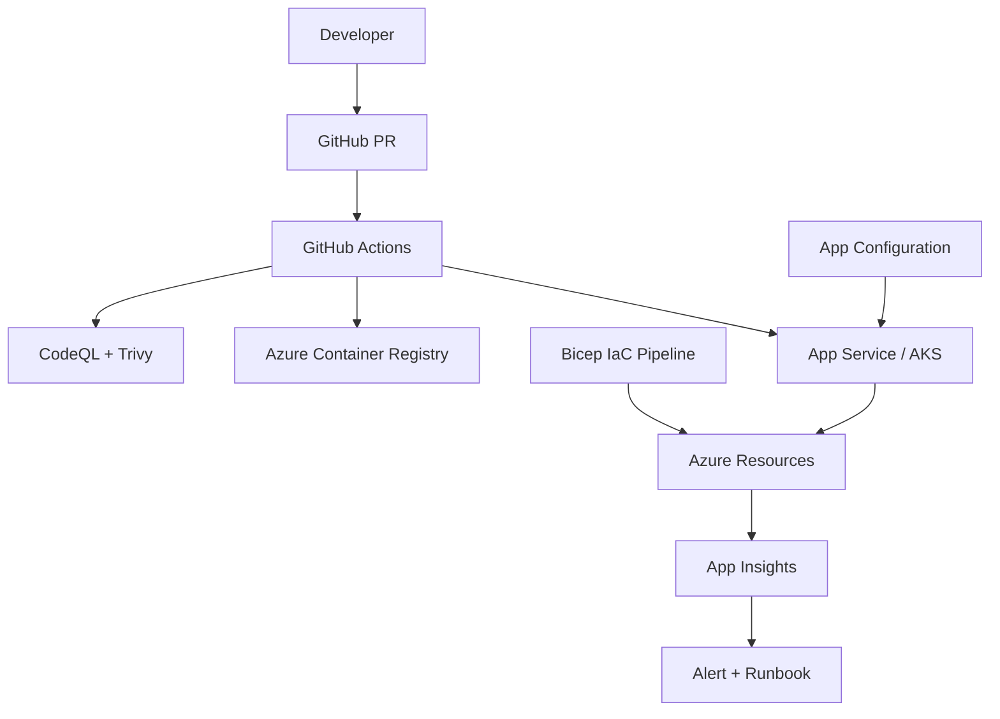

# DevOps Top 50 Interview Q&A — Detailed Answers (Part 3)

> **Premium bank** — Observability, operations, and architecture scenarios. Week 32.

| Section | Questions | Topics |
|---------|-----------|--------|
| [Observability](#section-1-observability) | Q031–Q040 | OpenTelemetry, SLOs, logging, alerting |
| [Scenarios & Capstone](#section-2-scenarios--capstone) | Q041–Q050 | Incidents, platform design, full DevOps architecture |

**Navigation:** [Part 1](devops-top-50-qa-part1.md) | [Part 2](devops-top-50-qa-part2.md) | [Index](devops-top-50-index.md)

---

## Section 1: Observability

## Q031: Three Pillars of Observability

| Attribute | Value |
|-----------|-------|
| **Difficulty** | Fundamentals |
| **Category** | Observability |
| **Frequency** | Very Common |
| **Week** | 32 |

### Question

What are the three pillars of observability? How do they work together during incident response?

### Short Answer (30 seconds)

Logs (what happened), metrics (how much/how fast), traces (where time went). During incidents: alert fires on metric → trace shows slow downstream call → logs provide exception details. All three linked by trace ID and correlation ID.

### Detailed Answer (3–5 minutes)

| Pillar | Data | Question | .NET Tooling |
|--------|------|----------|--------------|
| **Logs** | Discrete events | What happened? | ILogger, Serilog, App Insights |
| **Metrics** | Aggregated numbers | How much? How fast? | OTel metrics, Prometheus |
| **Traces** | Request spans | Where did latency go? | OTel, Application Insights |

**Incident flow:**
1. Metric alert: `http.server.duration p99 > 500ms`
2. Trace: Order API → Payment API span 4.2s (bottleneck)
3. Log: `PaymentTimeoutException` on correlation ID `abc-123`

**Fourth pillar (debated):** Profiling — why is code slow (CPU flame graphs).

**Architect mandate:** Every microservice exports all three via OpenTelemetry. Single vendor backend (App Insights, Datadog, Grafana Cloud).

### Architecture Perspective

Observability is not optional infrastructure — it's part of service definition of done.

### Follow-up Questions

1. **Logs vs traces?**
   - Traces show structure across services; logs add detail within a span. Complementary.

### Common Mistakes in Interviews

- Only logs, no metrics or traces (can't see trends or distributed latency)
- String-interpolated logs breaking structured query

---

## Q032: OpenTelemetry for .NET

| Attribute | Value |
|-----------|-------|
| **Difficulty** | Fundamentals |
| **Category** | OpenTelemetry |
| **Frequency** | Very Common |
| **Week** | 32 |

### Question

How do you instrument an ASP.NET Core 8 application with OpenTelemetry?

### Short Answer (30 seconds)

Add `OpenTelemetry.Extensions.Hosting`, enable ASP.NET Core, HttpClient, and EF Core instrumentations, export traces and metrics via OTLP or Azure Monitor exporter. Propagate W3C `traceparent` on all outbound calls.

### Detailed Answer (3–5 minutes)

```csharp
builder.Services.AddOpenTelemetry()
    .ConfigureResource(r => r.AddService(
        serviceName: "order-api",
        serviceVersion: "1.2.3"))
    .WithTracing(tracing => tracing
        .AddAspNetCoreInstrumentation()
        .AddHttpClientInstrumentation()
        .AddEntityFrameworkCoreInstrumentation()
        .AddAzureMonitorTraceExporter())
    .WithMetrics(metrics => metrics
        .AddAspNetCoreInstrumentation()
        .AddRuntimeInstrumentation()
        .AddAzureMonitorMetricExporter());
```

**Custom span:**
```csharp
using var activity = ActivitySource.StartActivity("ProcessPayment");
activity?.SetTag("order.id", orderId);
```

**Architect standards:**
- Service name matches K8s deployment name or App Service name
- Version tag = container image tag (deployment correlation)
- Collector sidecar or agent for batching in K8s

### Architecture Perspective

Vendor-neutral OTel avoids lock-in — architects standardize on OTel, swap backends per environment.

### Follow-up Questions

1. **Sampling?**
   - 100% in dev; tail-based or head-based probabilistic in prod (keep all errors).

### Common Mistakes in Interviews

- App Insights SDK only without OTel (legacy approach — OTel preferred for new services)
- Broken context propagation across Service Bus (must inject trace context in message properties)

---

## Q033: SLIs, SLOs, and Error Budgets

| Attribute | Value |
|-----------|-------|
| **Difficulty** | Intermediate |
| **Category** | SRE |
| **Frequency** | Very Common |
| **Week** | 32 |

### Question

Define SLI, SLO, SLA, and error budget. Give an example for an order API.

### Short Answer (30 seconds)

SLI is the measured indicator (availability, latency). SLO is the target (99.9% availability). SLA is the contract with penalties. Error budget is allowed failure (0.1% = 43 min downtime/month). When budget exhausted, freeze features and fix reliability.

### Detailed Answer (3–5 minutes)

**Order API example:**

| Term | Value |
|------|-------|
| SLI | % successful requests (non-5xx) over 30 days |
| SLO | 99.9% availability |
| Error budget | 43.2 minutes downtime/month |
| SLA | 99.95% with credits (stricter than internal SLO) |

**Latency SLI:**
- SLI: p99 response time
- SLO: p99 < 300ms
- Measure at load balancer, not app only

**Error budget policy:**
- Budget > 50%: normal development
- Budget 20–50%: increase review for risky changes
- Budget < 20%: reliability sprint, no new features
- Budget exhausted: executive escalation

```csharp
// Custom metric for SLI
_meter.CreateCounter<long>("orders.completed");
```

### Architecture Perspective

SLOs connect architecture decisions to business risk — interviewers want quantified reliability targets.

### Follow-up Questions

1. **SLI at client or server?**
   - User-facing SLI (synthetic + RUM) beats server-only — captures CDN and client issues.

### Common Mistakes in Interviews

- Confusing SLO with SLA (internal target vs customer contract)
- 100% availability SLO (impossible, paralyzes innovation)

---

## Q034: RED vs USE Monitoring Methods

| Attribute | Value |
|-----------|-------|
| **Difficulty** | Intermediate |
| **Category** | Monitoring |
| **Frequency** | Common |
| **Week** | 32 |

### Question

Explain the RED and USE methods. When do you apply each?

### Short Answer (30 seconds)

RED (Rate, Errors, Duration) for request-driven services. USE (Utilization, Saturation, Errors) for resources like CPU, memory, disk. Order API gets RED dashboard; SQL server gets USE dashboard.

### Detailed Answer (3–5 minutes)

**RED — services:**
- **Rate:** Requests per second
- **Errors:** Error rate (5xx / total)
- **Duration:** Latency distribution (p50, p95, p99)

**USE — resources:**
- **Utilization:** % time busy (CPU 80%)
- **Saturation:** Queue depth (thread pool starvation, disk queue length)
- **Errors:** Device/controller errors

| Component | Method | Key Alert |
|-----------|--------|-----------|
| Order API | RED | 5xx > 1% |
| SQL Database | USE | DTU > 85% sustained |
| Redis | USE | Memory > 90% |
| Service Bus | USE | Dead letter queue growing |

### Architecture Perspective

Dashboard design reflects system thinking — map every component to RED or USE.

### Follow-up Questions

1. **Golden signals (Google)?**
   - Latency, traffic, errors, saturation — overlaps with RED+USE combined.

### Common Mistakes in Interviews

- CPU alert only — missing saturation (thread pool exhausted at 60% CPU)

---

## Q035: Structured Logging in .NET

| Attribute | Value |
|-----------|-------|
| **Difficulty** | Fundamentals |
| **Category** | Logging |
| **Frequency** | Common |
| **Week** | 32 |

### Question

What is structured logging? Why avoid string interpolation in log messages?

### Short Answer (30 seconds)

Structured logging uses named properties (`OrderId`, `CustomerId`) queryable in Log Analytics. Message templates preserve structure; string interpolation (`$"Order {id}"`) breaks field extraction and costs more at scale.

### Detailed Answer (3–5 minutes)

```csharp
// Correct — structured
_logger.LogInformation("Order {OrderId} placed by {CustomerId} for {Total}",
    order.Id, order.CustomerId, order.Total);

// Wrong — loses structure
_logger.LogInformation($"Order {order.Id} placed");
```

**Query benefit:**
```kusto
traces
| where customDimensions.OrderId == "12345"
| project timestamp, message, customDimensions.CustomerId
```

**Architect standards:**
- Correlation ID in every log scope (`BeginScope`)
- Log levels: Error = action needed; Information = business events; Debug = dev only
- Never log PII/passwords — mask card numbers
- `ILogger<T>` category matches class name

### Architecture Perspective

Logs are your incident debugger — unstructured logs waste MTTR minutes during outages.

### Follow-up Questions

1. **Serilog vs built-in?**
   - Serilog rich sinks; built-in sufficient with App Insights exporter. Standardize per platform.

### Common Mistakes in Interviews

- Logging everything at Information in production (cost + noise)
- No correlation ID across microservices

---

## Q036: Alert Design and Alert Fatigue

| Attribute | Value |
|-----------|-------|
| **Difficulty** | Intermediate |
| **Category** | Alerting |
| **Frequency** | Common |
| **Week** | 32 |

### Question

How do you design alerts that wake people up without causing alert fatigue?

### Short Answer (30 seconds)

Alert on user-impacting symptoms (SLO burn, error rate), not every threshold breach. Page only for actionable urgent issues; ticket for warnings. Every page alert needs runbook link. Weekly alert review — delete noisy alerts.

### Detailed Answer (3–5 minutes)

| Alert | Condition | Severity | Action |
|-------|-----------|----------|--------|
| High error rate | 5xx > 1% for 5 min | Page | Rollback/runbook |
| Latency | p99 > 500ms for 10 min | Ticket | Investigate |
| CPU > 80% | 15 min sustained | Ticket if autoscale exists | Scale |
| Certificate expiry | 14 days | Ticket | Renew |

**SLO-based alerting (preferred):**
- Multi-window burn rate — fast burn (1h) pages; slow burn (3d) tickets

**Anti-patterns:**
- Alert on single failed health check (flapping)
- No runbook — on-call doesn't know what to do
- 50 alerts per incident (cascade)

### Architecture Perspective

Alert design is UX for on-call engineers — bad alerts cause burnout and missed real incidents.

### Follow-up Questions

1. **Who gets paged?**
   - Service owner via PagerDuty/Opsgenie rotation — not entire platform team.

### Common Mistakes in Interviews

- "Alert on everything" as safety strategy
- No distinction between page and ticket

---

## Q037: Distributed Tracing for Troubleshooting

| Attribute | Value |
|-----------|-------|
| **Difficulty** | Intermediate |
| **Category** | Tracing |
| **Frequency** | Common |
| **Week** | 32 |

### Question

Walk through how you'd use distributed tracing to debug a 5-second checkout API response.

### Short Answer (30 seconds)

Open App Insights transaction search, find slow trace by duration, examine span waterfall — identify which downstream call (Payment API, SQL, Redis) consumed time. Drill into that service's trace. Check logs on correlation ID for exceptions.

### Detailed Answer (3–5 minutes)

**Span waterfall example:**
```
checkout-api (5.2s total)
├── sql: SELECT inventory (50ms)
├── http: payment-api/authorize (4.8s) ← bottleneck
│   └── payment-api (4.7s)
│       └── http: stripe.com (4.6s) ← external timeout
└── servicebus: publish OrderPlaced (30ms)
```

**Steps:**
1. Filter traces: `duration > 3s`, `operation name == POST /checkout`
2. Compare p99 before/after deploy (regression detection)
3. Payment API span shows Stripe timeout — not SQL index issue
4. Mitigate: circuit breaker, reduce Stripe timeout, fallback message

**Broken trace causes:** Missing `traceparent` propagation in HttpClient, Service Bus, or custom gRPC.

### Architecture Perspective

Tracing turns "it's slow" into actionable service boundaries — architects require propagation standards.

### Follow-up Questions

1. **Trace across async messaging?**
   - Inject trace context in `ApplicationProperties` on Service Bus messages.

### Common Mistakes in Interviews

- Jumping to "add caching" without identifying bottleneck span
- No tracing, only grep logs across 15 services

---

## Q038: PowerShell for Azure Operations

| Attribute | Value |
|-----------|-------|
| **Difficulty** | Fundamentals |
| **Category** | Automation |
| **Frequency** | Occasional |
| **Week** | 32 |

### Question

Give examples of PowerShell tasks an architect would automate for Azure governance and incident response.

### Short Answer (30 seconds)

Cost reports by resource group, bulk tagging audits, enabling diagnostic settings, certificate expiry reports, and incident response (restart app, scale out, failover). PowerShell excels at cross-resource reporting in Windows-centric enterprises.

### Detailed Answer (3–5 minutes)

```powershell
# Cost by resource group last 30 days
Get-AzConsumptionUsageDetail -StartDate (Get-Date).AddDays(-30) |
  Group-Object ResourceGroupName |
  Select-Object Name, @{N='Cost';E={($_.Group | Measure-Object PretaxCost -Sum).Sum}} |
  Sort-Object Cost -Descending

# Find untagged resources
Get-AzResource | Where-Object { -not $_.Tags.Count } |
  Select-Object Name, ResourceType, ResourceGroupName

# Incident: scale App Service
Set-AzWebApp -ResourceGroupName "rg-prod" -Name "order-api" `
  -AppServicePlan (Get-AzAppServicePlan -Name "plan-prod-large")

# Enable diagnostics on all web apps
Get-AzWebApp | ForEach-Object {
  Set-AzDiagnosticSetting -ResourceId $_.Id -WorkspaceId $workspaceId -Enabled $true
}
```

**When Bash/Azure CLI instead:** Linux CI agents, kubectl scripting, cross-platform teams.

### Architecture Perspective

Automation scripts are operational runbooks — architects provide templates, SREs execute during incidents.

### Follow-up Questions

1. **PowerShell in CI?**
   - Azure DevOps Windows agents; prefer Bash on GitHub ubuntu-latest unless reporting needs Az module.

### Common Mistakes in Interviews

- Manual portal clicks during incident when script exists
- No idempotency in automation scripts

---

## Q039: Synthetic Monitoring

| Attribute | Value |
|-----------|-------|
| **Difficulty** | Intermediate |
| **Category** | Monitoring |
| **Frequency** | Common |
| **Week** | 32 |

### Question

Why is synthetic monitoring critical for multi-region architectures?

### Short Answer (30 seconds)

Health checks in primary region miss failures visible only to users in other regions or through public DNS/CDN paths. Synthetic probes from multiple geographies detect outages before customers — especially after failover when internal health checks still pass.

### Detailed Answer (3–5 minutes)

**Case:** Primary region failed, failover succeeded, but internal health checks ran only in primary — dashboards green for 12 minutes while customers couldn't checkout.

**Synthetic design:**
- Azure Monitor Application Insights availability tests
- Probes from US, EU, APAC every 60s
- Test critical journeys: login, search, checkout
- Alert when 2+ locations fail

```xml
<!-- Web test hits public URL through Front Door -->
<WebTest Name="CheckoutE2E">
  <Items>
    <Request Method="POST" Url="https://api.contoso.com/health" />
  </Items>
</WebTest>
```

**Architect:** Synthetic tests validate what users experience — complement internal RED metrics.

### Architecture Perspective

Directly addresses Week 32 case study — shows lesson internalized.

### Follow-up Questions

1. **Synthetic vs canary?**
   - Synthetic probes fixed test traffic; canary is prod user traffic to new version.

### Common Mistakes in Interviews

- `/health` endpoint only checks app process, not database connectivity

---

## Q040: Observability Cost Management

| Attribute | Value |
|-----------|-------|
| **Difficulty** | Intermediate |
| **Category** | FinOps |
| **Frequency** | Occasional |
| **Week** | 32 |

### Question

Application Insights costs are growing 40% month-over-month. How do you optimize observability spend?

### Short Answer (30 seconds)

Implement sampling (tail-based keeps errors), reduce verbose Information logging in prod, set daily cap alerts, use log levels correctly, archive old data to storage, and drop custom metrics nobody dashboards. Observability has ROI but unbounded ingestion burns budget.

### Detailed Answer (3–5 minutes)

| Lever | Action |
|-------|--------|
| Trace sampling | 10% head-based + 100% errors |
| Log volume | Debug off in prod; structured only |
| Retention | 30 days hot, archive to Storage |
| Daily cap | Alert at 80% of budget |
| Custom events | Audit — remove unused business events |
| Workspace design | Shared workspace with quotas per team |

**Architect balance:** Don't sample so aggressively you can't debug incidents — keep error traces 100%.

### Architecture Perspective

FinOps applies to observability — architects set ingestion standards in platform templates.

### Follow-up Questions

1. **OpenTelemetry collector?**
   - Filter and sample at collector before export — central control point.

### Common Mistakes in Interviews

- 100% trace sampling at 50K RPS (massive bill)
- No observability because "too expensive" (false economy)

---

## Section 2: Scenarios & Capstone

## Q041: Pipeline Secret Leak Response

| Attribute | Value |
|-----------|-------|
| **Difficulty** | Advanced |
| **Category** | Scenario |
| **Frequency** | Common |
| **Week** | 30 |

### Question

A GitGuardian alert finds an Azure storage connection string committed 6 months ago in a template repo forked by 12 teams. What is your response plan?

### Short Answer (30 seconds)

Immediate: rotate credential, audit access logs, revoke compromised access. Short-term: scan all forks, OIDC migration, pre-commit hooks. Long-term: secret scanning mandatory, Key Vault + Managed Identity pattern in golden path, ADR on CI authentication.

### Detailed Answer (3–5 minutes)

**T+0 to T+4 hours:**
1. Rotate storage key / switch to SAS with short expiry
2. Review Storage Analytics logs for unauthorized access
3. Identify all repos forked from template
4. Incident channel — security + platform + legal

**T+4 to T+48 hours:**
5. `git filter-repo` does NOT stop leaked key risk — rotation is primary
6. Mass PR to remove secret, add `.gitignore`, enable GitGuardian on all org repos
7. Migrate pipelines to OIDC
8. Board briefing: scope, exposure, remediation

**Architecture deliverables:** Updated pipeline template, ADR on secret management, runbook for future leaks.

### Architecture Perspective

Scenario tests security leadership — not just "rotate the key" but systemic fix.

### Follow-up Questions

1. **Was data exfiltrated?**
   - Storage logs + Defender for Cloud anomaly detection — may be unknown; assume worst case for notification.

### Common Mistakes in Interviews

- Only deleting secret from latest commit
- Blaming developer without fixing template that encouraged the pattern

---

## Q042: IaC Drift Production Outage

| Attribute | Value |
|-----------|-------|
| **Difficulty** | Advanced |
| **Category** | Scenario |
| **Frequency** | Common |
| **Week** | 31 |

### Question

A scheduled Terraform apply reverted a manual SQL scale-up during Black Friday, causing outage. Design governance to prevent recurrence.

### Short Answer (30 seconds)

Daily drift detection with alerts, Azure Policy deny on SKU downgrade, emergency change backport within 24h, separate prod apply approval, and `terraform plan` review showing destructive changes. Never apply prod IaC without diff review during peak season.

### Detailed Answer (3–5 minutes)

See Week 31 case study. Key architecture controls:

1. **Policy:** Deny `Microsoft.Sql/servers/databases` SKU change without `Exemption` tag
2. **CI:** Nightly `terraform plan` → Slack on diff
3. **Process:** Black Friday freeze on infra applies
4. **Break-glass:** Emergency scale via runbook → auto-ticket to backport IaC
5. **Postmortem:** Apply without plan review during peak — process failure

### Architecture Perspective

Connects IaC, ops culture, and incident prevention — holistic answer expected.

### Follow-up Questions

1. **Should Terraform manage SQL SKU at all?**
   - Yes with Policy guardrails, OR exclude SKU from TF and manage via separate autoscale policy — document decision in ADR.

### Common Mistakes in Interviews

- "Ban manual changes" without break-glass process for emergencies

---

## Q043: Observability Gap During Failover

| Attribute | Value |
|-----------|-------|
| **Difficulty** | Advanced |
| **Category** | Scenario |
| **Frequency** | Common |
| **Week** | 32 |

### Question

After region failover, dashboards showed green but customers reported errors for 12 minutes. Redesign observability.

### Short Answer (30 seconds)

Add multi-region synthetic probes, user-facing SLO dashboards, cross-region trace federation, alert on customer-facing error rate not internal health checks, and runbooks linked to every page alert.

### Detailed Answer (3–5 minutes)

**Gaps identified:**
- Health check only in failed primary region
- No Front Door-level metrics in dashboard
- Traces broken across regions (different App Insights instances)
- Alerts on server health, not synthetic/user journey

**Redesign:**
- Global App Insights or cross-workspace queries
- Synthetic checkout every 60s from 3 regions
- Alert: synthetic failure OR SLO burn rate
- Failover runbook with PowerShell validation steps
- Game day: failover drill quarterly with observability validation

### Architecture Perspective

Proves observability must validate user experience — internal metrics lie during partial failures.

### Follow-up Questions

1. **Active-active vs active-passive observability?**
   - Active-active: both regions must have full probe coverage. Passive: probes must follow traffic manager weights.

### Common Mistakes in Interviews

- More dashboards without fixing alert conditions
- `/health` returning 200 without DB check

---

## Q044: Platform Design for 10 .NET Teams

| Attribute | Value |
|-----------|-------|
| **Difficulty** | Advanced |
| **Category** | Scenario |
| **Frequency** | Common |
| **Week** | 29 |

### Question

Design a self-service platform enabling 10 .NET teams to deploy daily with consistent security and observability.

### Short Answer (30 seconds)

Golden path: .NET 8 template, reusable GitHub Actions workflow (OIDC), Bicep modules for App Service + SQL + Key Vault, mandatory OTel, feature flags via App Configuration, Backstage catalog, platform team of 3 supporting—not gatekeeping.

### Detailed Answer (3–5 minutes)

**Platform catalog:**
| Service | Template | Pipeline | IaC Module |
|---------|----------|----------|------------|
| REST API | architect-webapi | build-test-deploy.yml | app-service.bicep |
| Worker | architect-worker | same | function-app.bicep |
| + SQL | checkbox | migration gate | sql.bicep |

**Self-service flow:**
1. Developer runs `backstage create microservice`
2. PR creates repo from template + infra PR
3. Merge → staging deploy in 15 min
4. Prod via environment approval

**Metrics:** Time to first deploy, adoption rate, DORA per team, support ticket volume.

### Architecture Perspective

Capstone platform thinking — integrates culture, CI/CD, IaC, observability from Month 8.

### Follow-up Questions

1. **Team opts out?**
   - Allowed with documented operational burden and security exceptions approval.

### Common Mistakes in Interviews

- Central team reviews every deploy (bottleneck)
- No templates — each team reinvents

---

## Q045: CI Cost at Scale

| Attribute | Value |
|-----------|-------|
| **Difficulty** | Intermediate |
| **Category** | Scenario |
| **Frequency** | Occasional |
| **Week** | 30 |

### Question

50 microservices each running 20-minute CI on every PR — GitHub Actions bill is $15K/month. How do you optimize?

### Short Answer (30 seconds)

Path filters (build only changed services), NuGet caching, parallel jobs, smaller runners for unit tests, self-hosted runners for private network, merge queues to reduce redundant runs, and nightly full builds vs per-PR full matrix.

### Detailed Answer (3–5 minutes)

| Optimization | Savings |
|--------------|---------|
| Affected-only builds | 60–80% if monorepo |
| `cache: true` dotnet | 2–5 min per job |
| Split fast/slow pipelines | Faster feedback, fewer queued minutes |
| Self-hosted on Azure VMSS | Cheaper at scale than hosted minutes |
| Concurrency limits | Cancel superseded PR runs |

```yaml
paths:
  - 'services/order-api/**'
  - '.github/workflows/order-api.yml'
```

### Architecture Perspective

Platform architects own CI efficiency — connects DevOps to FinOps.

### Follow-up Questions

1. **Worth self-hosted at what scale?**
   - Roughly when monthly Actions bill exceeds 2–3 FTE maintaining runners — depends on utilization.

### Common Mistakes in Interviews

- Running full integration suite on every PR commit (use merge queue or nightly)

---

## Q046: Zero-Downtime .NET Deployment Design

| Attribute | Value |
|-----------|-------|
| **Difficulty** | Advanced |
| **Category** | Scenario |
| **Frequency** | Common |
| **Week** | 30 |

### Question

Design zero-downtime deployment for a .NET order API with SQL database on Azure.

### Short Answer (30 seconds)

App Service deployment slots with warm-up, backward-compatible EF migrations (expand-contract), health probe on `/health` including DB check, swap only when slot healthy, feature flags for risky logic, and automatic swap rollback on error rate spike.

### Detailed Answer (3–5 minutes)

```
Slot staging: deploy v2 → warm-up → health OK → swap
DB: expand migration before deploy, contract after all instances on v2
Traffic: Front Door health probe on both regions
Rollback: swap back (instant) or redeploy previous artifact
```

**Health check must validate:**
- App process running
- SQL connectivity
- Redis connectivity
- Critical downstream (payment) reachable or circuit open gracefully

### Architecture Perspective

Zero-downtime is system design — app, DB, infra, and observability together.

### Follow-up Questions

1. **WebSockets / SignalR?**
   - Sticky sessions complicate slot swap — drain connections before swap.

### Common Mistakes in Interviews

- Slot swap without DB migration strategy
- Health check returns 200 without dependencies

---

## Q047: Regulated Enterprise Continuous Delivery

| Attribute | Value |
|-----------|-------|
| **Difficulty** | Advanced |
| **Category** | Scenario |
| **Frequency** | Common |
| **Week** | 29 |

### Question

A SOC 2 bank wants continuous delivery for a .NET payments API. How do you satisfy auditors while deploying daily?

### Short Answer (30 seconds)

Automated evidence: signed artifacts, test reports, security scans, approval gates, immutable audit logs. SOC 2 change management requires authorization and documentation — pipelines with environment protection satisfy this. CAB reviews standard change catalog, not every deploy.

### Detailed Answer (3–5 minutes)

**SOC 2 CC8 (Change Management) mapping:**
| Control | Implementation |
|---------|----------------|
| Authorized changes | GitHub environment reviewers |
| Tested | CI test + scan gates |
| Documented | Deployment linked to commit, ADR, release notes |
| Segregation of duties | Developer cannot approve own prod deploy |

**Auditor package auto-generated per deploy:**
- Commit SHA, PR link, approver identity
- Test pass rate, coverage delta
- Vulnerability scan result
- Diff summary

**Feature flags:** Deploy daily (authorized standard change); flag enable for new payment flow (normal change with CAB if required).

### Architecture Perspective

Regulated CD is a top enterprise architect interview scenario — balance speed and compliance with specifics.

### Follow-up Questions

1. **Pen test between deploys?**
   - Annual pen test + continuous DAST in staging — not blocking every daily deploy.

### Common Mistakes in Interviews

- "Banks can't do CD" — false with proper controls
- Manual evidence collection per release (doesn't scale)

---

## Q048: MTTR Improvement Program

| Attribute | Value |
|-----------|-------|
| **Difficulty** | Advanced |
| **Category** | Scenario |
| **Frequency** | Common |
| **Week** | 32 |

### Question

MTTR is 4 hours average. Leadership wants sub-30 minutes. What program do you propose?

### Short Answer (30 seconds)

Measure detect-to-resolve breakdown, add observability gaps (tracing, SLO alerts), automated rollback on error spike, runbooks for top 5 incidents, blameless postmortems with action tracking, and game days. MTTR = detect + diagnose + fix + verify — attack each segment.

### Detailed Answer (3–5 minutes)

**MTTR breakdown (example):**
| Phase | Current | Target |
|-------|---------|--------|
| Detect | 45 min (customer report) | 2 min (SLO alert) |
| Diagnose | 90 min (no traces) | 10 min (trace + runbook) |
| Fix | 60 min (manual rollback) | 5 min (auto rollback) |
| Verify | 45 min | 5 min (synthetic probe) |

**Initiatives:**
1. Synthetic monitoring + SLO burn alerts
2. Distributed tracing mandatory
3. One-click rollback in pipeline
4. Runbook per alert in PagerDuty
5. Monthly game day exercises
6. Track postmortem action item completion

### Architecture Perspective

MTTR is architectural — better rollback and observability beat heroics.

### Follow-up Questions

1. **MTTR vs MTTD?**
   - Mean Time to Detect is often the hidden killer — fix detection first.

### Common Mistakes in Interviews

- "Hire more on-call" without systemic improvements
- No metrics on current MTTR breakdown

---

## Q049: End-to-End DevOps Architecture for .NET

| Attribute | Value |
|-----------|-------|
| **Difficulty** | Expert |
| **Category** | Capstone |
| **Frequency** | Common |
| **Week** | 29–32 |

### Question

Design the complete DevOps toolchain for a greenfield .NET 8 microservices platform on Azure (5 services, 3 teams).

### Short Answer (30 seconds)

GitHub repos per service, reusable Actions workflows with OIDC, Bicep modules for infra, ACR for images, App Configuration for feature flags, App Insights + OTel for observability, Azure Policy for guardrails, Backstage for developer portal. Platform team owns templates; product teams own services.

### Detailed Answer (3–5 minutes)



**Per service:** build → test → scan → push `service:1.2.3` → deploy staging → integration test → prod approval → deploy → synthetic validation.

**Cross-cutting:** DORA dashboard, secret scanning, drift detection nightly, FinOps tags mandatory.

See [Month 8 capstone lab](../weeks/week-32/labs/lab-32-month8-capstone.md).

### Architecture Perspective

The integrative Month 8 question — ties all four weeks into one coherent platform design.

### Follow-up Questions

1. **AKS vs App Service?**
   - 5 services, 3 teams without K8s expertise → App Service or Container Apps. AKS if service mesh, custom networking, or multi-cloud K8s strategy required.

### Common Mistakes in Interviews

- Tool list without workflow integration
- No governance layer (Policy, tagging, security scanning)

---

## Q050: DevOps Maturity Assessment

| Attribute | Value |
|-----------|-------|
| **Difficulty** | Expert |
| **Category** | Capstone |
| **Frequency** | Common |
| **Week** | 29–32 |

### Question

How would you assess DevOps maturity for an acquisition target during technical due diligence?

### Short Answer (30 seconds)

Evaluate DORA metrics, CI/CD automation level, IaC coverage, observability stack, incident history, security scanning, and deployment coupling. Red flags: manual prod deploys, no tests in CI, secrets in repos, no staging environment, MTTR measured in hours without improvement plan.

### Detailed Answer (3–5 minutes)

**Due diligence scorecard:**

| Area | Questions | Red Flag |
|------|-----------|----------|
| DORA | Deploy frequency? CFR? | Quarterly deploy, 30% CFR |
| CI/CD | Automated test gate? | Manual QA only |
| IaC | % infra in code? | 100% portal clicks |
| Security | Secret scanning? SAST? | Secrets in Git history |
| Observability | Tracing? SLOs? | Logs only, grep debugging |
| Culture | Postmortems? | Blame culture |
| Debt estimate | Cost to reach elite DORA? | 12–18 month platform investment |

**Output:** Integration roadmap with cost estimate for parent company architecture standards.

### Architecture Perspective

M&A technical assessment is a real architect engagement — this question separates principals from seniors.

### Follow-up Questions

1. **Walk away criteria?**
   - No production access logs, active breach, or unmaintainable monolith with no test coverage — valuation impact.

### Common Mistakes in Interviews

- Only reviewing code quality, ignoring delivery and ops maturity
- No quantified integration cost estimate

---

**Complete:** [DevOps Top 50 Index](devops-top-50-index.md) | [Month 8 Capstone Lab](../weeks/week-32/labs/lab-32-month8-capstone.md)
