# System Design Top 50 — Part 2 (Q009–Q030)

> [Part 1](system-design-top-50-qa-part1.md) | [Part 3](system-design-top-50-qa-part3.md) | [Index](system-design-top-50-index.md)

---


## Q009: URL Shortener Design

| Attribute | Value |
|-----------|-------|
| **Difficulty** | Intermediate |
| **Category** | Classic Design |
| **Frequency** | Very Common |

### Question

Design bit.ly for 100M URLs, 10K writes/sec, 100K reads/sec. Redirect latency p99 < 50ms.

### Short Answer (30 seconds)

Base62 short code from distributed ID generator; authoritative store (SQL/NoSQL) + Redis cache for hot URLs; 301 redirect; async analytics via queue. Read-heavy — cache-aside dominates.

### Detailed Answer (3–5 minutes)

**Requirements clarification:**
| Type | Detail |
|------|--------|
| Functional | Create short URL, redirect, optional custom alias, analytics |
| NFR | 100:1 read/write, p99 redirect < 50ms, 7-year retention |

**Estimation:** 100K read QPS peak ≈ 3× avg ≈ 33K avg. 10K write QPS. Storage: 100M × 500B ≈ 50GB + indexes.

**High-level design:**
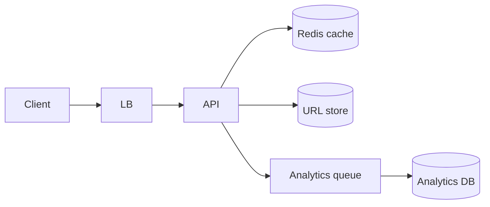

**Create flow:** Generate ID (Snowflake) → encode Base62 → write DB → return short URL.
**Redirect flow:** Cache-aside: Redis GET → miss → DB lookup → populate cache → 301.

**Key decisions:**
| Decision | Choice | Why |
|----------|--------|-----|
| ID generation | Snowflake / DB sequence | Avoid collision at 10K writes/sec |
| Cache | Redis cluster | Sub-ms reads, TTL on cold URLs |
| Redirect | 301 permanent | SEO + browser cache |
| Analytics | Async queue | Don't block redirect path |

**Deep dive — cache:** 80/20 rule — 20% URLs get 80% hits. LRU eviction; bloom filter optional for "definitely not exists" before DB.

### Architecture Perspective

Interviewers expect RESHADED flow: numbers first, then read path optimization. Redirect is the money path.

### Follow-up Questions

1. **Custom vanity URLs with collision handling? — Reserve in DB with unique constraint; 409 on conflict.**
2. **How handle expired URLs? — TTL column + lazy delete; 410 Gone response.**

### Common Mistakes in Interviews

- Hash long URL instead of ID — collision risk at scale
- No cache on read-heavy workload
- 302 instead of 301 without explaining trade-off

---

## Q010: Rate Limiter Design

| Attribute | Value |
|-----------|-------|
| **Difficulty** | Intermediate |
| **Category** | Infrastructure |
| **Frequency** | Very Common |

### Question

Design a distributed rate limiter: 1000 requests/minute per user globally across 50 API servers.

### Short Answer (30 seconds)

Token bucket or sliding window counter in Redis keyed by userId; atomic INCR + EXPIRE or Lua script; return 429 with Retry-After header; optional local cache for coarse pre-check.

### Detailed Answer (3–5 minutes)

**Algorithm comparison:**
| Algorithm | Pros | Cons |
|-----------|------|------|
| Fixed window | Simple | Burst at window boundary |
| Sliding window log | Accurate | Memory per request |
| Token bucket | Smooth burst allowance | Slightly complex |
| Sliding window counter | Good balance | Redis Lua script |

**Architecture:**
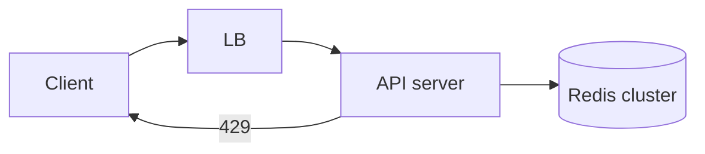

**Redis sliding window (Lua):**
```
KEY = rate:{userId}:{window}
INCR → if count > limit → reject
EXPIRE window key
```

**Distributed concerns:**
- **Centralized Redis** — single source of truth; ~100K ops/sec per shard
- **Local token cache** — reduce Redis calls; accept slight over-admission
- **Per-IP fallback** — when userId unknown

**Headers:** `X-RateLimit-Limit`, `X-RateLimit-Remaining`, `Retry-After`.

**Placement:** API gateway (Kong, APIM) for coarse limits; app-level for business rules (free vs paid tier).

### Architecture Perspective

Architects distinguish edge rate limiting (DDoS) from application quotas (billing tiers).

### Follow-up Questions

1. **Rate limit per API key vs IP vs user? — Layer all three; API key for B2B, IP for anonymous.**
2. **Multi-region rate limiting without global Redis? — Regional buckets + sync delay; or CRDT counters.**

### Common Mistakes in Interviews

- In-memory only on each server — 50× over-admission
- No Retry-After header on 429
- Fixed window without mentioning boundary burst

---

## Q011: Chat System Design

| Attribute | Value |
|-----------|-------|
| **Difficulty** | Intermediate |
| **Category** | Real-Time Messaging |
| **Frequency** | Very Common |

### Question

Design WhatsApp-scale messaging: 500M DAU, 1:1 and group chat, delivery receipts, offline delivery.

### Short Answer (30 seconds)

WebSocket gateway for online users; message service writes to partition by conversationId; inbox/outbox per user in Cassandra; push notification for offline; sequence numbers for ordering; at-least-once with client dedup.

### Detailed Answer (3–5 minutes)

**Components:**
| Component | Role |
|-----------|------|
| Connection service | WebSocket long-lived connections, heartbeats |
| Message service | Persist, route, fan-out to recipients |
| Presence service | Online/offline status (Redis) |
| Push service | APNs/FCM for offline |
| Media service | Blob storage for attachments |

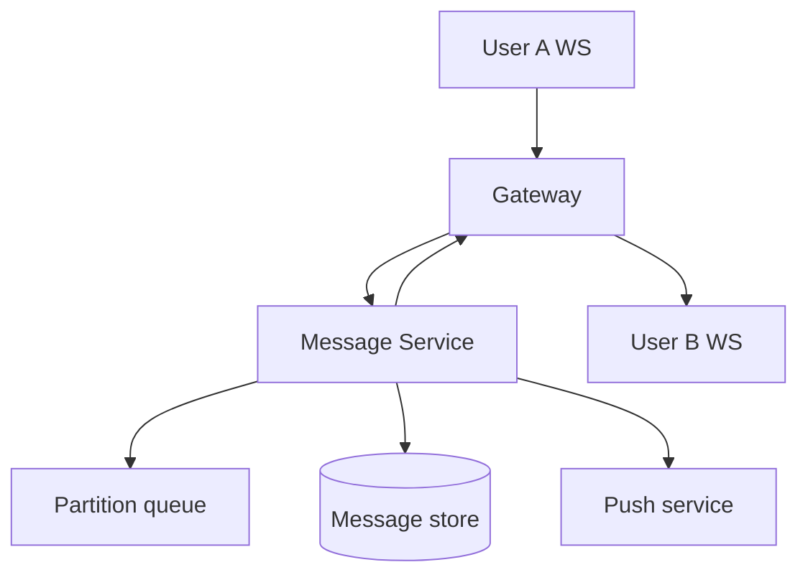

**Message flow:** Client sends → gateway → message service → persist (conversationId partition) → push to recipient gateway OR enqueue for offline sync.

**Group chat:** Fan-out to N members on write; or pull on read for large groups (500+).

**Ordering:** Per-conversation sequence ID (Snowflake or local counter). Client displays by sequence; handles gaps with sync API.

**Delivery states:** Sent → Delivered → Read (separate lightweight ACK channel).

### Architecture Perspective

Scale hinges on connection management (millions of WebSockets) and partition strategy (conversationId, not userId).

### Follow-up Questions

1. **End-to-end encryption impact? — Server can't read content; key exchange out of band; affects search/ moderation.**
2. **Group with 10K members? — Pull model on read; don't push to 10K sockets synchronously.**

### Common Mistakes in Interviews

- Polling instead of WebSocket at scale
- No offline message queue
- Global ordering across all chats — unnecessary bottleneck

---

## Q012: News Feed Fan-Out

| Attribute | Value |
|-----------|-------|
| **Difficulty** | Intermediate |
| **Category** | Social Feed |
| **Frequency** | Very Common |

### Question

Design Twitter/X home timeline. 300M users, celebrities with 50M followers. Fan-out on write vs read?

### Short Answer (30 seconds)

Hybrid: fan-out on write for normal users (<10K followers); fan-out on read for celebrities; merge timelines at read with cache; rank/score in separate service.

### Detailed Answer (3–5 minutes)

**The fork:**
| Strategy | Write cost | Read cost | Best for |
|----------|------------|-----------|----------|
| Fan-out on write | O(followers) | O(1) | Normal users |
| Fan-out on read | O(1) | O(following) | Celebrities |
| Hybrid | Mixed | Mixed | Production Twitter |

**Fan-out on write:**
Post created → for each follower, push postId to their timeline cache (Redis sorted set by timestamp).

**Celebrity problem:** Lady Gaga posts → 50M Redis writes synchronously = minutes. **Solution:** Mark celebrity; followers pull celebrity posts at read time and merge.

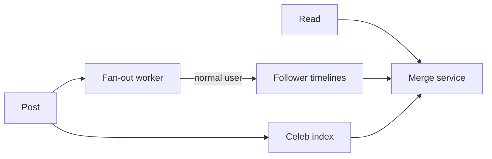

**Storage:** Post table (postId, userId, content, ts). Timeline = sorted set of postIds per userId.

**Ranking:** Separate feed ranker (ML) may reorder cached candidates — don't block write path.

### Architecture Perspective

This is THE social feed interview question — hybrid approach shows production awareness.

### Follow-up Questions

1. **How regenerate timeline after unfollow? — Remove postIds from cached timeline; lazy cleanup OK.**
2. **Feed ranking vs chronological? — Precompute candidate set; rank at read with cached features.**

### Common Mistakes in Interviews

- Pure fan-out on write for all users
- No celebrity exception path
- Cross-shard timeline JOIN at read time

---

## Q013: Sharding Strategy

| Attribute | Value |
|-----------|-------|
| **Difficulty** | Intermediate |
| **Category** | Database Scale |
| **Frequency** | Very Common |

### Question

Shard a users table with 1B rows, 50K QPS. Choose sharding key and strategy.

### Short Answer (30 seconds)

Hash(userId) mod N for even distribution; avoid cross-shard JOINs by co-locating related data; consistent hashing for resharding; shard map service for routing.

### Detailed Answer (3–5 minutes)

**Sharding key selection:**
| Key | Pros | Cons |
|-----|------|------|
| userId hash | Even spread | Can't range query by region |
| tenantId | Multi-tenant isolation | Hot tenant problem |
| geo | Data residency | Uneven distribution |

**Architecture:**
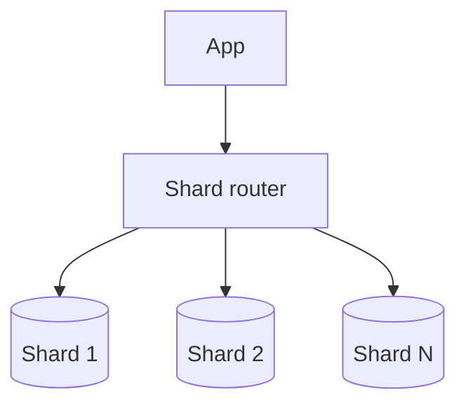

**Rules:**
1. **Co-locate** user + user's orders on same shard (same hash key)
2. **Avoid cross-shard transactions** — use saga or denormalize
3. **Global secondary indexes** — async replication to search index (Elasticsearch)
4. **Resharding** — consistent hashing minimizes key movement; dual-write migration window

**Hot shard mitigation:** Split hot key range; add read replicas; cache layer above hot shard.

**Capacity:** 1B rows / 16 shards = 62M rows/shard — manageable with proper indexes.

### Architecture Perspective

Interviewers want sharding key justification tied to access patterns, not just 'hash the ID'.

### Follow-up Questions

1. **When shard by geography? — GDPR/data residency; accept uneven load with overflow shards.**
2. **Cross-shard pagination? — Cursor on global index (ES) not SQL OFFSET.**

### Common Mistakes in Interviews

- Range shard on auto-increment ID — hot last shard
- Cross-shard JOIN in OLTP path
- No plan for resharding as data grows

---

## Q014: Consistent Hashing

| Attribute | Value |
|-----------|-------|
| **Difficulty** | Intermediate |
| **Category** | Distributed Systems |
| **Frequency** | Very Common |

### Question

Explain consistent hashing and why distributed caches use it. What happens when a node is added?

### Short Answer (30 seconds)

Keys and nodes mapped to a hash ring; key assigned to first node clockwise; virtual nodes (vnodes) for even distribution; adding node moves only ~K/n keys (not all keys).

### Detailed Answer (3–5 minutes)

**Problem:** Simple hash(key) mod N — when N changes, nearly all keys remap → cache stampede.

**Consistent hashing:** Ring 0 to 2^32-1; nodes placed on ring (with 100-200 vnodes each); key → clockwise nearest node.

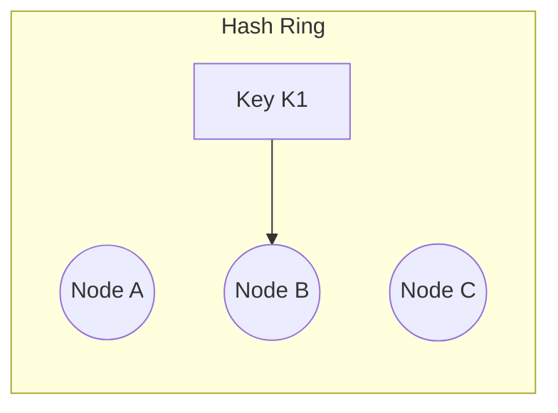

**Node add/remove:** Only keys between predecessor and new node migrate.

| Event | Keys affected |
|-------|---------------|
| Add 1 node to 10 | ~10% of keys |
| mod N change | ~100% of keys |

**Production:** Dynamo, Cassandra, Redis Cluster, memcached clients all use variants.

**Replication:** Walk clockwise for replica nodes (N+1, N+2 on ring).

**Hot key:** Doesn't solve hot keys — need local cache or key splitting.

### Architecture Perspective

Connects directly to cache cluster elasticity — architects specify vnode count and replication factor.

### Follow-up Questions

1. **Consistent hashing vs rendezvous hashing? — Rendezvous (HRW) better for small clusters; consistent hash for large.**
2. **How handle node failure? — Replica promotion; temporary over-replication on neighbors.**

### Common Mistakes in Interviews

- Think mod N is fine at scale
- No virtual nodes — uneven distribution
- Forget replication walk on ring

---

## Q015: Distributed Cache Design

| Attribute | Value |
|-----------|-------|
| **Difficulty** | Intermediate |
| **Category** | Caching |
| **Frequency** | Very Common |

### Question

Design a distributed cache layer for 1M QPS, 10TB working set, 99.9% availability.

### Short Answer (30 seconds)

Redis Cluster or Memcached with consistent hashing; cache-aside pattern; TTL + LRU eviction; local L1 cache optional; replication for HA; separate hot-key handling.

### Detailed Answer (3–5 minutes)

**Tiered cache:**
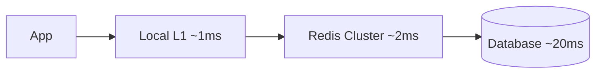

**Redis Cluster:** 16384 hash slots; min 3 masters; replica per master for failover.

| Pattern | Use when |
|---------|----------|
| Cache-aside | General read-heavy (most common) |
| Write-through | Strong consistency needed |
| Write-behind | Write-heavy, tolerate loss window |

**Eviction:** allkeys-lru for pure cache; volatile-lru if mixed TTL keys.

**Hot key:** Local JVM cache; read replicas; key splitting (`user:123 → user:123:0..9`).

**Invalidation:** Pub/sub channel; or version stamp in key; avoid flush-all.

**Monitoring:** Hit ratio >95% target; p99 latency; memory usage per shard.

### Architecture Perspective

Architects specify cache pattern, eviction, and invalidation strategy — not just 'add Redis'.

### Follow-up Questions

1. **Redis vs Memcached? — Redis: structures, persistence, cluster; Memcached: simpler, multithreaded, pure KV.**
2. **Cache stampede prevention? — Mutex, early expiration jitter, request coalescing.**

### Common Mistakes in Interviews

- No TTL — unbounded memory growth
- Cache-aside without invalidation on write
- Single Redis instance for 1M QPS

---

## Q016: Notification System Design

| Attribute | Value |
|-----------|-------|
| **Difficulty** | Advanced |
| **Category** | Async Messaging |
| **Frequency** | Common |

### Question

Design a notification system supporting email, SMS, and push for 10M users. 1M notifications/hour peak.

### Short Answer (30 seconds)

Event bus ingests triggers → router picks channel(s) → priority queues per channel → worker pools → template service → provider adapters (SendGrid, Twilio, FCM); retry + DLQ; user preference store.

### Detailed Answer (3–5 minutes)

**Flow:**
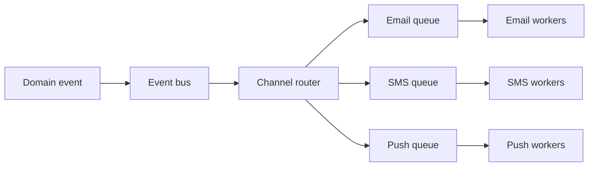

**Components:**
| Component | Purpose |
|-----------|---------|
| Preference service | User opt-in/out per channel and category |
| Template service | Render with variables; i18n |
| Idempotency store | Dedup by (userId, eventId, channel) |
| Rate limiter | Per-user caps (max 10 push/day) |

**Priority:** OTP/security > transactional > marketing. Separate queues prevent marketing backlog blocking OTP.

**Failure:** Exponential backoff retry (3×); DLQ for manual replay; dead letter alerting.

**Scale:** ~280 notif/sec peak — modest; bottleneck is provider API limits, not internal throughput.

### Architecture Perspective

Strategy pattern for providers; priority queues show you won't let marketing email block password reset.

### Follow-up Questions

1. **Digest vs real-time? — Batch queue with scheduled worker for daily digest.**
2. **Multi-tenant template isolation? — Namespace templates by tenantId; RBAC on edit.**

### Common Mistakes in Interviews

- Synchronous send in request path
- No user preference checks (CAN-SPAM/GDPR)
- Single queue for all channels and priorities

---

## Q017: Paste Bin Design

| Attribute | Value |
|-----------|-------|
| **Difficulty** | Advanced |
| **Category** | Classic Design |
| **Frequency** | Common |

### Question

Design Pastebin: create text paste, optional expiry, read by URL. 10M pastes/month, 100:1 read/write.

### Short Answer (30 seconds)

Short key (Base62 ID); blob storage for content (S3/Azure Blob); metadata in SQL (id, created, expiry, size); CDN for popular pastes; scan queue for abuse/malware.

### Detailed Answer (3–5 minutes)

**Create:** Validate size (<1MB) → store blob → insert metadata → return URL.
**Read:** Lookup metadata → if expired 410 → fetch blob → return with syntax highlighting (client-side).

| Storage | Content |
|---------|---------|
| SQL/NoSQL | id, userId?, createdAt, expiresAt, blobKey, viewCount |
| Object store | Actual paste text |

**Expiry:** Lazy delete on read + nightly sweeper job for cleanup.

**Custom URLs:** Unique constraint on vanity slug; premium feature.

**Abuse:** Rate limit creates; virus scan async; report/block workflow.

**Scale:** 10M/month ≈ 4 creates/sec avg; reads 400/sec — CDN caches hot pastes by URL.

### Architecture Perspective

Read-heavy blob + metadata split is a recurring pattern (also applies to attachments, exports).

### Follow-up Questions

1. **Syntax highlighting server vs client? — Client (highlight.js) saves CPU; server for API consumers.**
2. **Private pastes with auth? — Signed URLs with TTL; or require login + ACL table.**

### Common Mistakes in Interviews

- Store large pastes in SQL BLOB
- No expiry mechanism
- Skip abuse scanning on user-generated content

---

## Q018: Search Autocomplete

| Attribute | Value |
|-----------|-------|
| **Difficulty** | Advanced |
| **Category** | Search |
| **Frequency** | Common |

### Question

Design typeahead/autocomplete for Amazon-scale search. p99 < 100ms, top 10 suggestions.

### Short Answer (30 seconds)

Trie or prefix index in memory/Redis; popular queries precomputed; FST (finite state transducer) for compact storage; client debounce 150ms; optional personalization layer.

### Detailed Answer (3–5 minutes)

**Data pipeline:** Search logs → aggregate query prefixes → rank by frequency/recency/revenue → publish to serving tier hourly.

**Serving architecture:**
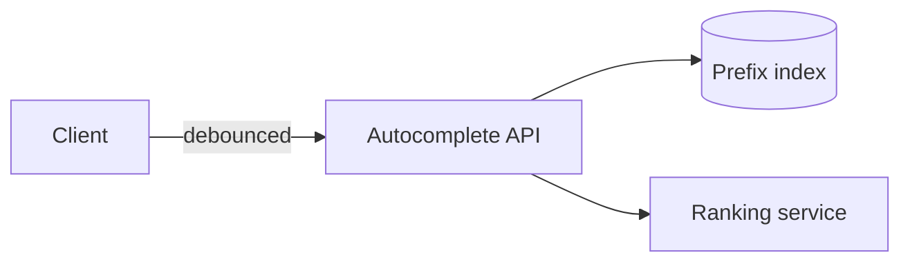

| Approach | Latency | Storage |
|----------|---------|---------|
| In-memory trie | <1ms | Large for full catalog |
| Redis ZSET per prefix | ~2ms | `prefix:appl → [(apple, score)]` |
| Elasticsearch completion | ~10ms | Easier ops, higher latency |

**Ranking signals:** Query frequency, click-through rate, inventory, margin (e-commerce).

**Personalization:** Blend global top-10 with user's recent searches (separate micro-index).

**Guardrails:** Blocklist offensive prefixes; minimum 2 chars before query.

### Architecture Perspective

Autocomplete is a prefix query problem — trie/FST is the DS interviewers expect tied to latency SLA.

### Follow-up Questions

1. **Update frequency for trending queries? — Stream aggregate (Flink) + publish every 5 min for viral terms.**
2. **Multi-language autocomplete? — Separate index per locale; detect language from keyboard/input.**

### Common Mistakes in Interviews

- Full table scan LIKE 'prefix%' on SQL
- No debounce — DDoS your own API
- Return unranked alphabetical results

---

## Q019: Video Streaming Platform

| Attribute | Value |
|-----------|-------|
| **Difficulty** | Advanced |
| **Category** | Media |
| **Frequency** | Common |

### Question

Design YouTube-style video upload and playback for 1B users. Upload 500K videos/day, stream 1M concurrent.

### Short Answer (30 seconds)

Chunked upload to blob storage → transcode queue (multiple bitrates) → HLS/DASH segments on CDN → metadata DB → recommendation separate; adaptive bitrate on client.

### Detailed Answer (3–5 minutes)

**Upload pipeline:**
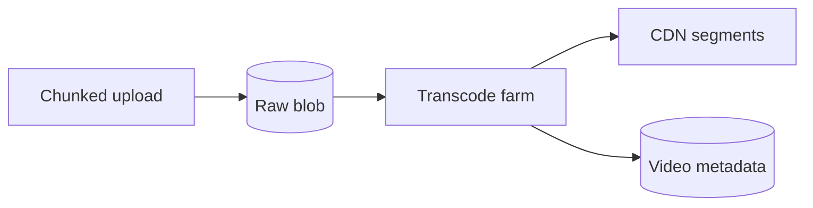

**Playback:** Client requests manifest (.m3u8) → CDN serves segments → player switches bitrate based on bandwidth.

| Component | Technology pattern |
|-----------|-------------------|
| Upload | Multipart resumable (tus protocol) |
| Transcode | FFmpeg workers on spot instances |
| Storage | S3 + CloudFront / Azure Blob + CDN |
| Metadata | SQL (title, owner, status, renditions) |

**Scale:** 1M concurrent × 2Mbps avg = 2Tbps CDN — must use edge; origin only on cache miss.

**Live vs VOD:** Live uses RTMP ingest → packager → low-latency HLS (LL-HLS).

### Architecture Perspective

Separate upload (write-heavy batch) from playback (CDN read) — different scaling profiles.

### Follow-up Questions

1. **Copyright detection? — Content ID fingerprinting async after upload; block before publish if match.**
2. **Transcode priority for premium creators? — Priority queue tiers; SLA per subscription.**

### Common Mistakes in Interviews

- Serve video from origin server directly
- Single bitrate for all clients
- Synchronous transcode blocking upload response

---

## Q020: Ticket Booking System

| Attribute | Value |
|-----------|-------|
| **Difficulty** | Advanced |
| **Category** | Concurrency |
| **Frequency** | Very Common |

### Question

Design Ticketmaster: 50K seats, prevent double booking, handle 100K concurrent users at on-sale.

### Short Answer (30 seconds)

Virtual waiting room → queue token → seat map in Redis with atomic hold (SETNX/HSET); 10-min TTL hold; payment confirms booking; optimistic locking fallback in DB.

### Detailed Answer (3–5 minutes)

**On-sale flow:**
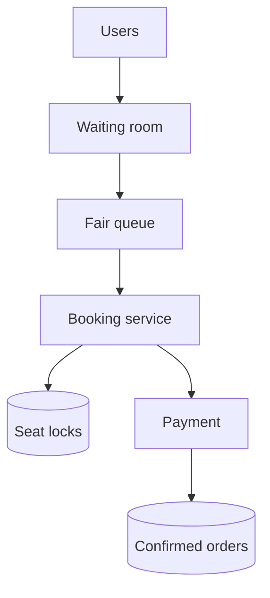

**Seat locking:**
```
HSET event:123:seats A12 locked userId:456 TTL:600
```
Atomic check-and-set prevents double book.

| Strategy | When |
|----------|------|
| Pessimistic lock (Redis) | High contention on-sale |
| Optimistic (version column) | Low contention |
| DB row lock | Small venues only |

**Waiting room:** Token bucket admission; random shuffle for fairness; static "queue position" page.

**Failure:** Hold expires → seat returns to pool; websocket/poll for seat map updates.

**Bot prevention:** CAPTCHA at queue entry; device fingerprint; rate limits.

### Architecture Perspective

Concurrency control is the core — show atomic operations, TTL holds, and queue fairness.

### Follow-up Questions

1. **Best available vs pick-your-seat? — Best available: simpler lock on count; pick-seat: 2D seat map locks.**
2. **Resale marketplace integration? — Transfer ownership atomically; void original barcode.**

### Common Mistakes in Interviews

- Check-then-set race condition without atomic ops
- No hold TTL — seats locked forever
- Direct DB row lock for 100K concurrent users

---

## Q021: Web Crawler Design

| Attribute | Value |
|-----------|-------|
| **Difficulty** | Advanced |
| **Category** | Distributed Systems |
| **Frequency** | Common |

### Question

Design a web crawler to index 1B pages, politeness (robots.txt), deduplication, 100 pages/sec sustained.

### Short Answer (30 seconds)

URL frontier queue → fetcher workers → parser → link extractor → bloom filter + URL store for dedup; respect robots.txt cache; priority by PageRank/recency; blob store for raw HTML.

### Detailed Answer (3–5 minutes)

**Architecture:**
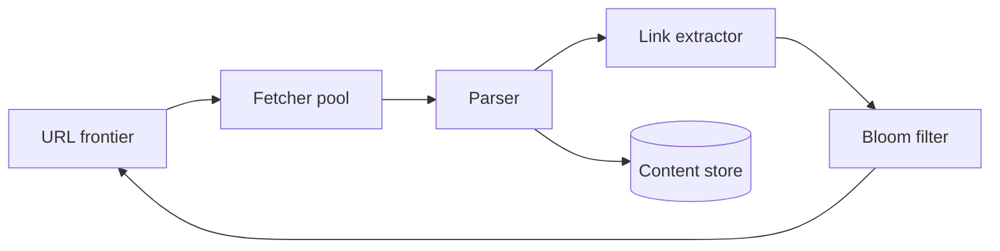

**Politeness:** Per-host queue; min 1 sec between requests to same domain; robots.txt cached 24h.

**Dedup:** Bloom filter (might exist) → exact URL hash in DB (definitely exists).

**Priority frontier:** High PageRank, fresh content, sitemap URLs first.

**Challenges:**
| Challenge | Solution |
|-----------|----------|
| Duplicate content | Content hash dedup |
| Spider traps | Max depth per domain |
| Dynamic JS pages | Headless browser pool (expensive) |

**Scale:** 100 pages/sec = 8.6M/day; 1B pages ≈ 116 days single cluster — horizontal fetchers.

### Architecture Perspective

Shows distributed systems thinking: frontier queue, politeness, probabilistic dedup.

### Follow-up Questions

1. **How detect content change for re-crawl? — Last-Modified/ETag headers; content hash comparison.**
2. **Distributed crawler coordination? — Partition frontier by URL hash; shared bloom via Redis.**

### Common Mistakes in Interviews

- Ignore robots.txt
- Unbounded frontier memory
- Fetch all URLs without per-host rate limit

---

## Q022: Distributed ID Generation

| Attribute | Value |
|-----------|-------|
| **Difficulty** | Advanced |
| **Category** | Infrastructure |
| **Frequency** | Very Common |

### Question

Design a globally unique ID generator for a distributed system. 10K IDs/sec, sortable by time, no coordination per ID.

### Short Answer (30 seconds)

Snowflake-style: timestamp (41b) + datacenter (5b) + worker (5b) + sequence (12b) = 64-bit sortable ID; or UUID v7 for standard sortable UUID; avoid DB auto-increment at scale.

### Detailed Answer (3–5 minutes)

**Requirements:**
| Requirement | Solution |
|-------------|----------|
| Unique | Machine ID + sequence |
| Sortable | Leading timestamp bits |
| High throughput | Local generation, no DB round-trip |
| Clock skew | Wait or use logical clock |

**Snowflake layout:**
```
| 41 bit timestamp | 5 bit DC | 5 bit worker | 12 bit sequence |
```

**Alternatives:**
| Approach | Pros | Cons |
|----------|------|------|
| DB sequence | Simple | Single point, latency |
| UUID v4 | No coordination | Not sortable |
| UUID v7 | Sortable, standard | 128-bit |
| Snowflake | Compact, fast | Custom, clock dependency |

**Deployment:** One generator per machine; register workerId in ZooKeeper/etcd; NTP sync critical.

### Architecture Perspective

Every sharded system needs this — interviewers connect IDs to URL shorteners, order numbers, tweets.

### Follow-up Questions

1. **ID exhaustion at sequence overflow? — Wait 1ms for next timestamp window; 4096/ms per machine.**
2. **Multi-region ID generation? — Embed region in datacenter bits; still no cross-region coordination.**

### Common Mistakes in Interviews

- DB auto-increment for 10K/sec global writes
- UUID v4 for time-ordered feeds
- Ignore clock skew handling

---

## Q023: Snowflake ID Deep Dive

| Attribute | Value |
|-----------|-------|
| **Difficulty** | Advanced |
| **Category** | Infrastructure |
| **Frequency** | Common |

### Question

Explain Twitter Snowflake ID structure. What breaks if system clock moves backward?

### Short Answer (30 seconds)

64-bit: timestamp + machine ID + sequence; IDs sortable by creation time; clock backward → duplicate risk — wait until caught up or use reserved sequence bits; NTP discipline required.

### Detailed Answer (3–5 minutes)

**Bit allocation (Twitter original):**
- 41 bits: milliseconds since epoch (~69 years)
- 10 bits: machine ID (1024 machines)
- 12 bits: sequence (4096 IDs/ms per machine)

**Generation algorithm:**
```
1. Get current timestamp T
2. If T == last_T: increment sequence (overflow → wait next ms)
3. If T < last_T: clock moved backward → error or wait
4. If T > last_T: reset sequence to 0
5. Compose ID = (T << 22) | (machine << 12) | sequence
```

**Clock backward handling:**
| Strategy | Trade-off |
|----------|-----------|
| Throw exception | Safe, brief unavailability |
| Wait until caught up | Simple, adds latency |
| Use reserved bit | Complex, rare |

**vs UUID v7:** Snowflake is 64-bit (fits JS Number with caution); UUID v7 is standard, 128-bit, interops better across systems.

**Monitoring:** Alert on clock skew >5ms; sequence overflow rate.

### Architecture Perspective

Deep dive follow-on to distributed IDs — shows you understand operational failure modes.

### Follow-up Questions

1. **JavaScript Number precision for Snowflake? — Use string or BigInt; IDs > 2^53 lose precision.**
2. **Snowflake vs DB UUID primary key index performance? — Both B-tree friendly when sortable; UUID v4 causes page splits.**

### Common Mistakes in Interviews

- No clock skew handling plan
- Same worker ID on two machines
- Assume NTP never fails

---

## Q024: API Design for System Design

| Attribute | Value |
|-----------|-------|
| **Difficulty** | Advanced |
| **Category** | API Design |
| **Frequency** | Very Common |

### Question

Design REST APIs for a social media platform. Posts, feeds, follows. Discuss pagination, versioning, idempotency.

### Short Answer (30 seconds)

Resource-oriented URLs; cursor pagination; idempotency keys on POST; versioning via URL prefix or header; rate limit headers; ProblemDetails errors (RFC 7807).

### Detailed Answer (3–5 minutes)

**Core endpoints:**
```
POST   /v1/posts              (Idempotency-Key header)
GET    /v1/feed?cursor=abc&limit=20
POST   /v1/users/{id}/follow
DELETE /v1/users/{id}/follow
GET    /v1/posts/{id}
```

**Pagination:**
| Type | Use |
|------|-----|
| Cursor | Feeds, real-time data (stable) |
| Offset | Admin, small datasets only |

**Idempotency:** Store `(key, request_hash, response)` 24h; replay same response on retry.

**Versioning:** `/v1/` prefix; sunset policy 12 months; breaking change = v2.

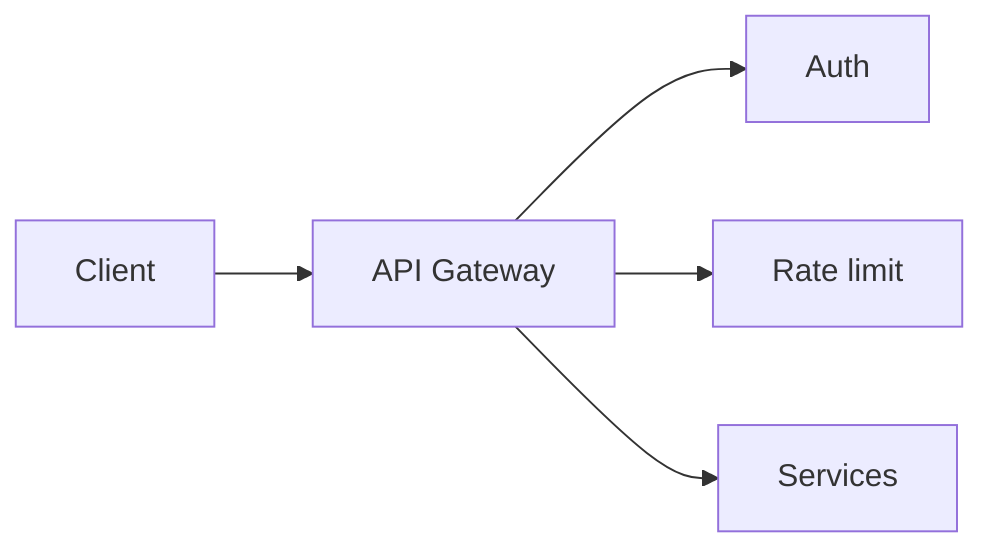

**HATEOAS:** Optional for public API; skip in mobile-first internal APIs.

### Architecture Perspective

System design interviews increasingly include API surface — show REST maturity beyond CRUD.

### Follow-up Questions

1. **GraphQL vs REST for mobile feed? — GraphQL reduces round trips; REST + BFF simpler at scale.**
2. **Webhook design for third parties? — HMAC signature, retry backoff, idempotent receiver docs.**

### Common Mistakes in Interviews

- Offset pagination on infinite feed
- POST without idempotency for payments/orders
- No API versioning strategy

---

## Q025: Multi-Tenant SaaS Architecture

| Attribute | Value |
|-----------|-------|
| **Difficulty** | Advanced |
| **Category** | SaaS |
| **Frequency** | Common |

### Question

Design data isolation for a multi-tenant B2B SaaS with 10K tenants, enterprise customers needing isolation.

### Short Answer (30 seconds)

Bridge model: pooled DB with tenant_id + RLS default; silo (DB per tenant) for enterprise; shared app tier; tenant context in every query; feature flags per tier.

### Detailed Answer (3–5 minutes)

**Isolation models:**
| Model | Isolation | Cost | Use |
|-------|-----------|------|-----|
| Pool | Row-level (tenant_id) | Lowest | SMB tenants |
| Silo | Database per tenant | Highest | Enterprise/regulated |
| Bridge | Pool default, silo premium | Balanced | Most SaaS |

**Implementation:**
```sql
-- Every table
CREATE TABLE orders (
  id BIGINT,
  tenant_id UUID NOT NULL,
  ...
);
-- RLS policy
CREATE POLICY tenant_isolation ON orders
  USING (tenant_id = current_setting('app.tenant_id')::uuid);
```

**Tenant routing:** Subdomain or JWT claim → set `app.tenant_id` on connection.

**Noisy neighbor:** Per-tenant rate limits; query cost caps; separate silo for heavy tenants.

**Compliance:** Data residency → silo in specific region; backup per tenant for enterprise.

### Architecture Perspective

Bridge model is the architect answer — pool for scale, silo for contract requirements.

### Follow-up Questions

1. **Tenant provisioning automation? — Terraform per silo; schema migration fleet-wide with Flyway.**
2. **Cross-tenant analytics? — ETL to warehouse with tenant dimension; never query across RLS in OLTP.**

### Common Mistakes in Interviews

- Separate schema per tenant without migration strategy
- Missing tenant_id on some tables
- Hard-code tenant in application code

---

## Q026: Search System Design

| Attribute | Value |
|-----------|-------|
| **Difficulty** | Advanced |
| **Category** | Search |
| **Frequency** | Common |

### Question

Design full-text search for an e-commerce catalog: 100M products, faceted filters, p99 < 200ms.

### Short Answer (30 seconds)

Elasticsearch/OpenSearch cluster; inverted index; write via CDC from OLTP; faceted aggregations; query understanding layer; cache popular queries; spell correction via separate index.

### Detailed Answer (3–5 minutes)

**Index pipeline:**
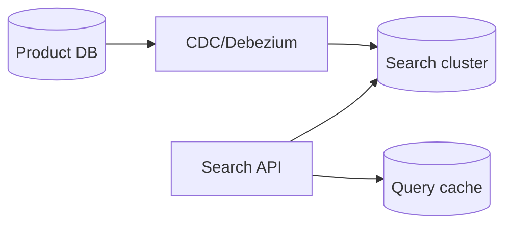

**Document structure:**
```json
{
  "productId": "123",
  "title": "Apple iPhone",
  "category": "Electronics",
  "price": 999,
  "attributes": {"color": "black"}
}
```

**Facets:** ES aggregations on category, brand, price ranges — parallel to hit query.

| Component | Role |
|-----------|------|
| Analyzer | Tokenization, stemming |
| Synonym filter | "laptop" = "notebook" |
| Suggest | Completion suggester for typos |

**Ranking:** BM25 default + business boosts (margin, stock, sponsored).

**Freshness:** Near-real-time ES refresh (1s) or pull from cache for price/stock overlay.

### Architecture Perspective

Search is inverted index + pipeline — don't query OLTP for full-text at 100M rows.

### Follow-up Questions

1. **Personalized search ranking? — Blend BM25 with user embedding; separate ranking service.**
2. **Search index rebuild without downtime? — Blue-green index alias swap.**

### Common Mistakes in Interviews

- SQL LIKE for catalog search
- Synchronous index on write path
- No spell correction or synonym handling

---

## Q027: CDN Architecture

| Attribute | Value |
|-----------|-------|
| **Difficulty** | Advanced |
| **Category** | Edge |
| **Frequency** | Common |

### Question

Design CDN strategy for global media and API acceleration. 10Tbps peak, 50ms latency worldwide.

### Short Answer (30 seconds)

Multi-CDN or single provider with PoPs; cache static assets aggressively; signed URLs for private content; edge compute for A/B and auth; origin shield; cache key design for API.

### Detailed Answer (3–5 minutes)

**What belongs on CDN:**
| Content | Cache | TTL |
|---------|-------|-----|
| Static JS/CSS/images | Yes | 1 year (hash in filename) |
| Video segments | Yes | Hours-days |
| Public API GET | Maybe | Short, cache-key by params |
| Personalized JSON | No* | *Unless edge compute |

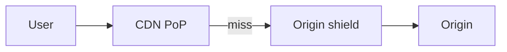

**Cache key design:** Include only relevant query params; strip session tokens.

**Invalidation:** Purge API on deploy; versioned asset URLs preferred over purge.

**Private content:** Signed cookies or URL tokens (CloudFront signed URLs).

**Origin shield:** Collapse miss storms — one request to origin per PoP region.

### Architecture Perspective

CDN is cost and latency optimization — architects know what NOT to cache.

### Follow-up Questions

1. **Multi-CDN failover? — DNS traffic management; health checks; higher ops complexity.**
2. **Edge compute (Workers/Lambda@Edge)? — Auth at edge, geo routing, HTML personalization.**

### Common Mistakes in Interviews

- Cache authenticated API responses without Vary header
- Same cache key for all users on personalized content
- No origin shield — thundering herd on deploy

---

## Q028: Load Balancer Architecture

| Attribute | Value |
|-----------|-------|
| **Difficulty** | Advanced |
| **Category** | Networking |
| **Frequency** | Very Common |

### Question

Design load balancing for 500K RPS HTTP API globally. L4 vs L7, health checks, session affinity.

### Short Answer (30 seconds)

L7 ALB/API Gateway at edge for path routing, TLS, WAF; L4 NLB for TCP/extreme throughput; round-robin + least connections; health checks every 30s; sticky sessions only when required.

### Detailed Answer (3–5 minutes)

**Layer comparison:**
| Layer | Routes on | Use case |
|-------|-----------|----------|
| L4 | IP + port | Gaming, MQTT, NLB passthrough |
| L7 | HTTP path/header | Microservices, TLS termination |

**Global:**
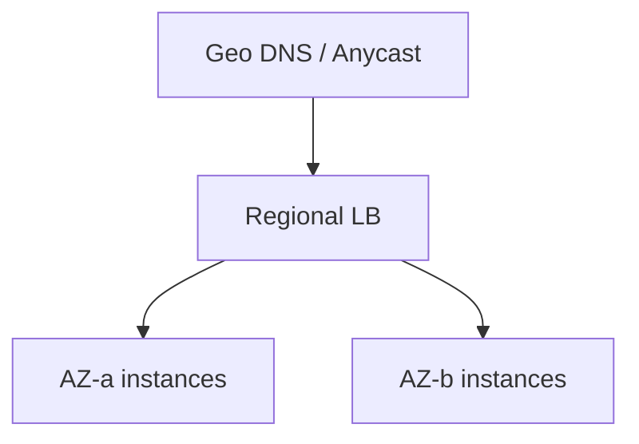

**Algorithms:**
| Algorithm | Best for |
|-----------|----------|
| Round robin | Equal capacity servers |
| Least connections | Long-lived requests |
| Weighted | Heterogeneous instance sizes |
| Consistent hash | Cache affinity |

**Health checks:** `/health` returning 200; drain connections before deregister (connection draining).

**Avoid sticky sessions** when possible — use shared Redis session store instead.

### Architecture Perspective

Load balancer choice is early in every design — L7 default for HTTP microservices.

### Follow-up Questions

1. **Active-active multi-region LB? — Global accelerator + regional LBs; session in global store.**
2. **gRPC load balancing? — Client-side LB or L7 proxy with HTTP/2 awareness (Envoy).**

### Common Mistakes in Interviews

- L7 LB for raw TCP binary protocol
- No health checks — route to dead instances
- Sticky sessions without failover plan

---

## Q029: Database Replication

| Attribute | Value |
|-----------|-------|
| **Difficulty** | Advanced |
| **Category** | Data |
| **Frequency** | Very Common |

### Question

Design MySQL/PostgreSQL replication for 99.99% availability. RPO 1 min, RTO 5 min. Read scaling.

### Short Answer (30 seconds)

Primary-replica async replication; read replicas for read scale; automatic failover (Patroni/Orchestrator); synchronous replica for zero RPO if required; connection router sends writes to primary.

### Detailed Answer (3–5 minutes)

**Topology:**
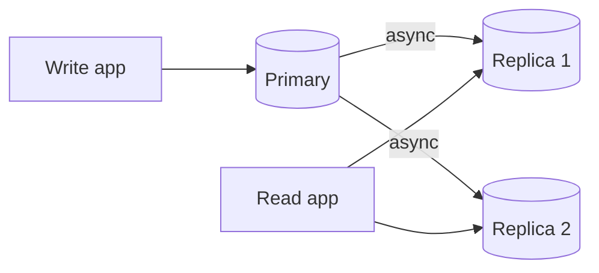

| Mode | RPO | Throughput |
|------|-----|------------|
| Async | Seconds | Highest |
| Semi-sync | 1 replica ack | Medium |
| Sync | Zero | Lower (latency) |

**Failover:** Monitor primary heartbeat; promote replica with most recent LSN; update DNS/VIP; fence old primary.

**Read replica lag:** Monitor seconds_behind_master; route stale-sensitive reads to primary.

**Multi-region:** Cross-region async replication; higher lag; regional read replicas for local reads.

### Architecture Perspective

Replication underpins every HA discussion — know RPO/RTO trade-offs by replication mode.

### Follow-up Questions

1. **Split-brain after failover? — Quorum + fencing (STONITH); prefer brief unavailability over dual-write.**
2. **Read your writes consistency? — Route same-user reads to primary or track replication LSN in session.**

### Common Mistakes in Interviews

- Assume sync replication with no latency cost
- No replica lag monitoring
- Failover without fencing old primary

---

## Q030: Caching Layers Strategy

| Attribute | Value |
|-----------|-------|
| **Difficulty** | Advanced |
| **Category** | Caching |
| **Frequency** | Very Common |

### Question

Design a multi-layer caching strategy for a read-heavy e-commerce site. Product catalog, sessions, cart.

### Short Answer (30 seconds)

Browser → CDN → API gateway cache → app local cache → Redis cluster → DB; different TTL and invalidation per layer; cache-aside default; write-through for cart.

### Detailed Answer (3–5 minutes)

**Layer responsibilities:**
| Layer | Content | TTL |
|-------|---------|-----|
| Browser | Static assets | Long (immutable hashes) |
| CDN | Product images, static API | Minutes-hours |
| Redis | Product details, sessions | Minutes |
| App L1 | Hot config, feature flags | Seconds |
| DB buffer pool | Rows | Managed |

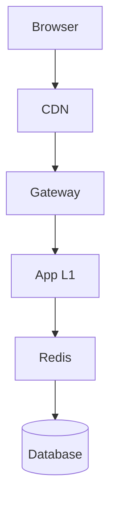

**Invalidation cascade:** Product update → purge Redis → publish invalidation event → CDN purge API → version bump on static JSON.

**Cart:** Write-through to Redis; async persist to DB; session affinity optional with Redis backing.

**Metrics per layer:** Hit ratio, latency contribution, memory — tune TTL where miss rate spikes.

### Architecture Perspective

Layered cache shows holistic thinking — each tier has different consistency and TTL semantics.

### Follow-up Questions

1. **When skip a layer? — Small apps: browser + Redis + DB sufficient; don't over-engineer L1.**
2. **Cache warming on deploy? — Preload hot keys; gradual traffic shift (canary).**

### Common Mistakes in Interviews

- Same TTL for all data types
- Invalidate CDN without versioned URLs
- No monitoring of per-layer hit rates

---

**Next:** [Part 3](system-design-top-50-qa-part3.md) →
