# System Design Top 50 — Part 3 (Q031–Q050)

> [Part 1](system-design-top-50-qa-part1.md) | [Part 2](system-design-top-50-qa-part2.md) | [Index](system-design-top-50-index.md)

---


## Q031: E-Commerce Checkout

| Attribute | Value |
|-----------|-------|
| **Difficulty** | Advanced |
| **Category** | Full Scenario |
| **Frequency** | Very Common |

### Question

Design checkout for 5K orders/minute. Cart, inventory, payment, order creation. Handle partial failures.

### Short Answer (30 seconds)

Cart in Redis → inventory reservation (TTL 15 min) → idempotent payment → order persist → saga with compensation (release inventory, refund) on failure; outbox for downstream events.

### Detailed Answer (3–5 minutes)

**Saga flow:**
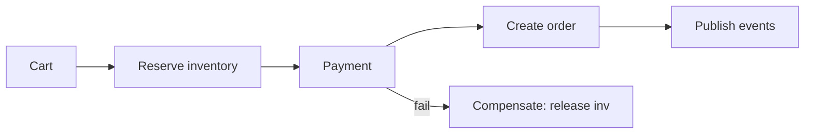

| Step | Failure handling |
|------|------------------|
| Reserve inventory | Return 409 insufficient stock |
| Payment fail | Release reservation |
| Order create fail | Refund payment + release |

**Inventory:** `DECRBY sku:123 reserved` with check ≥0 atomic; or row lock in DB for low SKU count.

**Idempotency:** Client sends `Idempotency-Key`; server returns cached result on retry.

**Scale:** 5K/min ≈ 83/sec — moderate; peak 3× plan for flash sales with queue admission.

See also: [mock-05 checkout](mock-interviews/mock-05-system-design-checkout.md).

### Architecture Perspective

Checkout is the canonical saga interview — compensation paths matter more than happy path.

### Follow-up Questions

1. **Flash sale 10× traffic? — Queue + waiting room; oversell protection with atomic counters.**
2. **Split shipment partial fulfillment? — Sub-orders; partial capture on payment.**

### Common Mistakes in Interviews

- Two-phase commit across all services
- No inventory reservation TTL
- Payment retry without idempotency key

---

## Q032: Notification System (Full Design)

| Attribute | Value |
|-----------|-------|
| **Difficulty** | Advanced |
| **Category** | Full Scenario |
| **Frequency** | Common |

### Question

Design enterprise notification platform: email, SMS, push, in-app, webhooks. 100M users, templates, analytics, compliance.

### Short Answer (30 seconds)

Event ingestion → rules engine (who, what channel) → template render → provider abstraction → delivery tracking → analytics pipeline; CAN-SPAM/GDPR preference center; priority lanes.

### Detailed Answer (3–5 minutes)

**Extended architecture:**
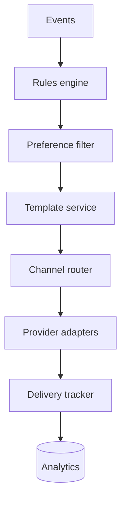

**Tracking states:** queued → sent → delivered → opened → clicked (email pixels/links).

**Compliance:** Opt-in audit log; unsubscribe one-click; regional SMS regulations (10DLC).

**Webhook outbound:** HMAC-SHA256 signature; retry 3× exponential; customer idempotency docs.

**Analytics:** Kafka → Flink aggregations → dashboard (delivery rate, latency by channel).

**Multi-tenant:** Template namespace; isolated provider API keys per tenant.

### Architecture Perspective

Full notification design adds compliance, analytics, and webhooks — beyond basic queue workers.

### Follow-up Questions

1. **In-app notification feed storage? — Per-user inbox table partitioned by userId; mark read API.**
2. **A/B test notification copy? — Experiment flag in rules engine; track conversion per variant.**

### Common Mistakes in Interviews

- No unsubscribe mechanism
- Same provider key for all tenants
- Blocking domain logic on SMS send completion

---

## Q033: Ride-Sharing Platform

| Attribute | Value |
|-----------|-------|
| **Difficulty** | Advanced |
| **Category** | Full Scenario |
| **Frequency** | Very Common |

### Question

Design Uber/Lyft: real-time driver location, rider request, matching, ETA, surge pricing.

### Short Answer (30 seconds)

Driver location stream (Kafka) → geospatial index (Redis GEO / QuadTree) → matching service (nearest available) → dispatch with timeout → ETA via routing graph → surge by supply/demand ratio.

### Detailed Answer (3–5 minutes)

**Real-time location:**
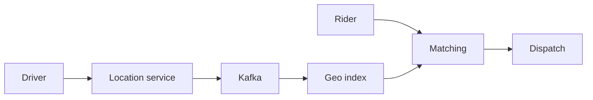

**Matching:** Query drivers within 2km radius → filter available → rank by distance, rating, acceptance rate → offer to top 3 sequentially with 15s timeout.

**ETA:** Precomputed road graph (OSRM/Google); cache frequent routes; update with live traffic feed.

**Surge:** `multiplier = f(demand/supply)` per geo cell (H3 hex grid); update every 2 min.

**Trip state machine:** requested → matched → arrived → in_progress → completed → payment.

### Architecture Perspective

Geospatial indexing + streaming location is the differentiator from generic CRUD designs.

### Follow-up Questions

1. **Driver going offline mid-match? — Heartbeat 30s; re-match rider on timeout.**
2. **Pool/shared rides? — Match compatible routes; detour constraint in algorithm.**

### Common Mistakes in Interviews

- Poll DB for driver locations
- Match without timeout — rider waits forever
- No surge isolation between adjacent cells

---

## Q034: Dropbox File Sync

| Attribute | Value |
|-----------|-------|
| **Difficulty** | Advanced |
| **Category** | Full Scenario |
| **Frequency** | Common |

### Question

Design Dropbox: upload, sync across devices, conflict resolution, sharing, 500M users.

### Short Answer (30 seconds)

Metadata DB (files, versions, ACLs) + blob storage (S3); content-defined chunking + hash dedup; delta sync (rsync-style); vector clock or version tree for conflicts; notification via long poll/WebSocket.

### Detailed Answer (3–5 minutes)

**Sync protocol:**
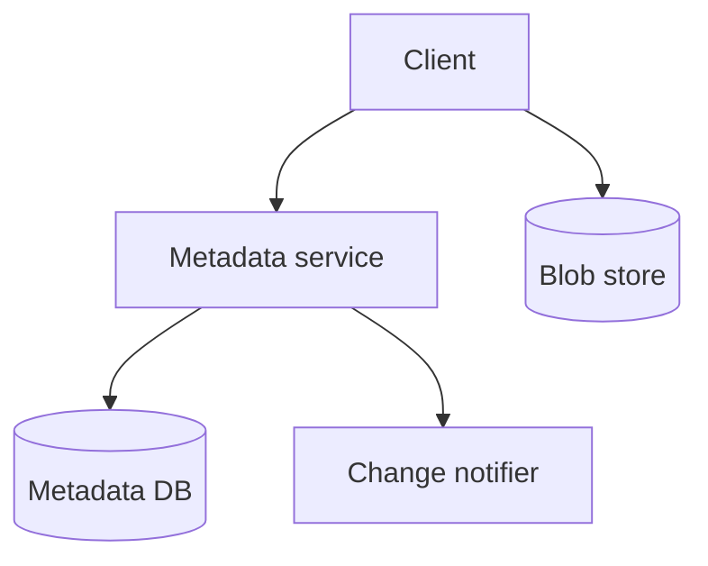

**Chunking:** Split file 4MB blocks → SHA256 hash → upload only changed chunks (dedup saves storage).

**Conflict:** Last-write-wins for casual users; version branch for power users (save both copies).

**Sharing:** ACL table (fileId, userId, permission); signed download URLs.

**Scale:** Metadata hot path in SQL sharded by userId; blobs infinitely scalable on object store.

**Mobile:** Background sync queue; bandwidth-aware (WiFi only setting).

### Architecture Perspective

Content-hash chunking and dedup separates Dropbox from naive 'upload whole file' designs.

### Follow-up Questions

1. **End-to-end encryption (Zero Knowledge)? — Client-side encrypt; server stores ciphertext; no dedup across users.**
2. **Large team shared folders? — Namespace permissions; activity log; quota per team.**

### Common Mistakes in Interviews

- Upload entire file on every save
- No conflict detection — silent overwrite
- Metadata and blob on same SQL server

---

## Q035: Ticketmaster Scale Design

| Attribute | Value |
|-----------|-------|
| **Difficulty** | Advanced |
| **Category** | Full Scenario |
| **Frequency** | Very Common |

### Question

Design high-demand concert on-sale: 500K users, 20K seats, zero double booking, fair queue.

### Short Answer (30 seconds)

Virtual waiting room with random shuffle → admit N users/min → seat service with Redis atomic locks → payment window 10 min → anti-bot (CAPTCHA, device ID) → static seat map CDN with dynamic availability overlay.

### Detailed Answer (3–5 minutes)

**Scale tactics:**
| Tactic | Purpose |
|--------|---------|
| Waiting room | Protect origin from 500K simultaneous |
| Queue tokens | Fair admission, prevent refresh advantage |
| Edge caching | Static venue map at CDN |
| WebSocket | Live seat availability updates |

**Architecture extension of Q020:**
- Pre-load seat map into Redis before on-sale
- Atomic Lua script: check available + lock + decrement in one op
- Idempotent booking token prevents double-submit

**Observability:** Queue depth, lock contention rate, payment conversion funnel.

**Post-sale:** Waitlist queue for cancelled holds backfill.

### Architecture Perspective

Combines concurrency (Q020) with traffic shaping — interviewers test both fairness and correctness.

### Follow-up Questions

1. **Dynamic pricing during queue? — Display price at lock time; honor locked price for TTL.**
2. **Accessibility / verified fan programs? — Separate queue pool with identity verification.**

### Common Mistakes in Interviews

- Allow refresh to skip queue
- Optimistic UI showing seat available without lock
- No bot mitigation on high-value on-sales

---

## Q036: Instagram Design

| Attribute | Value |
|-----------|-------|
| **Difficulty** | Advanced |
| **Category** | Full Scenario |
| **Frequency** | Very Common |

### Question

Design Instagram: photo upload, feed, stories, likes, follow graph. 1B users, 100M DAU.

### Short Answer (30 seconds)

Blob + CDN for media; metadata in Cassandra (posts by userId); feed via hybrid fan-out; stories TTL 24h separate store; likes sharded counter; social graph in separate service.

### Detailed Answer (3–5 minutes)

**Media pipeline:** Upload → transcoding (thumbnails) → CDN → metadata write.

**Feed:** Hybrid fan-out (see Q012); rank by engagement score.

**Stories:** Separate Redis TTL store (24h expiry); ring buffer per user; viewed-by bitmap.

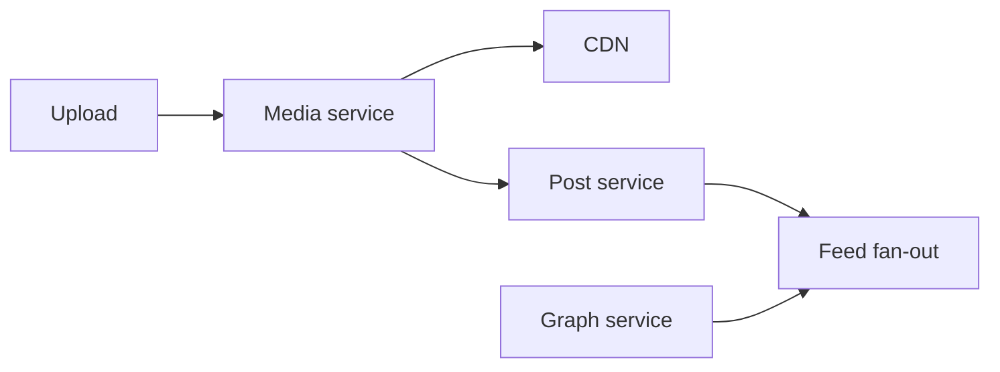

**Likes:** Sharded Redis counter + async persist; approximate OK for display.

**Explore/discover:** ML ranker on candidate generation from graph + interests — offline batch + online serve.

### Architecture Perspective

Instagram bundles media CDN, social graph, and feed — hit each subsystem briefly then deep dive one.

### Follow-up Questions

1. **Comments threading at scale? — Partition by postId; paginate cursor; hot post comment cache.**
2. **Direct messaging overlap? — Reuse chat architecture (Q011) with separate partition.**

### Common Mistakes in Interviews

- Store images in database BLOB
- Fan-out on write for celebrity accounts
- No CDN for photo delivery

---

## Q037: Twitter/X Timeline

| Attribute | Value |
|-----------|-------|
| **Difficulty** | Advanced |
| **Category** | Full Scenario |
| **Frequency** | Very Common |

### Question

Design home timeline and tweet posting. 400M users, 500M tweets/day, celebrity accounts.

### Short Answer (30 seconds)

Tweet write → fan-out hybrid; timeline cache Redis sorted sets; tweet store sharded by tweetId; retweet/quote as reference not copy; search index async; trending via stream aggregation.

### Detailed Answer (3–5 minutes)

**Post tweet:**
1. Persist tweet (userId, content, ts, tweetId)
2. Fan-out to followers (unless celebrity flag)
3. Update search index async

**Read timeline:**
1. Fetch precomputed timeline IDs from Redis
2. Merge celebrity tweets from pull cache
3. Hydrate tweet objects (batch mget)
4. Apply ranker (optional)

| Storage | Key pattern |
|---------|-------------|
| Tweet | tweet:{id} |
| User timeline | timeline:{userId} (sorted set) |
| Fan-out queue | Async workers for bulk push |

**Retweet:** Store pointer to original tweetId — avoid duplicate content.

**Trending:** Count hashtags in 5-min windows via Flink; locality per country.

### Architecture Perspective

Twitter timeline IS the fan-out question in product form — expect deep dive on celebrity hybrid.

### Follow-up Questions

1. **Quote tweet vs retweet storage? — Quote stores new tweet with embedded reference ID.**
2. **Edit tweet (30 min window)? — Version chain; serve latest to timeline; audit old versions.**

### Common Mistakes in Interviews

- Materialize full tweet in every follower timeline
- No async fan-out workers — block post request
- Global trending without sharded aggregation

---

## Q038: Uber ETA Service

| Attribute | Value |
|-----------|-------|
| **Difficulty** | Advanced |
| **Category** | Full Scenario |
| **Frequency** | Common |

### Question

Design ETA prediction for ride-hailing: pickup ETA, trip duration, update every 30 seconds.

### Short Answer (30 seconds)

Road graph database (OSRM/custom); ML model on historical trips (time of day, weather); live traffic ingestion; cache ETA(origin, dest, time_bucket); WebSocket push updates to client.

### Detailed Answer (3–5 minutes)

**ETA pipeline:**
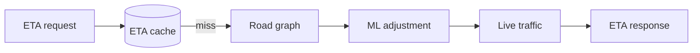

**Components:**
| Component | Role |
|-----------|------|
| Graph server | Shortest path baseline |
| ML model | Adjust for real-world vs theoretical |
| Traffic feed | Incidents, congestion |
| Geofence | Airport rules, one-way streets |

**Cache key:** `(origin_cell, dest_cell, hour_of_week)` — H3 hex ~500m resolution.

**Accuracy metric:** MAE < 2 min for pickup; monitor p95 error by city.

**Update loop:** Driver location stream recalculates en route every 30s.

### Architecture Perspective

ETA is graph + ML + streaming — show you know map data is precomputed not live Dijkstra every request.

### Follow-up Questions

1. **Multi-stop trip ETA? — Sum segments; reoptimize order for pool rides (TSP heuristic).**
2. **Offline maps vs online? — Cache graph tiles regionally; fallback when connectivity poor.**

### Common Mistakes in Interviews

- Straight-line distance for ETA
- No traffic data integration
- Recalculate full path every second per active trip

---

## Q039: Yelp / Local Search

| Attribute | Value |
|-----------|-------|
| **Difficulty** | Advanced |
| **Category** | Full Scenario |
| **Frequency** | Common |

### Question

Design Yelp: business search, reviews, ratings, geo filters. 200M reviews, search by location + category.

### Short Answer (30 seconds)

Geo-sharded index (Elasticsearch geo_point); reviews partitioned by businessId; rating aggregate cached; search + filter + sort by distance/rating; photo CDN separate.

### Detailed Answer (3–5 minutes)

**Search query:** "Italian restaurants within 2km" → geo filter + text match + sort by rating/distance.

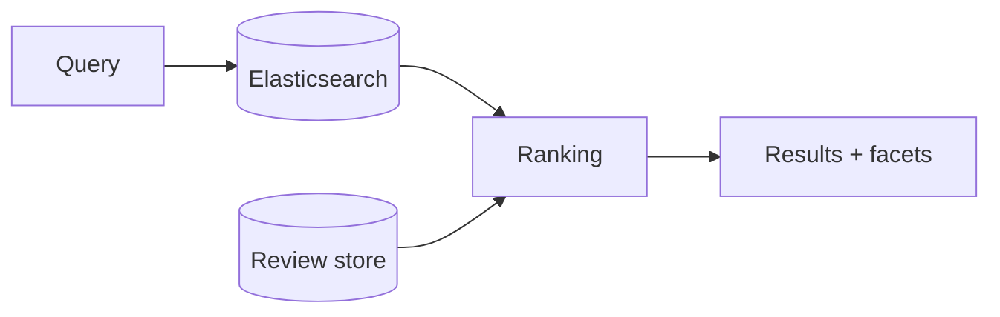

**Review write:** Insert review → async update business aggregate (count, avg rating) → invalidate cache.

**Ranking signals:** Wilson score (statistical rating), review count, distance, sponsored boost.

**Sharding:** Businesses geo-sharded or ES cluster handles geo natively.

**Abuse:** Review fraud detection ML; rate limit reviews per user per day.

### Architecture Perspective

Local search combines geo + full-text + aggregated ratings — three data patterns in one design.

### Follow-up Questions

1. **Business owner claims listing? — Verification workflow; separate admin API.**
2. **Real-time busy hours (like Google)? — Anonymized visit stream; heatmap by hour.**

### Common Mistakes in Interviews

- Calculate average rating on every search query
- Single global SQL table for geo search
- No review spam controls

---

## Q040: Distributed Lock

| Attribute | Value |
|-----------|-------|
| **Difficulty** | Advanced |
| **Category** | Infrastructure |
| **Frequency** | Very Common |

### Question

Design a distributed lock service for coordinating jobs across 100 servers. Avoid split brain.

### Short Answer (30 seconds)

Redis Redlock or etcd/ZooKeeper consensus lock; fencing token monotonic; TTL prevents deadlock; renew heartbeat for long jobs; prefer DB advisory lock only for low scale.

### Detailed Answer (3–5 minutes)

**Redis single-instance lock (simple):**
```
SET lock:resource uuid NX EX 30
```
Release with Lua compare-and-del (only owner releases).

**Redlock:** Quorum across N independent Redis masters; controversial — know trade-offs.

**etcd/consensus (preferred for correctness):**
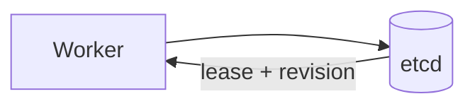

**Fencing token:** Lock returns monotonic token; resource (DB) rejects writes with stale token — prevents delayed worker from corrupting data after lock lost.

| Approach | Correctness | Complexity |
|----------|-------------|------------|
| Redis SET NX | Good with fencing | Low |
| Redlock | Debated | Medium |
| etcd lease | Strong | Medium |

**Always set TTL** — prevent dead worker holding lock forever.

### Architecture Perspective

Distributed locks are easy to get wrong — fencing token separates senior answers.

### Follow-up Questions

1. **Lock vs leader election? — Leader election is long-held lock with watch notification on loss.**
2. **Database advisory lock (pg_advisory_lock)? — OK single-DB low scale; not cross-service.**

### Common Mistakes in Interviews

- Lock without TTL — deadlock on crash
- Release lock without verifying owner
- Redlock without mentioning Martin Kleppmann critique

---

## Q041: Metrics and Monitoring System

| Attribute | Value |
|-----------|-------|
| **Difficulty** | Expert |
| **Category** | Observability |
| **Frequency** | Common |

### Question

Design metrics collection for 10K microservices. 1M metrics/sec, dashboards, alerting.

### Short Answer (30 seconds)

Prometheus pull or OTLP push → time-series DB (Prometheus/Cortex/Mimir) → Grafana dashboards; recording rules for aggregates; Alertmanager for routing; cardinality control.

### Detailed Answer (3–5 minutes)

**Pipeline:**
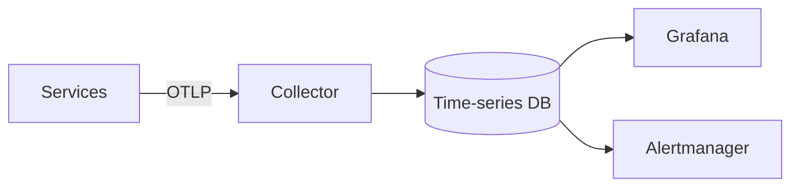

**Metric types:**
| Type | Example |
|------|---------|
| Counter | requests_total |
| Gauge | queue_depth |
| Histogram | request_duration_seconds |

**Cardinality explosion:** Avoid high-cardinality labels (userId); aggregate at scrape or recording rule.

**Retention:** 15 days hot → downsample → 1 year cold (Thanos/Cortex).

**SLI/SLO:** Error rate + latency histogram → burn rate alerts (multi-window).

### Architecture Perspective

Metrics design is increasingly asked — know pull vs push and cardinality limits.

### Follow-up Questions

1. **Logs vs metrics vs traces? — Metrics for aggregates; traces for request path; logs for details.**
2. **Custom business metrics at checkout? — orders_completed_total counter with status label.**

### Common Mistakes in Interviews

- userId as metric label — cardinality disaster
- No alerting on SLO burn rate
- Single Prometheus for 1M metrics/sec

---

## Q042: Logging Aggregation

| Attribute | Value |
|-----------|-------|
| **Difficulty** | Expert |
| **Category** | Observability |
| **Frequency** | Common |

### Question

Design centralized logging for 50TB/day across 5000 servers. Search, retention, cost control.

### Short Answer (30 seconds)

Structured JSON logs → agent (Fluent Bit) → Kafka buffer → Elasticsearch/OpenSearch hot tier → S3 cold archive; index by service/environment; 30-day hot, 1-year cold.

### Detailed Answer (3–5 minutes)

**Architecture:**
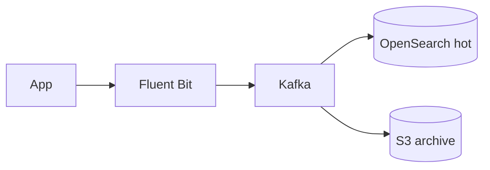

**Structured logging:**
```json
{"ts":"...","level":"ERROR","service":"payment","traceId":"abc","msg":"..."}
```

**Cost control:**
| Tier | Retention | Storage |
|------|-----------|---------|
| Hot | 7-30 days | SSD index |
| Warm | 90 days | Reduced replicas |
| Cold | 1+ year | S3 + Athena query |

**Sampling:** 100% ERROR; 1% DEBUG in prod; always keep audit/security logs.

**Correlation:** traceId links logs ↔ traces (Jaeger/Tempo).

### Architecture Perspective

Log volume at scale forces tiered retention — interviewers want cost-aware design.

### Follow-up Questions

1. **PII in logs? — Scrub at agent; field-level redaction; GDPR delete propagation.**
2. **Log-based alerting vs metrics? — Metrics preferred for alerts; logs for investigation.**

### Common Mistakes in Interviews

- Plain text unstructured logs at scale
- Infinite hot retention on SSD
- No trace correlation ID

---

## Q043: Configuration Service

| Attribute | Value |
|-----------|-------|
| **Difficulty** | Expert |
| **Category** | Infrastructure |
| **Frequency** | Common |

### Question

Design a dynamic configuration service for 500 microservices. Feature flags, gradual rollout, audit trail.

### Short Answer (30 seconds)

Central config store (etcd/Consul/AppConfig) → watch/subscribe push to clients; versioned namespaces per env; feature flag with percentage rollout; audit log on change; cache locally with fallback.

### Detailed Answer (3–5 minutes)

**Model:**
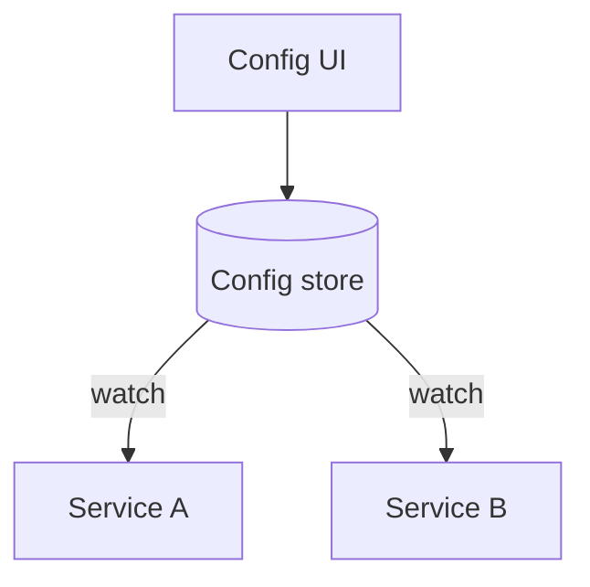

| Feature | Implementation |
|---------|----------------|
| Versioning | Git-backed or revision numbers |
| Rollout | Flag: 5% → 25% → 100% by user hash |
| Rollback | Instant revert to previous revision |
| Secrets | Separate vault; never in config service |

**Client SDK:** Local cache + long poll/watch; stale cache OK for non-critical flags; fail-safe defaults.

**Examples:** LaunchDarkly, Azure App Configuration, Consul KV.

### Architecture Perspective

Config service enables safe deploys — connect to feature flags and blast radius reduction.

### Follow-up Questions

1. **Config change without restart? — Push watch updates; IOptionsMonitor pattern in .NET.**
2. **Multi-region config consistency? — Eventually consistent OK; critical flags use consensus store.**

### Common Mistakes in Interviews

- Config in code only — require redeploy for toggle
- Secrets in same store as feature flags
- No audit trail on production config changes

---

## Q044: Distributed Key-Value Store

| Attribute | Value |
|-----------|-------|
| **Difficulty** | Expert |
| **Category** | Storage |
| **Frequency** | Very Common |

### Question

Design Dynamo-style distributed KV store. Partitioning, replication, eventual consistency, conflict resolution.

### Short Answer (30 seconds)

Consistent hash partitioning; N replicas (typically 3); quorum read/write (R+W>N); vector clocks for conflict detection; hinted handoff on temporary failure; anti-entropy repair (Merkle trees).

### Detailed Answer (3–5 minutes)

**Dynamo principles:**
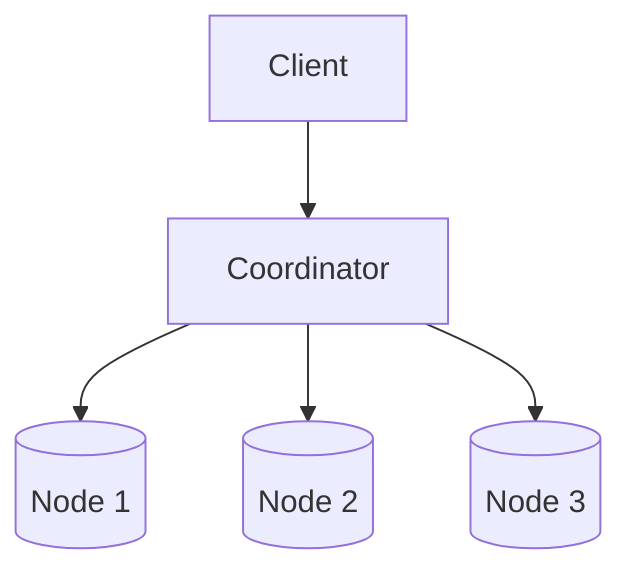

| Parameter | Typical |
|-----------|---------|
| N replicas | 3 |
| W write quorum | 2 |
| R read quorum | 2 |

**Conflict:** Vector clock detects concurrent writes → return all versions to client (last-write-wins or merge).

**Failure handling:**
- **Hinted handoff:** Temporarily store for down node
- **Read repair:** Fix stale replica on read
- **Merkle tree:** Compare checksums between replicas periodically

**Not ACID:** Eventually consistent; tuned for availability (AP in CAP).

### Architecture Perspective

Dynamo/paper questions test CAP understanding — quorum math is expected.

### Follow-up Questions

1. **Dynamo vs Cassandra? — Cassandra implements Dynamo model with CQL; know lineage.**
2. **When strong consistency? — R+W > N with W=ALL — latency cost.**

### Common Mistakes in Interviews

- Single replica — no durability
- Last-write-wins without vector clocks for concurrent writes
- Ignore hinted handoff on node failure

---

## Q045: Distributed Rate Limiter

| Attribute | Value |
|-----------|-------|
| **Difficulty** | Expert |
| **Category** | Infrastructure |
| **Frequency** | Common |

### Question

Design rate limiting across 20 API regions without single Redis bottleneck. 10M users, tiered limits.

### Short Answer (30 seconds)

Global counter via Redis Cluster with local token bucket fallback; or regional budgets + async sync; GCRA algorithm; edge rate limit (CDN/API gateway) + regional enforcement.

### Detailed Answer (3–5 minutes)

**Multi-region options:**
| Approach | Accuracy | Latency |
|----------|----------|---------|
| Global Redis Cluster | Exact | Cross-region RTT |
| Regional + sync | Approximate | Low local |
| Edge + regional | Coarse + fine | Lowest |

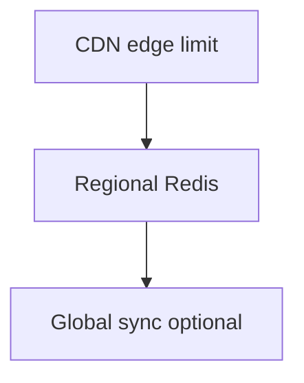

**Tiered limits:**
| Tier | Limit |
|------|-------|
| Free | 100 req/min |
| Pro | 10K req/min |
| Enterprise | Custom contract |

**GCRA (Generic Cell Rate Algorithm):** Used in Envoy; smooth limiting with burst.

**Response:** 429 + Retry-After; distinguish burst vs sustained violation in headers.

### Architecture Perspective

Extends Q010 to multi-region — shows evolution from single Redis to hierarchical limiting.

### Follow-up Questions

1. **Rate limit distributed cron jobs? — Token per job type globally; leader election for scheduler.**
2. **DDoS vs user rate limit? — Edge network (Cloudflare) for DDoS; app limit for quotas.**

### Common Mistakes in Interviews

- Single global Redis at 10M users — latency and SPOF
- Exact global count without cross-region cost analysis
- Same limit for free and enterprise tiers

---

## Q046: Message Queue System Design

| Attribute | Value |
|-----------|-------|
| **Difficulty** | Expert |
| **Category** | Messaging |
| **Frequency** | Very Common |

### Question

Design a message queue like SQS/RabbitMQ. Ordering, durability, at-least-once delivery, DLQ.

### Short Answer (30 seconds)

Partitioned log (Kafka-style) or broker queues; persist to disk before ack; consumer groups; visibility timeout (SQS); dead letter queue after N failures; idempotent consumers.

### Detailed Answer (3–5 minutes)

**SQS-style semantics:**
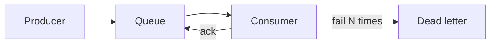

| Guarantee | Mechanism |
|-----------|-----------|
| Durability | Replicate to disk before ACK |
| At-least-once | Visibility timeout + redelivery |
| Ordering | Single partition / FIFO queue |
| Backpressure | Queue depth monitoring + scale consumers |

**Kafka vs SQS:**
| | Kafka | SQS |
|---|-------|-----|
| Model | Log (replay) | Queue (delete on ack) |
| Ordering | Per partition | FIFO variant |
| Throughput | Very high | High managed |

**Consumer design:** Idempotent processing + dedup store (processed message IDs).

### Architecture Perspective

Message queue questions test delivery semantics — at-least-once + idempotent consumer is the standard answer.

### Follow-up Questions

1. **Exactly-once semantics? — Kafka transactions or idempotent producer + dedup; expensive.**
2. **Priority queues? — Separate queues per priority; weighted consumer allocation.**

### Common Mistakes in Interviews

- Assume exactly-once without idempotent consumers
- No DLQ — poison message blocks queue
- Unbounded queue without consumer scaling plan

---

## Q047: Payment System Design

| Attribute | Value |
|-----------|-------|
| **Difficulty** | Expert |
| **Category** | Full Scenario |
| **Frequency** | Very Common |

### Question

Design payment processing: authorize, capture, refund, idempotency. PCI compliance, 99.99% accuracy.

### Short Answer (30 seconds)

Tokenized cards (Stripe/Adyen); payment state machine; idempotency keys; ledger double-entry accounting; webhook reconciliation; never store raw PAN.

### Detailed Answer (3–5 minutes)

**State machine:**
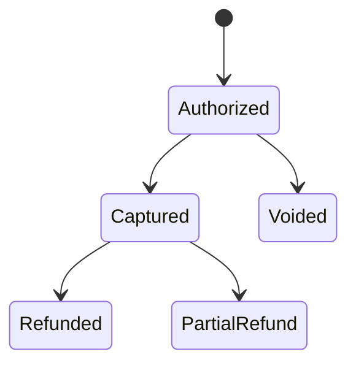

**Architecture:**
| Component | Role |
|-----------|------|
| Payment gateway adapter | Stripe/Adyen abstraction |
| Ledger service | Double-entry audit trail |
| Idempotency store | Prevent duplicate charges |
| Reconciliation worker | Match provider webhooks to internal state |

**PCI:** SAQ-A — card data never touches your servers (hosted fields / tokenization).

**Failure:** Timeout → query provider status before retry (avoid double charge).

**Ledger:** Every money movement = debit + credit entries; immutable append-only.

### Architecture Perspective

Payment design demands idempotency and ledger — financial correctness over availability theater.

### Follow-up Questions

1. **Multi-currency? — Presentment vs settlement currency; FX rate snapshot at capture.**
2. **Chargeback workflow? — Dispute state; evidence upload; link to original transaction.**

### Common Mistakes in Interviews

- Store credit card numbers in database
- Retry failed payment without idempotency key
- No reconciliation with payment provider

---

## Q048: Fraud Detection System

| Attribute | Value |
|-----------|-------|
| **Difficulty** | Expert |
| **Category** | Full Scenario |
| **Frequency** | Common |

### Question

Design real-time fraud detection for e-commerce checkout. <100ms decision, minimize false positives.

### Short Answer (30 seconds)

Feature extraction stream → rules engine (hard blocks) → ML model score → decision (approve/review/decline); feature store; human review queue for borderline; feedback loop for model retrain.

### Detailed Answer (3–5 minutes)

**Decision pipeline:**
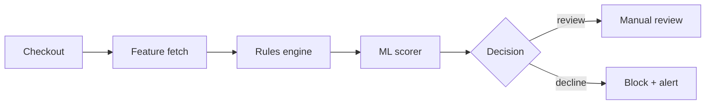

**Features:** Velocity (5 txns/10min), device fingerprint, geo mismatch, email domain age, amount anomaly.

| Layer | Latency | Purpose |
|-------|---------|---------|
| Rules | <5ms | Known bad patterns |
| ML | <50ms | Novel fraud |
| Graph | Async | Ring detection |

**False positive cost:** Lost revenue + customer anger — tune threshold for review band (0.4-0.7 score).

**Compliance:** Model explainability for disputes; audit log per decision.

### Architecture Perspective

Fraud is rules + ML + human review — show latency budget and false positive trade-off.

### Follow-up Questions

1. **Real-time graph fraud (shared cards)? — Neo4j or custom graph batch; not in 100ms path.**
2. **Account takeover vs payment fraud? — Separate models; credential stuffing rules on login.**

### Common Mistakes in Interviews

- Block all high-value orders — revenue loss
- ML only without explainable rules layer
- No manual review queue for edge cases

---

## Q049: Multi-Region Architecture

| Attribute | Value |
|-----------|-------|
| **Difficulty** | Expert |
| **Category** | Infrastructure |
| **Frequency** | Very Common |

### Question

Design active-active multi-region deployment for global SaaS. US, EU, APAC. Data residency, latency, conflicts.

### Short Answer (30 seconds)

Geo-routed DNS/Global Accelerator; regional stacks with data replication; CRDT or last-write-wins for conflicts; strong consistency within region; async cross-region; GDPR data stays in EU region.

### Detailed Answer (3–5 minutes)

**Topology:**
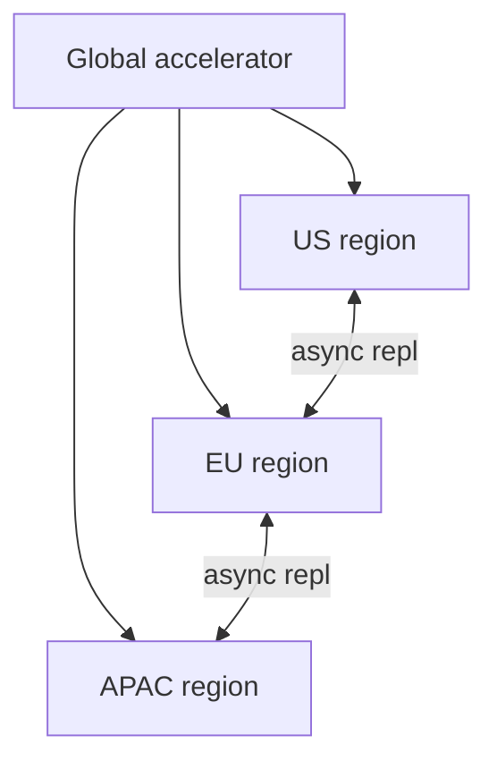

| Concern | Pattern |
|---------|---------|
| Latency | Route user to nearest region |
| Data residency | EU PII never leaves EU |
| Consistency | Strong local, eventual global |
| Failover | Health check → drain → redirect |

**Conflict resolution:** Version vectors; application merge; avoid cross-region synchronous transactions.

**Cost:** 3× infrastructure baseline + cross-region egress — justify with SLA/revenue.

### Architecture Perspective

Multi-region is the capstone infrastructure question — tie to CAP, residency, and failover RTO.

### Follow-up Questions

1. **Active-passive vs active-active? — Active-passive simpler; active-active for zero RTO read path.**
2. **Global database (Spanner/Cosmos multi-write)? — Strong consistency option at premium cost/latency.**

### Common Mistakes in Interviews

- Synchronous cross-region writes for all data
- Ignore GDPR data residency
- No conflict resolution strategy for concurrent edits

---

## Q050: System Design Capstone Rubric

| Attribute | Value |
|-----------|-------|
| **Difficulty** | Expert |
| **Category** | Interview Readiness |
| **Frequency** | Common |

### Question

How do you self-evaluate a system design interview answer? Provide a rubric scoring ≥75/100 for readiness.

### Short Answer (30 seconds)

Score 5 dimensions × 20 points: Requirements (20), Estimation (20), High-level design (20), Deep dive (20), Ops/failures (20). Pass ≥75. Practice 5 full designs timed 45 min.

### Detailed Answer (3–5 minutes)

**Rubric (100 points):**
| Dimension | 20 pts criteria | Common deductions |
|-----------|-----------------|-------------------|
| Requirements | Functional + NFR clarified; assumptions stated | Jump to diagram (-10) |
| Estimation | QPS, storage, bandwidth with math | No numbers (-15) |
| High-level | Clear components, data flow, APIs | Spaghetti diagram (-10) |
| Deep dive | 2 components with trade-offs | Surface-level only (-10) |
| Ops/failures | Monitoring, scaling, failure modes | Happy path only (-15) |

**Time management (45 min):**
| Phase | Minutes |
|-------|---------|
| Requirements | 5 |
| Estimation | 5 |
| High-level | 10 |
| Deep dive | 15 |
| Wrap-up | 5 |
| Buffer | 5 |

**Month 9 capstone:** Complete 5 designs (URL shortener, feed, chat, checkout, ride-share) each scored ≥75 by peer or mentor.

**Pitch template (2 min):** Problem → scale → architecture → key trade-off → how it fails.

### Architecture Perspective

Meta-question closing the Top 50 — shows interview process maturity and self-assessment discipline.

### Follow-up Questions

1. **RESHADED vs C4? — RESHADED for whiteboard interview; C4 for documentation deliverables.**
2. **Map design to Azure/AWS quickly? — App Service/AKS/SQL/Redis vs ALB/ECS/RDS/ElastiCache.**

### Common Mistakes in Interviews

- No estimation in any design
- Cannot name single trade-off decision
- Never timed full 45-min practice

---

**Complete:** [Index](system-design-top-50-index.md) | [Mock interviews](mock-interviews/README.md)
