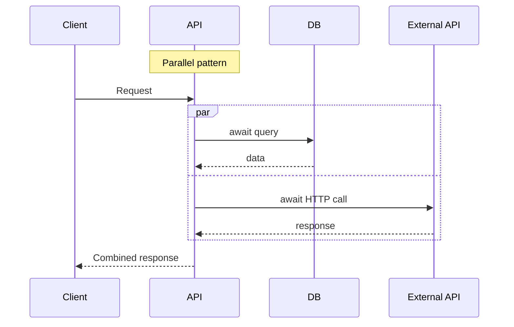

# Week 01 Assessment — C# Language Mastery

| Attribute | Value |
|-----------|-------|
| **Time Limit** | 60 minutes |
| **Pass Score** | 70% |
| **Expert Score** | 90% |

---

## Section A: Conceptual (30 points)

### A1. Value vs Reference Types in System Design (10 pts)

You are designing a high-frequency trading analytics API that processes 50,000 price ticks per second. Each tick contains: `Symbol` (string), `Price` (decimal), `Timestamp` (DateTime), `Volume` (int).

**Question:** How would you model the tick data type? Justify struct vs class, immutability, and memory implications.

**Model Answer:**
- Use `readonly record struct PriceTick(string Symbol, decimal Price, DateTime Timestamp, int Volume)` for the tick itself
- Struct avoids heap allocation per tick — critical at 50K/sec (50K fewer Gen 0 objects/sec)
- `readonly` ensures thread safety when passed between pipeline stages
- `string Symbol` is still a reference type on the heap, but the struct wrapper is stack-allocated
- Consider `string` interning or symbol ID (int) lookup table if symbol strings cause allocation pressure
- Do NOT use `class` — each tick would be a heap object, overwhelming GC at this throughput

**Scoring:** 10 = struct + immutability + GC reasoning + symbol optimization mention

---

### A2. Async Decision (10 pts)

A team proposes making every method in a report generation service `async`, including a method that performs heavy in-memory Excel generation (CPU-bound, takes 30 seconds).

**Question:** Is this correct? What would you recommend?

**Model Answer:**
- Incorrect to make CPU-bound work `async` without actual awaits
- Excel generation should run on a background worker (Azure Function, Hangfire, message queue consumer)
- API should return 202 Accepted with a job ID; client polls or receives webhook
- If must run inline: `Task.Run` to thread pool with timeout, but better to offload entirely
- Architect concern: 30-second synchronous/blocking work in a web request thread starves the pool
- Recommend: queue-based architecture with progress tracking

---

### A3. Nullable Reference Types Policy (10 pts)

A 200-developer organization has 40 legacy .NET Framework projects and 10 new .NET 8 microservices. Should NRT be enabled? How?

**Model Answer:**
- Yes for all 10 new microservices — non-negotiable, warnings as errors in CI
- Legacy Framework projects: enable incrementally per project as they are touched/modernized
- Create an ADR documenting the policy
- Provide team training on NRT patterns (`?`, `!`, `ThrowIfNull`)
- Track adoption metrics: % of projects with NRT enabled
- Don't block legacy maintenance — pragmatic incremental adoption

---

## Section B: Architecture Diagram (20 points)

**Prompt:** Draw a sequence diagram showing async request flow through an ASP.NET Core API that calls a database and an external HTTP API sequentially vs in parallel.

**Rubric:**
| Criteria | Points |
|----------|--------|
| Correct async flow (thread release on await) | 8 |
| Sequential vs parallel shown | 6 |
| Latency difference articulated | 4 |
| Clear labeling | 2 |

**Reference:** See [diagrams/README.md](../diagrams/README.md) — add parallel flow:

---

## Section C: Trade-off Analysis (25 points)

**Scenario:** Team wants to migrate from .NET Framework 4.8 to .NET 8 for a monolith serving 500 RPS with p99 latency of 120ms (SLA: 200ms).

**Options:**
- A: Big-bang rewrite to .NET 8
- B: Strangler fig — extract services incrementally
- C: Stay on .NET Framework, optimize current codebase

**Prompt:** Analyze and recommend.

**Model Answer (key points):**
- Not a language performance problem (120ms < 200ms SLA)
- Option C may suffice short-term; profile to find actual bottlenecks
- Option B preferred for long-term: extract high-change modules first, reduce risk
- Option A highest risk: 12+ month rewrite, no business value until complete
- .NET 8 benefits: performance headroom, modern tooling, container support, security updates
- Recommend B with ADR: extract payment module first (highest change frequency)
- Set measurable migration criteria: deployment frequency, lead time, error rate

---

## Section D: Production Realism (15 points)

**Scenario:** Production alert — API p99 latency jumped from 40ms to 200ms after a deployment. The change added three new `await` calls to external services in the order creation flow.

**Question:** What is your investigation plan?

**Model Answer:**
1. Check if external services are slow (dependency dashboard)
2. Compare sequential vs parallel — three sequential 50ms calls = 150ms added
3. Review distributed tracing (App Insights/OpenTelemetry) for span durations
4. Check thread pool queue length and starvation metrics
5. Verify timeouts and retry policies on new calls
6. Short-term: parallelize independent calls with `Task.WhenAll`
7. Long-term: consider async messaging for non-critical external calls
8. Rollback if SLA breached while investigating

---

## Section E: Interview Communication (10 points)

**Prompt:** Explain to a non-technical VP why "async code" matters for the company's e-commerce platform during Black Friday.

**Model Answer (2 minutes):**
"When a customer clicks 'Buy', our system needs to check inventory, process payment, and send confirmation. Each step involves waiting for other systems to respond — like waiting on hold.

Without async, each waiting employee (server thread) can only help one customer at a time. During Black Friday with 10,000 simultaneous shoppers, we'd need 10,000 employees standing around waiting.

With async, one employee starts a task, moves to the next customer while waiting for a response, and comes back when the answer arrives. We serve more customers with fewer resources.

This means our platform stays fast and available during peak traffic without proportionally increasing server costs."

---

## Self-Score Summary

| Section | Score | Max |
|---------|-------|-----|
| A | | 30 |
| B | | 20 |
| C | | 25 |
| D | | 15 |
| E | | 10 |
| **Total** | | **100** |

## Review Plan

| If scored low in... | Revisit |
|---------------------|---------|
| Section A | [theory/01-fundamentals.md](../theory/01-fundamentals.md) |
| Section B | [diagrams/README.md](../diagrams/README.md) |
| Section C | [theory/03-advanced-expert.md](../theory/03-advanced-expert.md) |
| Section D | [theory/02-intermediate.md](../theory/02-intermediate.md) |
| Section E | Practice aloud — [interview-questions/](../interview-questions/) |
