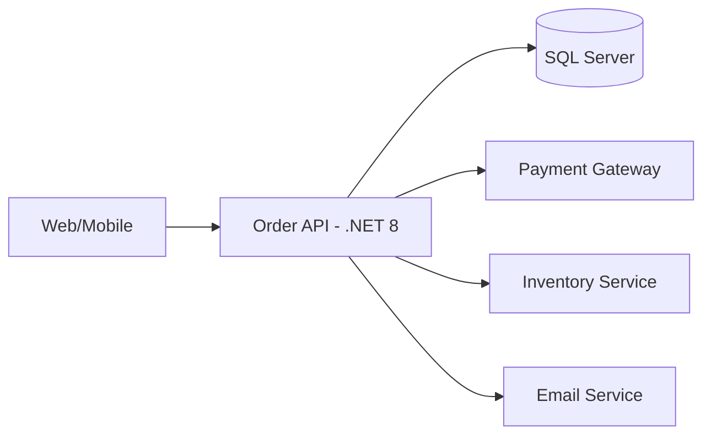
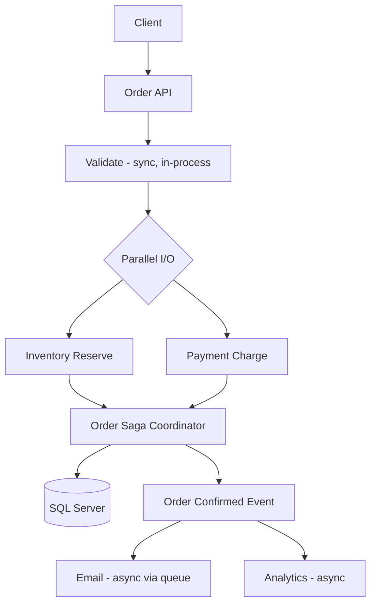

# Case Study: High-Throughput Order API — Type & Performance Decisions

| Attribute | Value |
|-----------|-------|
| **Industry** | E-commerce |
| **Scale** | 8,000 orders/minute peak (Black Friday) |
| **Week** | 01 |
| **Difficulty** | Intermediate |

## Business Context

An e-commerce company processes orders through a .NET 8 API. During last Black Friday, the order API experienced p99 latency spikes from 50ms to 350ms, causing checkout timeouts and an estimated $2M in lost revenue.

The VP of Engineering has asked you — the newly appointed solution architect — to review the order processing pipeline and recommend changes before the next peak season (12 weeks away).

## Current State



**Current implementation issues (from code review):**
- `Order` modeled as mutable `class` with 40+ properties
- LINQ chains on every request over in-memory cached order lists
- Three external service calls made **sequentially** (sync-over-async with `.Result` in one path)
- JSON serialization uses reflection-based `System.Text.Json` defaults
- No `CancellationToken` propagation
- No performance budgets or profiling in CI

## Requirements

### Functional
- Process order: validate → reserve inventory → charge payment → confirm → notify
- Return order confirmation to client within SLA

### Non-Functional
| NFR | Target |
|-----|--------|
| Availability | 99.95% |
| Latency (p99) | < 100ms (excluding payment gateway) |
| Throughput | 10,000 orders/minute peak |
| RTO | 30 minutes |
| RPO | 5 minutes |

## Constraints

- Team: 12 .NET developers, no Go/Rust expertise
- Budget: moderate — can add Azure services, not a full rewrite
- Payment gateway (Stripe) cannot be replaced
- 12-week timeline before next Black Friday
- Must maintain backward-compatible API contract

## Your Task

1. Identify the top 3 architectural/technical issues
2. Propose a revised architecture or implementation strategy
3. Explain type modeling choices for order data
4. Address the async/sequential call problem
5. Define what observability you'd add

> **Attempt your solution before reading the reference below.**

---

## Reference Solution

### Top 3 Issues

1. **Sequential external calls** — 3 × 80ms = 240ms minimum before business logic
2. **Sync-over-async** — thread pool starvation under concurrent load
3. **Allocation-heavy hot path** — LINQ + mutable class DTOs causing GC pressure

### Revised Architecture



### Key Decisions

| Decision | Choice | Rationale |
|----------|--------|-----------|
| Order DTO (API) | `record OrderResponse(...)` | Immutable, cacheable, clear contract |
| Order Entity (DB) | `class Order` | EF Core change tracking |
| Value objects | `record struct Money(...)` | Reduce allocations in calculations |
| External calls | `Task.WhenAll` for independent calls | Inventory + payment can be parallel |
| Email/Analytics | Async via Service Bus | User doesn't wait for notification |
| Serialization | Source-generated JSON | Reduce reflection overhead |
| Observability | OpenTelemetry + App Insights | Distributed tracing across calls |

### Type Modeling

```csharp
// API layer — immutable
public record OrderResponse(Guid Id, string Status, Money Total, DateTime CreatedAt);
public readonly record struct Money(decimal Amount, string Currency);

// Domain — identity-bearing entity
public class Order
{
    public Guid Id { get; private set; }
    public OrderStatus Status { get; private set; }
    // behavior methods: Confirm(), Cancel()
}

// Internal pipeline — stack-allocated where possible
public readonly record struct OrderProcessingContext(Guid OrderId, Money Total);
```

### Expected Outcome

- p99 latency: 350ms → ~80ms (parallel I/O + reduced GC)
- Throughput: 8K → 15K+ orders/minute with same infrastructure
- Cost: +$500/month for Service Bus (offset by avoiding scale-up)

## Discussion Questions

1. Would you extract order processing to a separate microservice at this scale?
2. When would you introduce event sourcing for orders?
3. How would you load-test this before Black Friday?

## Interview Story Angle

**STAR prompt:** "Tell me about a performance problem you diagnosed and fixed."

Use this case study: emphasize profiling-first approach, parallel I/O decision, and measurable business impact ($2M risk mitigation).
