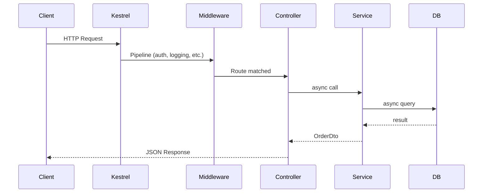
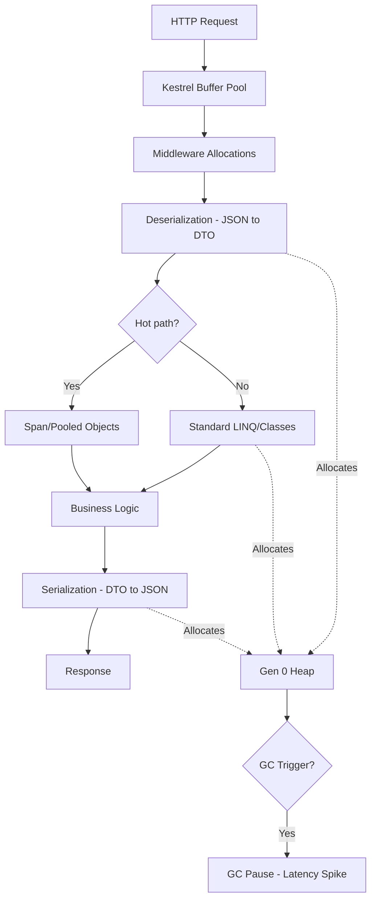
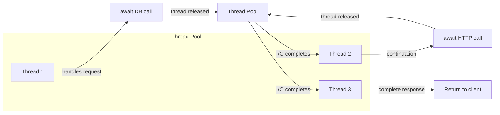
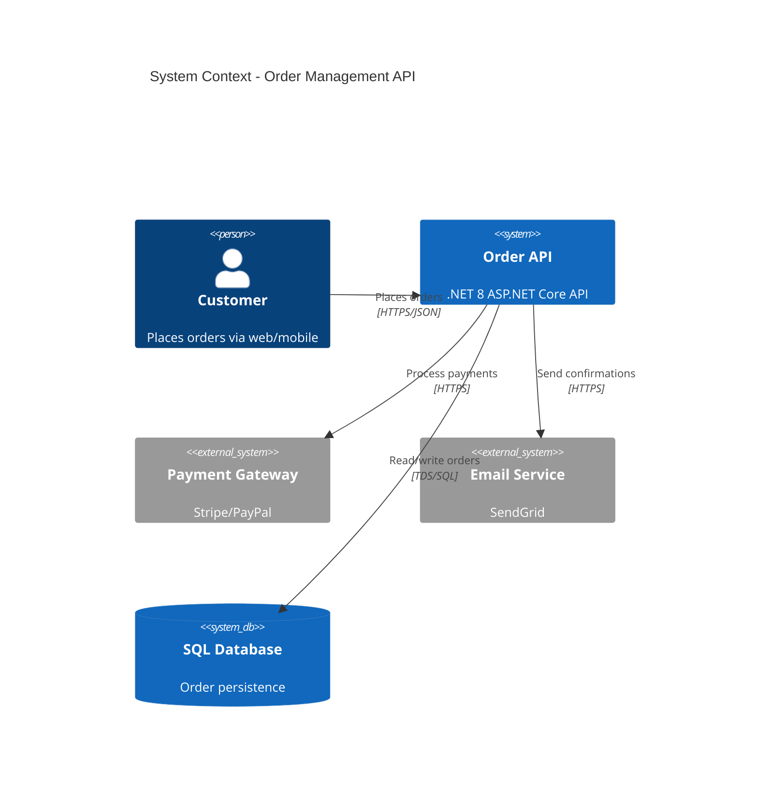
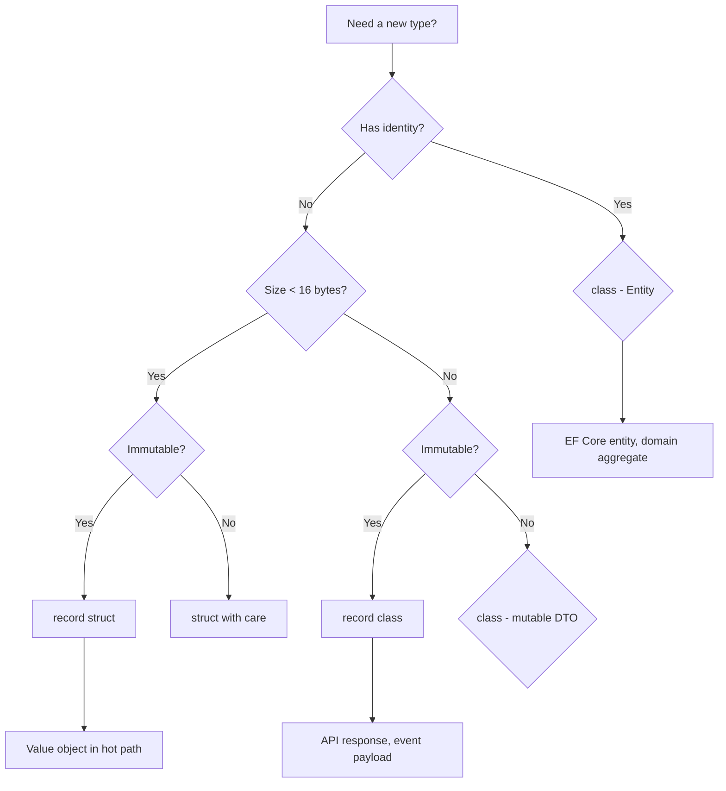

# Week 01 — Architecture Diagrams

## 1. .NET Request Processing Pipeline

## 2. Memory Allocation in Request Lifecycle

## 3. Async Request Thread Model

## 4. C4 Container — Typical .NET API (Context Level)

> **Note:** C4 diagrams render on tools supporting C4 Mermaid syntax. For GitHub, use the sequence/flowchart diagrams above.

## 5. Type Selection Decision Tree

## Practice Exercise

Redraw diagrams 1, 2, and 5 from memory. Time yourself — aim for under 5 minutes each.

---

[← Back to Week 01](../README.md)
