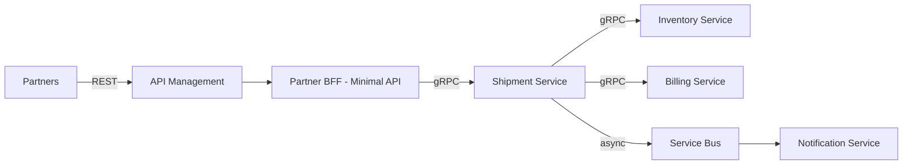

# Case Study: API Style Migration — REST Monolith to gRPC Microservices

| Attribute | Value |
|-----------|-------|
| **Industry** | Logistics |
| **Scale** | 12 internal services, 3000 RPS internal traffic |
| **Week** | 02 |
| **Difficulty** | Advanced |

## Business Context

A logistics company has 12 .NET Framework Web API services communicating via REST/JSON. Internal latency p99 is 450ms due to chatty REST calls and JSON serialization overhead. Platform team wants to modernize to .NET 8.

## Current State

- All services expose REST JSON publicly and internally
- Synchronous HTTP chains: Shipment → Inventory → Billing → Notification (4 hops)
- No API gateway — services call each other directly via DNS
- Average payload: 15KB JSON per call

## Requirements

- Reduce internal p99 latency to < 100ms
- Maintain REST for external partners (backward compatible)
- 6-month migration timeline
- Team of 25 .NET developers

## Your Task

1. Recommend API style per boundary (REST vs gRPC vs Minimal vs MVC)
2. Propose target architecture diagram
3. Define migration strategy (not big-bang)
4. Identify risks

---

## Reference Solution

### Target Architecture

### Key Decisions

| Boundary | Style | Rationale |
|----------|-------|-----------|
| Partner-facing | REST via APIM | Contract stability, OpenAPI |
| BFF | Minimal APIs | Low ceremony, aggregation |
| Service-to-service | gRPC | Binary, HTTP/2 multiplexing, strict contracts |
| Notifications | Async (Service Bus) | Remove sync hop |

### Migration Strategy

1. **Month 1–2:** Add gRPC alongside existing REST (parallel run)
2. **Month 3–4:** Migrate internal callers service by service
3. **Month 5:** Introduce BFF + APIM for partners
4. **Month 6:** Deprecate internal REST endpoints

### Expected Outcome

- Internal p99: 450ms → 80ms
- Payload size: 15KB → 2KB (protobuf)
- Partner APIs unchanged (REST preserved)

### Risks

| Risk | Mitigation |
|------|------------|
| Proto breaking changes | Semantic versioning, compatibility tests in CI |
| Team gRPC learning curve | Shared proto repo, code generation in pipeline |
| Dual API maintenance | Time-box parallel run to 3 months per service |

## Interview Story

**Prompt:** "Describe a technology migration you led."

Use STAR: REST→gRPC internal migration, measurable latency improvement, partner compatibility preserved.
