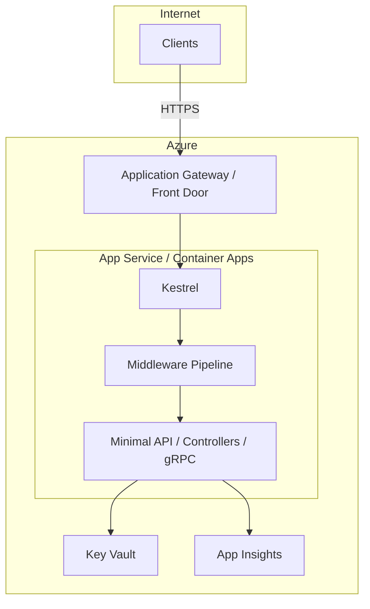
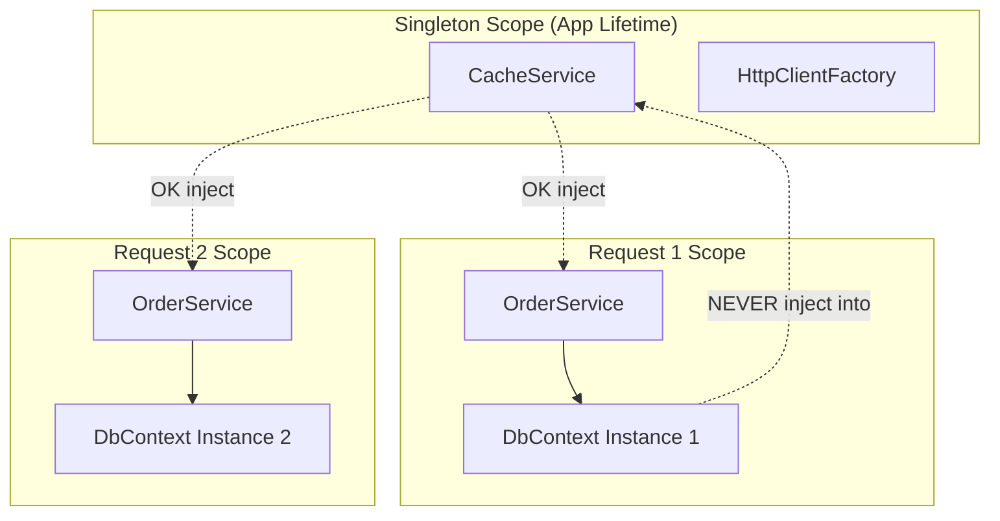
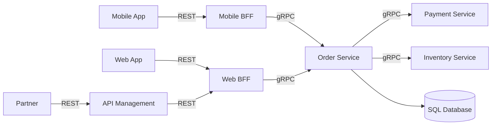
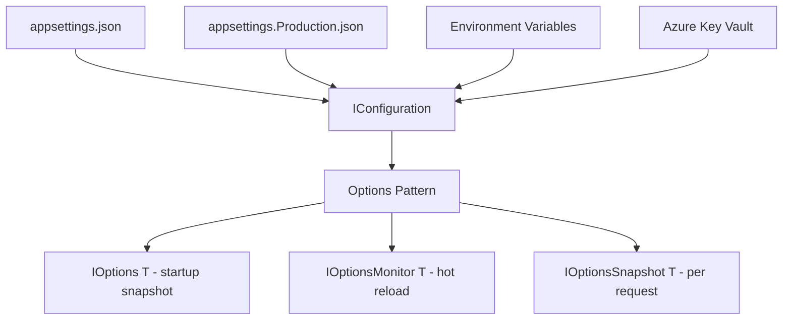
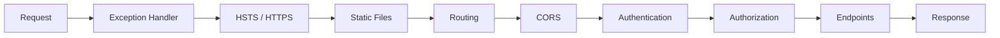

# Week 02 — Architecture Diagrams

## 1. .NET Hosting Architecture

## 2. DI Lifetime Scopes

## 3. BFF + gRPC Internal Architecture

## 4. Configuration Flow

## 5. Middleware Pipeline Order

## Practice

Redraw diagrams 2 and 3 from memory. Explain DI lifetime rules while drawing diagram 2 aloud.

---

[← Back to Week 02](../README.md)
