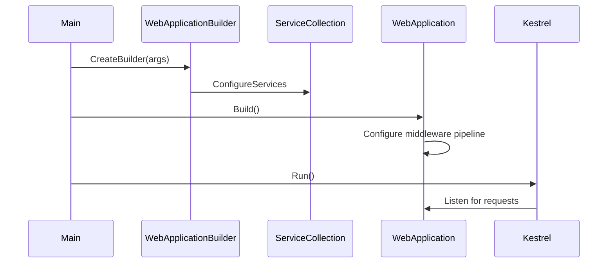

# .NET Runtime — Fundamentals (Architect Lens)

> **Week 02** | **Level:** Fundamentals | **Module:** [csharp-dotnet](../../../modules/csharp-dotnet/README.md)

## Learning Objectives

- Explain the CLR, BCL, and runtime components
- Compare .NET hosting models and when to use each
- Understand the role of `IHost` and application startup

---

## 1. .NET Platform Components

```
┌─────────────────────────────────────────────────────┐
│                   Your Application                   │
├─────────────────────────────────────────────────────┤
│  ASP.NET Core │ EF Core │ gRPC │ Minimal APIs       │
├─────────────────────────────────────────────────────┤
│           Base Class Library (BCL)                   │
│  System.* │ Collections │ IO │ Threading │ LINQ     │
├─────────────────────────────────────────────────────┤
│     Common Language Runtime (CLR)                    │
│  GC │ JIT │ Type System │ Exception Handling         │
├─────────────────────────────────────────────────────┤
│              Operating System                        │
└─────────────────────────────────────────────────────┘
```

| Component | Role | Architect Relevance |
|-----------|------|---------------------|
| **CLR** | Executes managed code, GC, type safety | GC pauses, memory limits in containers |
| **BCL** | Standard library | API stability across .NET versions |
| **ASP.NET Core** | Web framework | Hosting, middleware, DI integration |
| **SDK** | Build, publish, restore | CI/CD, multi-targeting, AOT |

---

## 2. .NET Versions & Support

| Version | LTS | Support Until | Key Features |
|---------|-----|---------------|--------------|
| .NET 6 | Yes | Nov 2024 (extended) | Minimal APIs, Hot Reload |
| .NET 8 | Yes | Nov 2026 | Native AOT improvements, performance |
| .NET 9 | STS | May 2026 | Latest features |
| .NET Framework 4.8 | — | Windows lifecycle | Legacy only |

**Architect policy:** New services on current LTS (.NET 8+). Plan migration from .NET Framework via strangler fig, not big-bang.

---

## 3. Hosting Models

### Kestrel (Cross-Platform)

Default web server for ASP.NET Core. Runs on Windows, Linux, macOS.

```csharp
var builder = WebApplication.CreateBuilder(args);
var app = builder.Build();
app.MapGet("/", () => "Hello");
app.Run();
```

**Use when:** Containers, Linux, microservices, cloud-native.

### IIS (Windows)

Reverse proxy in front of Kestrel via ASP.NET Core Module.

**Use when:** Existing Windows Server investment, IIS features (Windows Auth, ARR).

### In-Process vs Out-of-Process (IIS)

| Mode | Behavior |
|------|----------|
| In-process | Kestrel runs inside IIS worker process — lower latency |
| Out-of-process | Kestrel separate process — better isolation |

**Architect default:** Kestrel behind reverse proxy (Azure App Service, nginx, Application Gateway) for cloud deployments.

---

## 4. Generic Host (`IHost`)

.NET 6+ unified hosting model:

```csharp
var builder = Host.CreateApplicationBuilder(args);
builder.Services.AddHostedService<Worker>();
var host = builder.Build();
await host.RunAsync();
```

| Host Type | Use Case |
|-----------|----------|
| `WebApplication` | HTTP APIs, web apps |
| `Host` | Background workers, console apps |
| `Host.CreateDefaultBuilder` | Legacy pattern (still valid) |

**Architect note:** Same DI container, configuration, and logging across web and worker hosts — enables shared libraries and consistent observability.

---

## 5. Application Startup Flow



**Key phases:**
1. **Configuration** — appsettings, env vars, Key Vault
2. **Service registration** — DI container built
3. **Middleware pipeline** — request processing order
4. **Endpoint routing** — Minimal APIs, controllers, gRPC

---

## 6. Project Structure Conventions

```
src/
├── OrderApi/                 # Host project
│   ├── Program.cs
│   ├── appsettings.json
│   └── Endpoints/            # Minimal API routes
├── OrderApi.Application/     # Use cases, interfaces
├── OrderApi.Domain/          # Entities, value objects
└── OrderApi.Infrastructure/  # EF, external services
```

**Architect standard:** Multi-project solution from day one for services expected to grow beyond CRUD.

---

## Common Mistakes

1. **Running Kestrel exposed directly to internet** — always use reverse proxy in production
2. **Mixing .NET versions** in same solution without clear boundaries
3. **Ignoring `launchSettings.json` vs production config** — development settings leaking to prod

---

## Best Practices

1. Target current LTS SDK in CI and Dockerfiles
2. Use `WebApplication` template for new APIs
3. Centralize configuration with Options pattern (Week 2 intermediate)
4. Document hosting model in deployment ADR

**Next:** [02-intermediate.md](02-intermediate.md) — Dependency Injection deep dive
