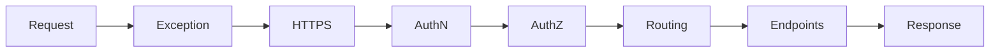

# .NET — Intermediate (DI, Configuration, Middleware)

> **Week 02** | **Level:** Intermediate

## Learning Objectives

- Design DI containers for testability and modularity
- Apply Options pattern for configuration
- Understand middleware pipeline ordering

---

## 1. Dependency Injection in .NET

Built into `Microsoft.Extensions.DependencyInjection`. Default container is sufficient for most applications.

### Service Lifetimes

| Lifetime | Instance | Use Case | Risk |
|----------|----------|----------|------|
| **Singleton** | One per application | Caches, config, HTTP clients (via `IHttpClientFactory`) | Captive dependencies |
| **Scoped** | One per request | DbContext, unit of work | Never inject scoped into singleton |
| **Transient** | New every injection | Lightweight stateless services | High allocation if overused |

```csharp
builder.Services.AddSingleton<ICacheService, RedisCacheService>();
builder.Services.AddScoped<IOrderRepository, OrderRepository>();
builder.Services.AddTransient<IEmailSender, SendGridEmailSender>();
```

### Captive Dependency Anti-Pattern

```csharp
// WRONG: Scoped DbContext in Singleton
builder.Services.AddSingleton<OrderService>(); // holds scoped DbContext forever

// CORRECT: OrderService is Scoped
builder.Services.AddScoped<OrderService>();
```

**Architect rule:** Enforce lifetime rules in code review. Use Scrutor or architecture tests to validate.

---

## 2. Registration Patterns

### Interface-Based Registration

```csharp
builder.Services.AddScoped<IOrderService, OrderService>();
```

### Keyed Services (.NET 8+)

```csharp
builder.Services.AddKeyedScoped<IPaymentGateway, StripeGateway>("stripe");
builder.Services.AddKeyedScoped<IPaymentGateway, PayPalGateway>("paypal");

// Resolve
var gateway = serviceProvider.GetRequiredKeyedService<IPaymentGateway>("stripe");
```

**Use when:** Multiple implementations of same interface (payment providers, regional configs).

### Factory Pattern with DI

```csharp
builder.Services.AddScoped<IOrderService>(sp =>
{
    var repo = sp.GetRequiredService<IOrderRepository>();
    var logger = sp.GetRequiredService<ILogger<OrderService>>();
    return new OrderService(repo, logger);
});
```

---

## 3. Options Pattern

Strongly typed configuration binding:

```csharp
// appsettings.json: "Payment": { "ApiKey": "...", "TimeoutSeconds": 30 }

public class PaymentOptions
{
    public const string SectionName = "Payment";
    public string ApiKey { get; set; } = string.Empty;
    public int TimeoutSeconds { get; set; } = 30;
}

// Registration
builder.Services.Configure<PaymentOptions>(
    builder.Configuration.GetSection(PaymentOptions.SectionName));

// Usage
public class PaymentService(IOptions<PaymentOptions> options) { ... }

// Hot reload (when config changes)
public class PaymentMonitor(IOptionsMonitor<PaymentOptions> monitor) { ... }
```

| Interface | Behavior |
|-----------|----------|
| `IOptions<T>` | Singleton snapshot at startup |
| `IOptionsSnapshot<T>` | Scoped — re-reads per request |
| `IOptionsMonitor<T>` | Singleton with change notifications |

**Architect standard:** Never read `IConfiguration` directly in business logic — always use Options classes.

---

## 4. Configuration Hierarchy

```
appsettings.json
  └── appsettings.{Environment}.json
        └── Environment variables (override)
              └── Azure Key Vault / AWS Secrets Manager
                    └── Command-line args
```

```csharp
builder.Configuration
    .AddJsonFile("appsettings.json")
    .AddJsonFile($"appsettings.{env}.json", optional: true)
    .AddEnvironmentVariables()
    .AddAzureKeyVault(/* ... */);
```

**Production rule:** Secrets never in appsettings committed to git. Use Key Vault references or env vars.

---

## 5. Middleware Pipeline

```csharp
var app = builder.Build();

app.UseExceptionHandler("/error");  // First — catch all
app.UseHttpsRedirection();
app.UseAuthentication();            // Before authorization
app.UseAuthorization();
app.MapControllers();
app.Run();
```



**Order matters:** Exception handling first; authentication before authorization; endpoints last.

### Custom Middleware

```csharp
public class CorrelationIdMiddleware(RequestDelegate next)
{
    public async Task InvokeAsync(HttpContext context)
    {
        var correlationId = context.Request.Headers["X-Correlation-ID"].FirstOrDefault()
            ?? Guid.NewGuid().ToString();
        context.Response.Headers["X-Correlation-ID"] = correlationId;
        using (LogContext.PushProperty("CorrelationId", correlationId))
        {
            await next(context);
        }
    }
}
```

**Architect use:** Correlation IDs, request logging, tenant resolution, rate limiting.

---

## 6. IHttpClientFactory

**Never** do this:

```csharp
// ANTI-PATTERN: new HttpClient() per request — socket exhaustion
var client = new HttpClient();
```

**Always** use factory:

```csharp
builder.Services.AddHttpClient<IPaymentClient, PaymentClient>(client =>
{
    client.BaseAddress = new Uri("https://api.stripe.com/");
    client.Timeout = TimeSpan.FromSeconds(30);
})
.AddPolicyHandler(GetRetryPolicy())
.AddPolicyHandler(GetCircuitBreakerPolicy());
```

**Why architects mandate this:** `HttpClient` is IDisposable but reusing instances is required; factory manages handler lifetime and prevents DNS staleness.

---

## Production Example

**Problem:** Memory leak in production API — `DbContext` held for hours.

**Root cause:** Singleton `CacheWarmupService` injected scoped `AppDbContext`.

**Fix:** 
- Made `CacheWarmupService` scoped, OR
- Used `IServiceScopeFactory` to create scope within singleton:

```csharp
public class CacheWarmupService(IServiceScopeFactory scopeFactory)
{
    public async Task WarmupAsync()
    {
        using var scope = scopeFactory.CreateScope();
        var db = scope.ServiceProvider.GetRequiredService<AppDbContext>();
        // use db within scope
    }
}
```

---

**Next:** [03-advanced-expert.md](03-advanced-expert.md) — API styles, gRPC, architecture decisions
