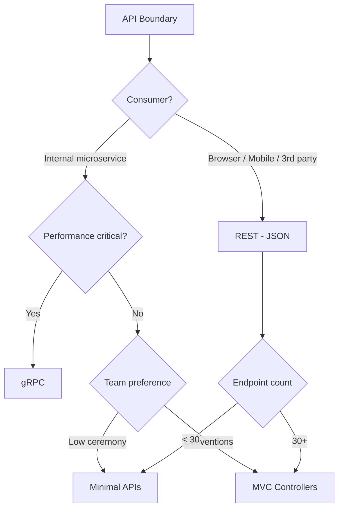

# .NET — Advanced & Expert (API Styles, gRPC, Hosting Decisions)

> **Week 02** | **Level:** Advanced → Expert

## Learning Objectives

- Compare Minimal APIs, MVC Controllers, and gRPC with trade-offs
- Make hosting and deployment architecture decisions
- Design API boundaries for microservices

---

## 1. API Style Comparison

| Aspect | Minimal APIs | MVC Controllers | gRPC |
|--------|-------------|-----------------|------|
| Ceremony | Low | Medium | Medium |
| Validation | Manual / filters | Model binding + filters | Protobuf schema |
| Versioning | Manual | Built-in conventions | Package versioning |
| OpenAPI/Swagger | Good support | Excellent | grpc-gateway needed |
| Performance | High | High | Highest (binary) |
| Browser clients | JSON/REST | JSON/REST | Requires gRPC-Web |
| Contract | Informal | Informal | Strict (.proto) |
| Best for | Microservices, simple CRUD | Complex APIs, filters | Internal service-to-service |

---

## 2. Minimal APIs

```csharp
var builder = WebApplication.CreateBuilder(args);
builder.Services.AddScoped<IOrderService, OrderService>();

var app = builder.Build();

var orders = app.MapGroup("/api/orders")
    .WithTags("Orders")
    .RequireAuthorization();

orders.MapGet("/{id:guid}", async (Guid id, IOrderService svc) =>
    await svc.GetAsync(id) is { } order ? Results.Ok(order) : Results.NotFound())
    .WithName("GetOrder")
    .Produces<OrderDto>(200)
    .Produces(404);

app.Run();
```

**Choose Minimal APIs when:**
- Small to medium microservices
- Team prefers low ceremony
- Endpoint count < 30 per service
- OpenAPI documentation needed

**Avoid when:**
- Heavy filter/attribute conventions across many endpoints
- Complex model binding scenarios
- Large team prefers controller class organization

---

## 3. MVC Controllers

```csharp
[ApiController]
[Route("api/[controller]")]
[Authorize]
public class OrdersController(IOrderService orderService) : ControllerBase
{
    [HttpGet("{id:guid}")]
    [ProducesResponseType<OrderDto>(200)]
    [ProducesResponseType(404)]
    public async Task<IActionResult> Get(Guid id)
    {
        var order = await orderService.GetAsync(id);
        return order is null ? NotFound() : Ok(order);
    }
}
```

**Choose MVC when:**
- Existing team conventions use controllers
- Complex authorization attributes per action
- API versioning with `Microsoft.AspNetCore.Mvc.Versioning`
- 30+ endpoints with shared base behavior

---

## 4. gRPC

```protobuf
service OrderService {
  rpc GetOrder (GetOrderRequest) returns (OrderResponse);
  rpc StreamOrders (StreamOrdersRequest) returns (stream OrderResponse);
}
```

```csharp
public class OrderGrpcService(IOrderService orders) : OrderService.OrderServiceBase
{
    public override async Task<OrderResponse> GetOrder(
        GetOrderRequest request, ServerCallContext context)
    {
        var order = await orders.GetAsync(Guid.Parse(request.Id));
        return MapToProto(order);
    }
}
```

**Choose gRPC when:**
- Internal service-to-service communication
- High throughput, low latency required
- Strict contracts needed (backward compatibility via protobuf)
- Bi-directional streaming (real-time feeds, chat backends)

**Avoid gRPC when:**
- Public API consumed by browsers (unless gRPC-Web + proxy)
- Third-party integrations expect REST/JSON
- Team lacks protobuf/protobuf tooling experience

---

## 5. API Architecture Decision Matrix



### Hybrid Pattern (Common in Production)

```
                    ┌─────────────────┐
  Public clients ──►│  API Gateway     │
  (REST/JSON)       │  (Azure APIM)    │
                    └────────┬────────┘
                             │ REST
                    ┌────────▼────────┐
                    │  BFF Service     │
                    │  (Minimal API)   │
                    └────────┬────────┘
                             │ gRPC
              ┌──────────────┼──────────────┐
              ▼              ▼              ▼
        Order Service  Payment Service  Inventory Service
           (gRPC)          (gRPC)           (gRPC)
```

---

## 6. Deployment & Hosting Architecture

| Hosting | Best For | Avoid When |
|---------|----------|------------|
| **Azure App Service** | Standard web APIs, quick deploy | Need K8s features, custom networking |
| **Azure Container Apps** | Containers without K8s ops | Need full K8s ecosystem |
| **AKS** | Complex orchestration, multi-service | Small team, simple app |
| **Azure Functions** | Event-driven, sporadic load | Long-running HTTP, always-on low latency |
| **IIS + Windows Server** | Legacy enterprise Windows | Cloud-native, Linux preference |

### Container Deployment

```dockerfile
FROM mcr.microsoft.com/dotnet/aspnet:8.0 AS base
WORKDIR /app
EXPOSE 8080

FROM mcr.microsoft.com/dotnet/sdk:8.0 AS build
WORKDIR /src
COPY . .
RUN dotnet publish -c Release -o /app/publish

FROM base AS final
WORKDIR /app
COPY --from=build /app/publish .
USER $APP_UID
ENTRYPOINT ["dotnet", "OrderApi.dll"]
```

**Architect checklist for containers:**
- [ ] Non-root user
- [ ] Health check endpoint (`/health`)
- [ ] Graceful shutdown (CancellationToken, `IHostApplicationLifetime`)
- [ ] Readiness vs liveness probes
- [ ] Resource limits (CPU/memory) set in K8s/Container Apps

---

## 7. Health Checks

```csharp
builder.Services.AddHealthChecks()
    .AddDbContextCheck<AppDbContext>()
    .AddRedis(redisConnectionString)
    .AddUrlGroup(new Uri("https://payment-api/health"), "payment-api");

app.MapHealthChecks("/health/live", new HealthCheckOptions
{
    Predicate = _ => false // liveness — process alive
});
app.MapHealthChecks("/health/ready", new HealthCheckOptions
{
    Predicate = check => check.Tags.Contains("ready")
});
```

**Kubernetes:**
- **Liveness** — restart pod if failing
- **Readiness** — remove from load balancer if failing

---

## 8. Expert Scenario: API Gateway Design

**Context:** 8 microservices, mobile + web + partner API consumers.

**Recommendation:**
1. **Azure API Management** as edge — rate limiting, auth, versioning
2. **BFF per client type** — Mobile BFF (aggregated), Web BFF, Partner REST (strict SLA)
3. **Internal gRPC** between services
4. **Minimal APIs** for BFFs; gRPC for domain services
5. **OpenAPI** published for partner APIs only

**Trade-offs accepted:**
- BFF duplication vs single generic API — chose duplication for client optimization
- gRPC learning curve — mitigated with shared proto packages

---

## Best Practices Summary

1. **One API style per service boundary** — don't mix MVC + Minimal in same project without reason
2. **gRPC internal, REST external** — industry standard pattern
3. **IHttpClientFactory** for all outbound HTTP
4. **Options pattern** for all configuration
5. **Health checks** on every deployable service
6. **Document API style choice** in ADR per service

---

**Next:** [diagrams/](../diagrams/) | [interview-questions/](../interview-questions/)
