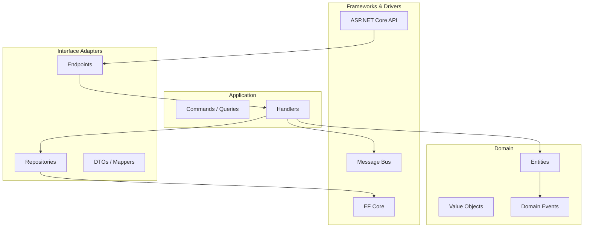
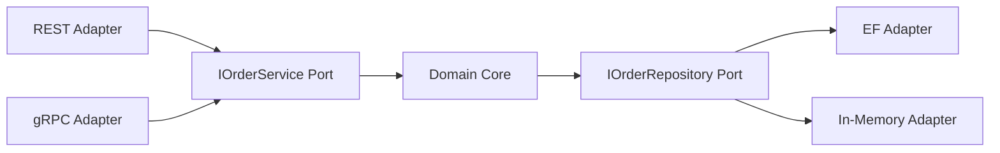
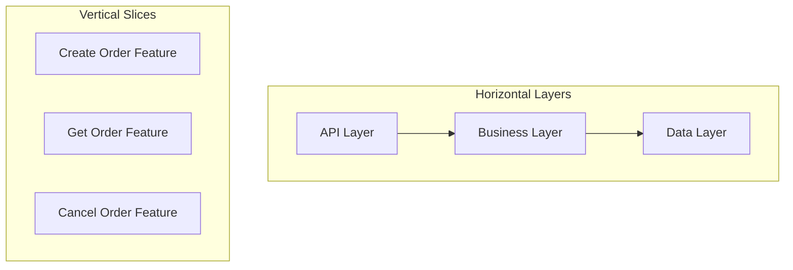
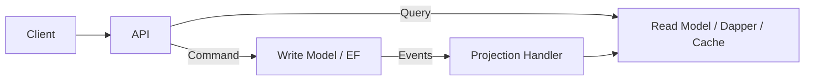
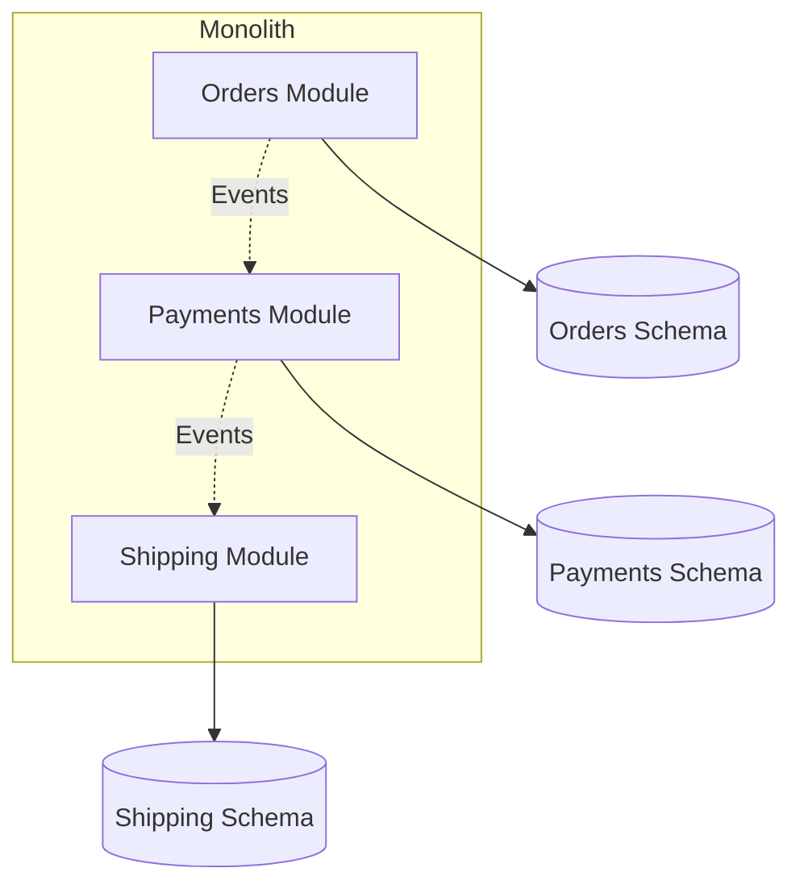

# Week 03 — Diagrams

## Clean Architecture Layers

## Hexagonal (Ports & Adapters)

## Vertical Slice vs Layered

## CQRS Read/Write Separation

## Modular Monolith

---

[← Back to Week 03](../README.md)
