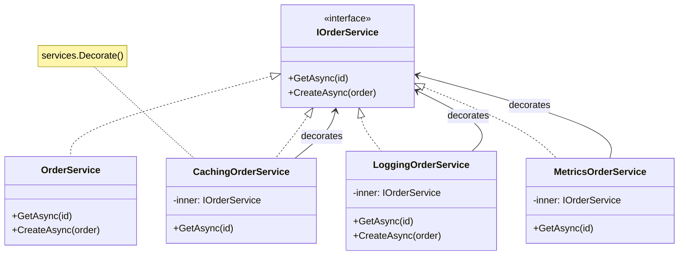

# Week 04 Assessment — Design Patterns (GoF + Enterprise)

| Attribute | Value |
|-----------|-------|
| **Time Limit** | 60 minutes |
| **Pass Score** | 70% |
| **Expert Score** | 90% |

---

## Section A: Conceptual (30 points)

### A1. Strategy vs Factory Method (10 pts)

A shipping platform supports three rate-calculation algorithms (standard, express, freight) that change quarterly based on carrier contracts. A separate team wants a `PaymentGatewayFactory` that returns Stripe, PayPal, or Adyen implementations based on customer region.

**Question:** Which pattern applies to each problem? Why are they different?

**Model Answer:**
- **Shipping rate calculation → Strategy:** Interchangeable algorithms at runtime; same interface (`IShippingStrategy.Calculate`), different behavior; client selects strategy based on order context
- **Payment gateway creation → Factory Method / Abstract Factory:** Object creation varies by provider/region; encapsulates construction logic; returns concrete implementations behind `IPaymentGateway`
- **Key distinction:** Strategy swaps *behavior* of an existing object; Factory swaps *which object* gets created
- **Anti-pattern:** Using Factory when you only need a simple `switch` on two providers with no creation complexity
- **Modern .NET:** Strategy often replaced by `switch` expressions or dictionary delegates for 2–3 algorithms; Factory still valuable when construction involves config, credentials, or SDK initialization

**Scoring:** 10 = correct pattern per problem + behavior vs creation distinction + pragmatic .NET note

---

### A2. Repository Anti-Pattern Recognition (10 pts)

A team wraps EF Core `DbContext` in `IOrderRepository`, `ICustomerRepository`, `IProductRepository` — each with 40+ methods mirroring LINQ. Unit tests mock all three repositories. The team uses SQL Server exclusively with no plans to change.

**Question:** Is this good architecture? What would you recommend?

**Model Answer:**
- **Over-abstraction:** EF Core `DbContext` already implements Repository + Unit of Work; thin wrapper adds indirection without value
- **Symptoms of anti-pattern:** 40+ methods per repo = leaking query logic into interfaces; mock maintenance burden exceeds benefit
- **When Repository IS justified:** Multiple persistence backends, complex test isolation requirements, CQRS with separate read/write stores
- **Recommendation:** Use `DbContext` directly in application handlers; extract complex queries into Specification objects or query services if needed
- **Testing:** Use Testcontainers with real SQL Server or in-memory provider for integration tests instead of mocking 120 repository methods
- **Architect stance:** Document ADR — "no generic repository layer" unless concrete swap requirement exists

---

### A3. When NOT to Use Patterns (10 pts)

A junior architect proposes applying Decorator, Observer, Strategy, and Factory to a simple CRUD admin panel with 5 entities and 3 developers.

**Question:** What is wrong with this approach? When should patterns be applied?

**Model Answer:**
- **Golden Hammer anti-pattern:** Applying patterns without a recurring problem they solve
- **Cost:** Indirection, onboarding friction, over-engineering for a team of 3 on stable CRUD
- **YAGNI:** No evidence of algorithm variation (Strategy), cross-cutting extension (Decorator), or complex creation (Factory)
- **Observer overkill:** Domain events for admin CRUD add complexity; direct method calls suffice
- **Apply patterns when:** Recurring problem, high change frequency at a specific seam, external integration boundary (Adapter), or cross-cutting concern proven by production pain (caching Decorator after profiling shows hot path)
- **Pattern selection framework:** Problem → cost → change frequency → simpler alternative first

---

## Section B: Architecture Diagram (20 points)

**Prompt:** Draw a class/component diagram showing Decorator pattern applied to cross-cutting concerns (caching, logging, metrics) around an `IOrderService`, registered via DI.

**Rubric:**
| Criteria | Points |
|----------|--------|
| Decorator wraps inner service (not inheritance) | 6 |
| Multiple decorators chain correctly | 6 |
| DI registration shown (`Decorate<T>`) | 4 |
| Cross-cutting concerns labeled | 4 |

**Reference:** See [diagrams/README.md](../diagrams/README.md)

---

## Section C: Trade-off Analysis (25 points)

**Scenario:** An e-commerce order service currently raises domain events in-process (`order.Raise(new OrderPlacedEvent())`) and a single `OrderEventHandler` sends email, updates analytics, and reserves inventory synchronously in the same request.

**Options:**
- A: Keep in-process events, add MediatR for handler dispatch
- B: Observer pattern with `IObservable<Order>` and reactive subscribers
- C: Domain events collected in aggregate, published to message bus after `SaveChanges` (outbox)

**Prompt:** Analyze each option. Recommend for a system scaling to 500 orders/minute with independent notification and analytics teams.

**Model Answer:**
- **Current problem:** Synchronous side effects in request path — email/analytics failures block order placement; tight coupling
- **Option A (MediatR in-process):** Better separation, still synchronous unless handlers are async fire-and-forget (unreliable — lost on crash)
- **Option B (IObservable):** Same-process coupling; doesn't solve cross-service boundaries; debugging reactive chains is hard
- **Option C (domain events + outbox):** Events persisted atomically with order; async consumers process independently; teams deploy notification/analytics separately
- **Observer/events at architect level:** In-process domain events for aggregate consistency; outbox for cross-service Observer pattern
- **Recommend C** with choreography: `OrderPlaced` → Notification service, Analytics service, Inventory service subscribe independently
- **Trade-off:** Eventual consistency for side effects; order confirmation returns before email sent (acceptable with UX "confirmation pending")

---

## Section D: Production Realism (15 points)

**Scenario:** Production incident — after deploying a `CachingDecorator` on `IProductService`, product prices shown to customers are stale by up to 15 minutes during a flash sale. The decorator uses a 30-minute absolute TTL cache with no invalidation.

**Question:** What went wrong and what is your fix plan?

**Model Answer:**
1. **Root cause:** Decorator added cross-cutting caching without understanding data volatility; flash sale prices change frequently
2. **Immediate:** Disable cache decorator via feature flag or reduce TTL to 30 seconds for pricing endpoints
3. **Invalidation strategy:** Cache-aside with explicit invalidation on `PriceUpdated` domain event
4. **Architect review:** Not all `IProductService` methods should be cached equally — selective decorator or cache policy per method
5. **Monitoring:** Add cache hit/miss metrics and staleness alerts; compare cached vs DB price in shadow mode
6. **Long-term:** Separate read model (CQRS) for catalog with controlled refresh; Redis with event-driven invalidation
7. **Lesson:** Decorator is correct pattern but cache policy is a business decision, not a default TTL

---

## Section E: Interview Communication (10 points)

**Prompt:** A product manager asks: "Why can't we just use the same design pattern everywhere for consistency? It would make the codebase easier to understand."

**Model Answer (2 minutes):**
"Patterns are tools for specific recurring problems — like wrenches for bolts and screwdrivers for screws. Using the same tool everywhere doesn't make things simpler; it makes simple things complicated.

For example, our payment provider selection genuinely needs a Factory — creation logic varies by region and involves SDK setup. But our shipping cost calculation only has two algorithms that haven't changed in two years — a simple function is clearer than a Strategy hierarchy.

The goal isn't pattern consistency — it's solving the right problem with the minimum complexity. We document patterns where they earn their keep: external integrations get Adapters, proven hot paths get caching Decorators, and interchangeable algorithms get Strategy. Everything else stays plain code that any developer can read in five minutes.

This actually reduces onboarding time because new developers aren't hunting through abstraction layers to find where an order gets created."

---

## Self-Score Summary

| Section | Score | Max |
|---------|-------|-----|
| A | | 30 |
| B | | 20 |
| C | | 25 |
| D | | 15 |
| E | | 10 |
| **Total** | | **100** |

## Review Plan

| If scored low in... | Revisit |
|---------------------|---------|
| Section A | [theory/01-design-patterns-fundamentals.md](../theory/01-design-patterns-fundamentals.md) |
| Section B | [diagrams/README.md](../diagrams/README.md) + [theory/02-advanced-patterns.md](../theory/02-advanced-patterns.md) |
| Section C | [theory/02-gof-deep-dive.md](../theory/02-gof-deep-dive.md) |
| Section D | [common-mistakes.md](../common-mistakes.md) + [labs/lab-04-pattern-refactoring.md](../labs/lab-04-pattern-refactoring.md) |
| Section E | Practice aloud — [interview-questions/](../interview-questions/) |
