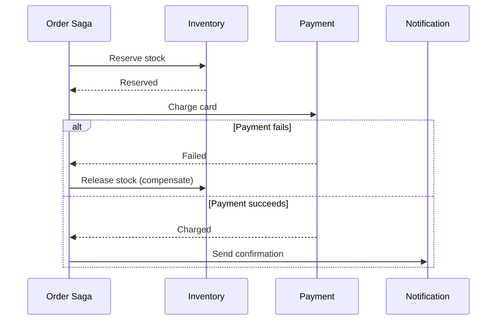
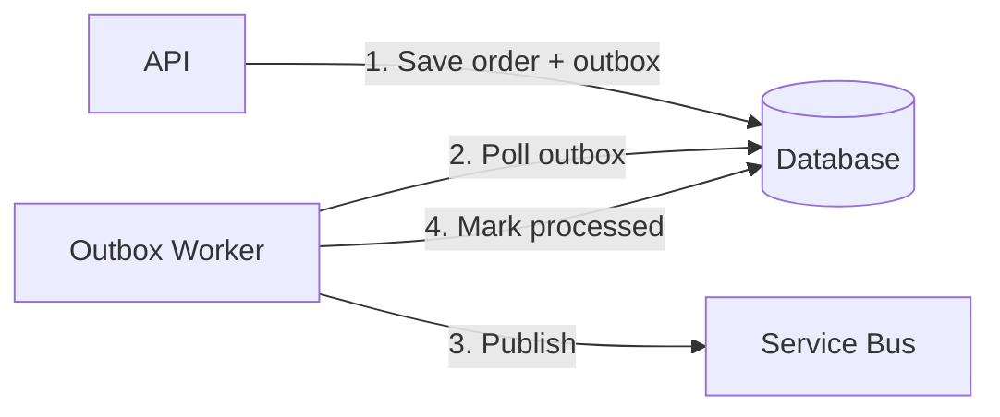

# Week 04 — Diagrams, Lab, Case Study, Assessment

## Saga Orchestration

## Outbox Pattern

## Lab 04: Refactor to Patterns

1. Start with monolithic `OrderManager` (provided in theory)
2. Apply: Command, Adapter, Strategy, Outbox
3. Write ADR for each pattern introduced
4. Add unit tests for domain logic

## Case Study: Payment System Patterns

**Context:** Payment service processes $50M/month. Current issues: duplicate charges, lost notifications, no audit trail.

**Solution patterns:**
- **Idempotency key** on all payment commands
- **Outbox** for payment confirmation events
- **Saga** for multi-step refund flow
- **Circuit breaker** (Polly) on bank API
- **Strategy** for regional payment providers

## Assessment

### Q1: When Strategy vs pattern matching?
**Answer:** Strategy when algorithms swappable at runtime via DI/config. Pattern matching for fixed, compile-time known cases.

### Q2: Repository — use or skip?
**Answer:** Skip for simple EF apps. Use when multiple stores or testing strategy demands it.

### Q3: Outbox — when mandatory?
**Answer:** Any time you write to DB and publish message that must be consistent.

### Q4: Draw saga choreography vs orchestration for order flow.

### Q5: Identify 3 anti-patterns in legacy OrderManager code.

## Common Mistakes

1. Pattern for pattern's sake
2. Generic Repository<T> everywhere
3. Saga without idempotency
4. Outbox without deduplication
5. Ignoring compensating transactions

---

[← Back to Week 04](../README.md)
