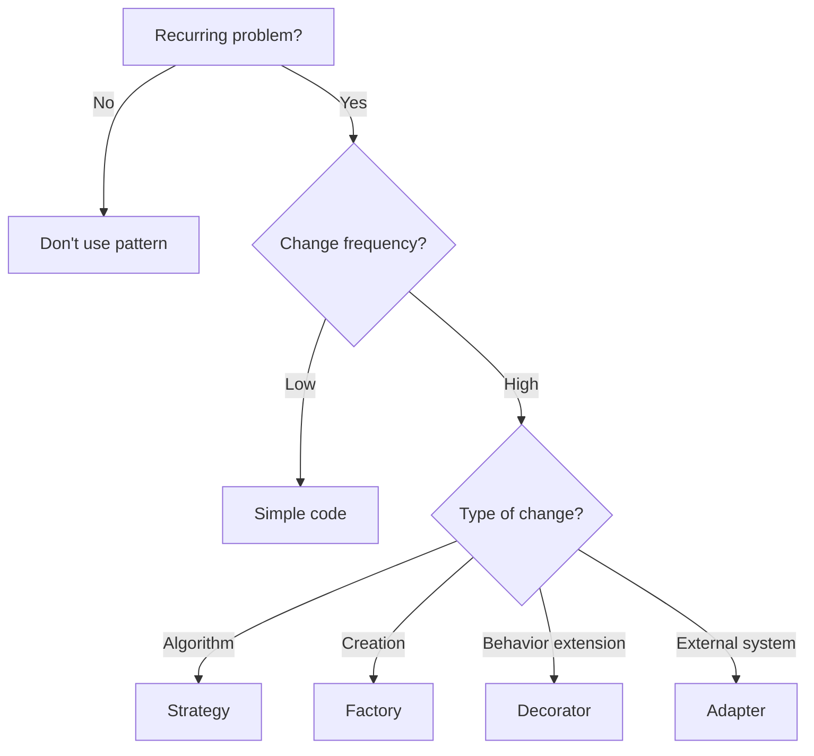

# Design Patterns — Advanced Selection & Refactoring

> **Week 04** | **Level:** Advanced → Expert

## Pattern Selection Framework

Before applying any pattern, ask:

1. **What problem does this solve?** (Not "it's best practice")
2. **What is the cost?** (Complexity, indirection, onboarding)
3. **What changes frequently?** (Optimize for change points)
4. **Is there a simpler solution?** (Pattern matching, functions, DI)



---

## Outbox Pattern (Critical for Architects)

**Problem:** DB save succeeds, message publish fails → inconsistent state.

```csharp
public class OrderService(AppDbContext db)
{
    public async Task CreateAsync(Order order)
    {
        db.Orders.Add(order);
        db.OutboxMessages.Add(new OutboxMessage
        {
            Type = "OrderCreated",
            Payload = JsonSerializer.Serialize(new OrderCreatedEvent(order.Id)),
            CreatedAt = DateTime.UtcNow
        });
        await db.SaveChangesAsync(); // Atomic: order + outbox message
    }
}
// Separate worker reads outbox, publishes to Service Bus, marks processed
```

**When mandatory:** Any event-driven system with database + message broker.

---

## Saga Pattern

**Choreography** (events):
```
OrderCreated → InventoryReserved → PaymentCharged → OrderConfirmed
                     ↓ fail
              InventoryReleased (compensating)
```

**Orchestration** (central coordinator):
```csharp
public class OrderSaga
{
    public async Task ExecuteAsync(Order order)
    {
        await _inventory.ReserveAsync(order);
        try { await _payment.ChargeAsync(order); }
        catch { await _inventory.ReleaseAsync(order); throw; }
    }
}
```

| Style | Pros | Cons |
|-------|------|------|
| Choreography | Loose coupling | Hard to trace |
| Orchestration | Clear flow | Single point of failure |

---

## Week 04 Capstone: Refactoring Exercise

### Before (Anti-patterns galore)

```csharp
public class OrderManager
{
    public void ProcessOrder(string json)
    {
        var order = JsonSerializer.Deserialize<Order>(json);
        // 200 lines: validate, save, email, payment, inventory, logging
        var client = new HttpClient();
        client.PostAsync("https://payment.api/charge", ...).Result;
    }
}
```

### After (Patterns applied)

- **SRP:** Separate services
- **Adapter:** PaymentGatewayAdapter
- **Command:** ProcessOrderCommand + Handler
- **Outbox:** Reliable event publishing
- **Strategy:** Shipping calculation
- **Decorator:** Caching, logging
- **Factory:** Payment provider selection

**Deliverable:** Refactored solution with ADR documenting each pattern choice.

---

## Expert: Pattern Interview Questions

**"Is Repository pattern dead?"**

Structured answer: "EF Core DbContext implements Unit of Work and Repository patterns internally. Adding generic IRepository<T> often adds indirection without benefit. I use repositories when: (1) multiple persistence sources, (2) need to swap EF for Dapper in specific queries, (3) team testing strategy requires it. Otherwise, I inject DbContext or use specification pattern for complex queries."

---

## Best Practices

1. Name patterns in ADRs when used — helps onboarding
2. Prefer composition over inheritance
3. Use DI over Singleton static
4. Outbox for all DB + messaging scenarios
5. Don't introduce patterns speculatively — refactor to patterns when pain appears

**Next:** [diagrams/](../diagrams/) | [interview-questions/](../interview-questions/)
