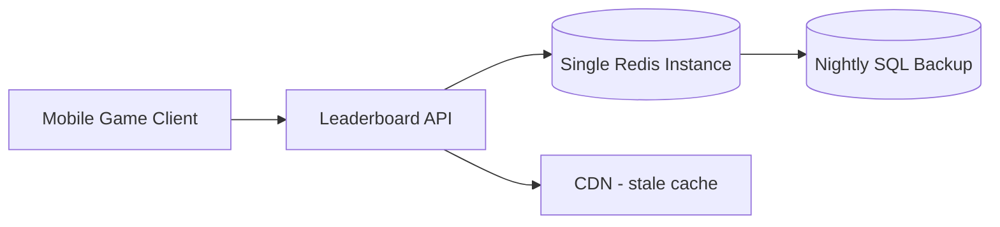
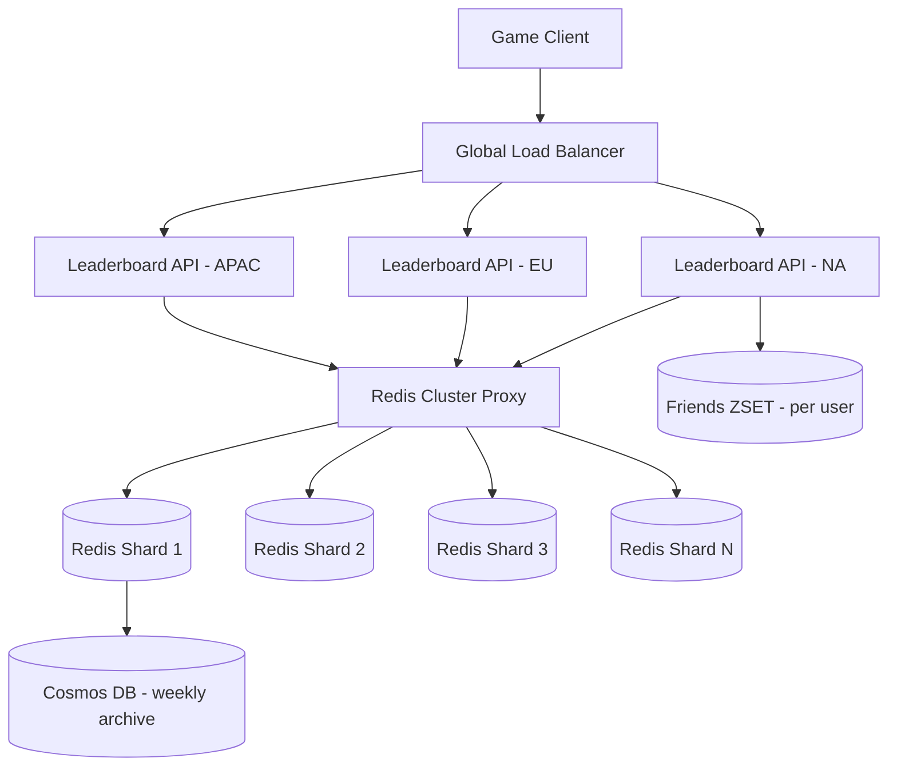

# Case Study: Real-Time Gaming Leaderboard — 10M Users

| Attribute | Value |
|-----------|-------|
| **Industry** | Mobile Gaming |
| **Scale** | 10M DAU, 50K score updates/second peak |
| **Week** | 05 |
| **Difficulty** | Advanced |

## Business Context

A mobile battle-royale game with 10M daily active users needs a global leaderboard that updates in real time as players earn points. During weekend tournaments, score submissions spike to 50K/second. Players expect to see their rank change within 2 seconds of completing a match.

Last month's tournament exposed critical failures: a single Redis instance hit memory limits, leaderboard reads timed out at p99 > 800ms, and a regional outage took the entire ranking system offline for 40 minutes — costing an estimated $400K in in-app purchase revenue and triggering a social media backlash.

The CTO has asked you to redesign the leaderboard architecture before the next global championship in 8 weeks.

## Current State



**Current implementation issues (from post-mortem):**
- Single Redis instance stores all scores in one `ZSET` key (`global:leaderboard`)
- No sharding — 10M members × ~50 bytes = ~500MB per key, plus write contention
- `ZREVRANGE` for top-100 runs on the same node handling all `ZADD` writes
- CDN caches top-100 for 60 seconds — players see stale ranks during tournaments
- No regional failover; EU players hit US Redis with 120ms RTT
- Consistent hashing not used — previous attempt to add a second Redis caused split-brain

## Requirements

### Functional
- Submit score update after each match
- Return player's current rank and score
- Return top-100 global leaderboard
- Return top-50 friends leaderboard (per player)
- Support weekly tournament resets with archival

### Non-Functional
| NFR | Target |
|-----|--------|
| Availability | 99.99% during tournaments |
| Latency (p99) — rank lookup | < 50ms |
| Latency (p99) — top-100 | < 100ms |
| Write throughput | 50K updates/second peak |
| Data freshness | < 2 seconds |
| RTO | 5 minutes |
| RPO | 0 (acceptable score loss < 0.01%) |

## Constraints

- Team: 6 backend engineers, strong Redis experience, limited Kubernetes ops
- Budget: $15K/month infrastructure ceiling
- Must support iOS and Android clients globally (NA, EU, APAC)
- Regulatory: COPPA compliance — no PII in leaderboard keys
- Cannot rewrite the game client SDK — existing REST API contract must remain
- 8-week timeline before championship

## Your Task

1. Design a sharded Redis architecture using ZSET and consistent hashing
2. Explain how you handle hot keys and write contention at 50K updates/second
3. Propose a strategy for friends leaderboard without N+1 queries
4. Define the tournament reset and archival workflow
5. Specify failover and observability for the ranking tier

> **Attempt your solution before reading the reference below.**

---

## Reference Solution

### Top 3 Issues

1. **Single-key hot spot** — one ZSET absorbs all reads and writes; O(log N) inserts become a bottleneck at 50K/sec
2. **No geographic distribution** — cross-region RTT degrades player experience and amplifies timeout risk
3. **Friends leaderboard naively implemented** — per-request `ZSCORE` × 50 friends = 50 Redis round-trips

### Revised Architecture



### Key Decisions

| Decision | Choice | Rationale |
|----------|--------|-----------|
| Sharding strategy | Consistent hashing on `userId` | Even distribution; add shards without full remapping |
| Score storage | Per-shard ZSET `lb:shard:{n}` | Eliminates single hot key |
| Top-100 aggregation | Local top-100 per shard → merge sort | O(shards × 100) vs scanning 10M members |
| Friends leaderboard | Per-user ZSET `friends:{userId}` | Single `ZREVRANGE` returns ranked friends |
| Write path | `ZADD` + async fan-out to friends sets | Decouple global rank from social graph |
| Tournament reset | Rename key + background archive to Cosmos | Atomic `RENAMENX`; zero downtime reset |
| Client caching | Short TTL (3s) edge cache for top-100 only | Balance freshness vs load |

### Sharding Detail

```
shard_id = hash(userId) % num_shards
ZADD lb:shard:{shard_id} score userId
rank = ZREVRANK lb:shard:{shard_id} userId  -- local shard rank
global_rank = sum(higher_counts_on_other_shards) + local_rank
```

For global rank without scanning all shards: maintain per-shard **score histogram buckets** (e.g., 100-point ranges) updated on each write. Approximate global rank in O(shards); exact rank on demand for top-10K players only.

### Expected Outcome

- p99 rank lookup: 800ms → ~35ms (regional API + sharded ZSET)
- Write throughput: 50K/sec sustained across 8 shards
- Tournament reset: < 30 seconds with zero read downtime
- Cost: ~$12K/month (8 × Redis Enterprise cache + 3 regional APIs)

## Discussion Questions

1. When would you switch from Redis ZSET to a dedicated ranking service (e.g., Apache Druid, ScyllaDB)?
2. How do you handle tie-breaking when two players have identical scores?
3. Would CRDTs or eventual consistency be acceptable for a casual game's leaderboard?

## Interview Story Angle

**STAR prompt:** "Tell me about designing a system for extreme write throughput."

Use this case study: emphasize consistent hashing to eliminate hot keys, the top-100 merge strategy across shards, and measurable tournament revenue protection ($400K risk).
