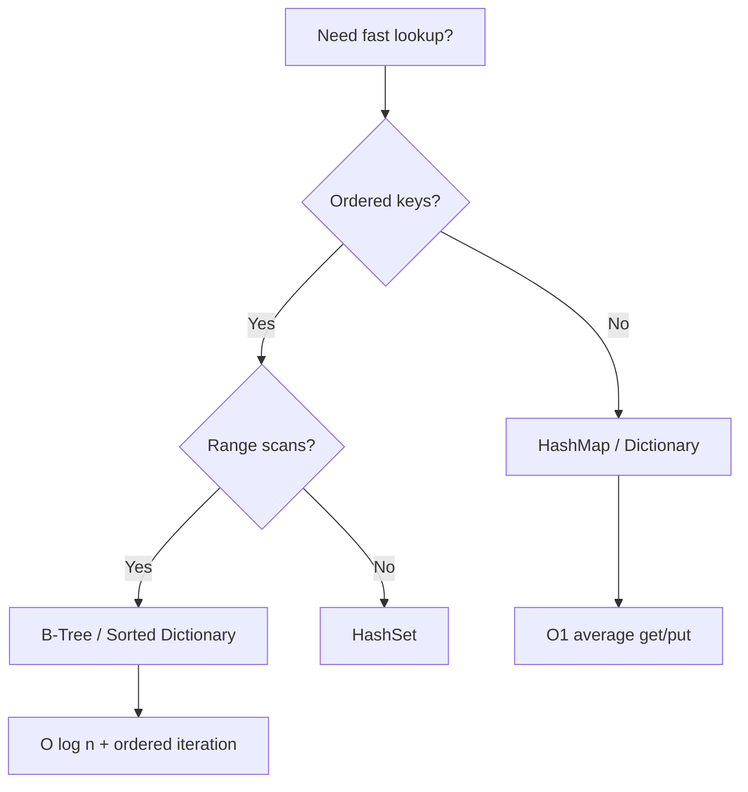
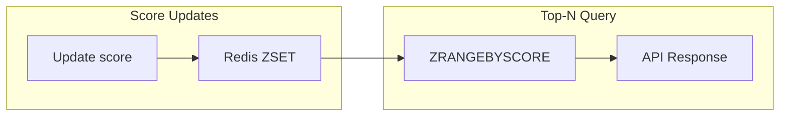
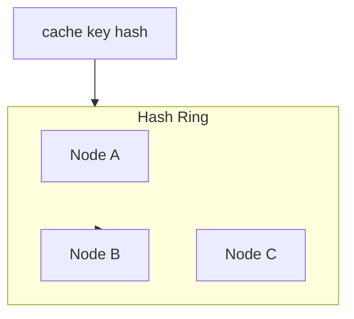
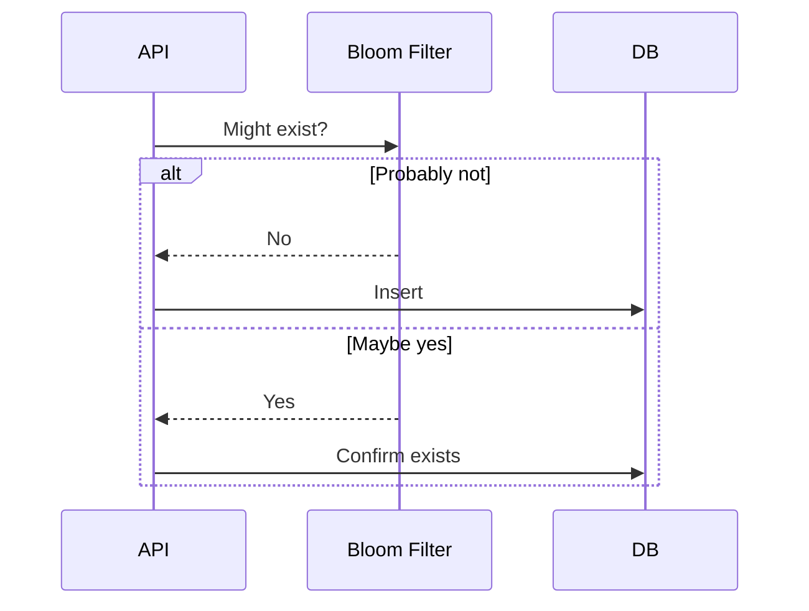
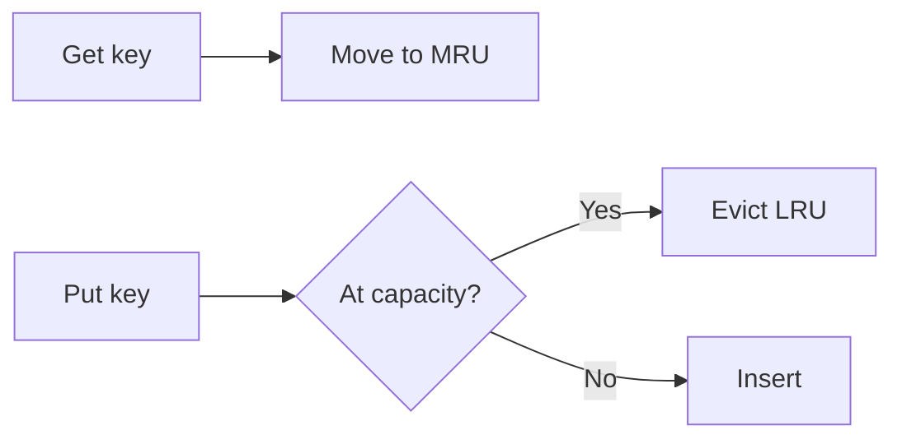

# Week 05 — Data Structures for System Design Diagrams

## 1. Structure Selection for Hot Paths

> **Architect note:** In .NET, `Dictionary<K,V>` for general purpose; `SortedDictionary` when you need ordered keys; `ImmutableDictionary` for read-heavy config snapshots.

## 2. Leaderboard — Skip List vs Heap vs Sorted Set

## 3. Consistent Hashing — Cache Ring

> **Architect note:** Use virtual nodes (vnodes) to reduce rebalance churn when adding/removing cache nodes.

## 4. Bloom Filter — Duplicate Detection

## 5. LRU Cache Eviction

## Practice Exercise

Redraw diagrams 1 and 3 from memory. For a 10M-key session store, justify HashMap vs Redis cluster.

---

[← Back to Week 05](../README.md)
