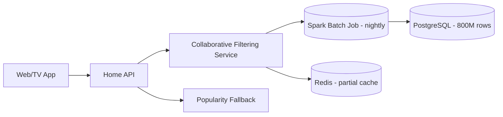
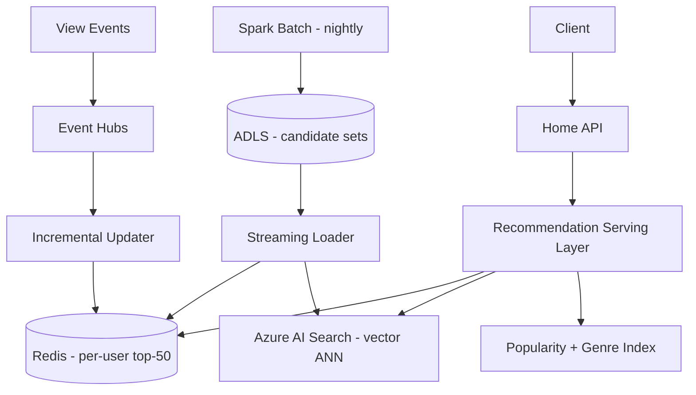

# Case Study: Recommendation Engine Latency — Algorithm Choice at Scale

| Attribute | Value |
|-----------|-------|
| **Industry** | Streaming Media |
| **Scale** | 25M subscribers, 200M catalog items, 500K concurrent sessions |
| **Week** | 06 |
| **Difficulty** | Advanced |

## Business Context

A streaming platform serves personalized "Watch Next" recommendations on every homepage load and between episodes. Data science built a collaborative filtering pipeline that achieves 18% higher click-through than the previous popularity-based approach — but production latency is unacceptable.

Homepage p99 load time jumped from 400ms to 2.8 seconds after the ML pipeline went live. Session abandonment on the homepage rose 12%, and the CPO has paused further ML rollouts until latency is fixed without sacrificing recommendation quality.

You are the solution architect asked to redesign the recommendation serving path while keeping the collaborative filtering model the data science team validated.

## Current State



**Current implementation issues (from profiling):**
- Collaborative filtering runs **online** — matrix factorization inference per request
- PostgreSQL queried with 6-table JOIN across `user_interactions`, `item_features`, `similarity_scores`
- Nightly Spark job writes 800M similarity pairs; only 12% fit in Redis cache
- Cache miss path: 2.4s average (DB + inference)
- No pre-computation of per-user candidate sets
- A/B test traffic shares the same slow path — no tiered serving

## Requirements

### Functional
- Return top-20 personalized recommendations per user
- Support cold-start users (< 5 interactions) with popularity + genre affinity
- Refresh recommendations within 4 hours of new viewing activity
- Enable A/B testing of new models without latency regression

### Non-Functional
| NFR | Target |
|-----|--------|
| Availability | 99.95% |
| Latency (p99) — recommendations | < 150ms |
| Latency (p99) — full homepage | < 500ms |
| Throughput | 80K recommendation requests/second peak |
| Model freshness | < 4 hours |
| RTO | 1 hour |
| RPO | 24 hours (batch tolerable) |

## Constraints

- Data science team owns the Spark pipeline and will not rewrite the CF algorithm
- Cannot store full 800M similarity matrix in memory ($2M/year budget cap)
- Must run on Azure (existing EA agreement)
- Team: 4 ML engineers, 8 backend engineers
- 10-week deadline before holiday content launch
- GDPR: user viewing history must stay in EU region for EU users

## Your Task

1. Redesign the collaborative filtering **serving** architecture (not retraining)
2. Choose between pre-computation, approximate nearest neighbor, and caching strategies
3. Define the batch-to-online pipeline with freshness guarantees
4. Explain how you handle cache misses without 2.4s latency
5. Propose observability to catch latency regressions before users do

> **Attempt your solution before reading the reference below.**

---

## Reference Solution

### Top 3 Issues

1. **Online inference on cold data** — CF similarity lookup should be pre-computed, not computed per request
2. **Cache designed for items, not users** — 12% cache hit rate because similarity pairs are item-centric
3. **Monolithic query path** — 6-table JOIN on every cache miss instead of denormalized serving layer

### Revised Architecture



### Key Decisions

| Decision | Choice | Rationale |
|----------|--------|-----------|
| Serving model | Pre-computed per-user candidate sets (top-50) | O(1) Redis read; CF runs offline only |
| Similarity index | Azure AI Search vector ANN for long-tail | Handles users not in pre-computed set |
| Cache key | `recs:{userId}` → sorted set of item IDs | 25M users × 50 items × 8 bytes ≈ 10GB — fits Redis cluster |
| Cold start | Popularity-by-genre inverted index | < 20ms; no CF needed |
| Freshness | Nightly full recompute + incremental Event Hubs updates | 4-hour SLA met via streaming delta |
| A/B testing | Model version in cache key `recs:{userId}:v2` | Isolate experiment traffic |

### Pipeline Detail

**Nightly batch:** Spark CF outputs `(userId, itemId, score)` top-50 per user → ADLS Parquet → parallel loader writes Redis + ANN index.

**Incremental path:** View-complete events → Event Hubs → Azure Function recalculates affected user's candidates using pre-loaded item similarity vectors (not full CF) → upsert Redis.

**Request path:**
```
1. GET recs:{userId} from Redis → if hit, return in < 5ms
2. If miss → ANN query with user embedding → < 80ms
3. If new user → genre-popularity index → < 20ms
4. Async backfill Redis on miss
```

### Expected Outcome

- p99 recommendation latency: 2.8s → ~90ms (pre-computed + ANN fallback)
- Cache hit rate: 12% → 94% after per-user key redesign
- Homepage abandonment: projected 12% reduction recovery
- Cost: +$3K/month Redis cluster, +$1.5K/month AI Search (within budget)

## Discussion Questions

1. When would you move from batch pre-computation to real-time feature stores (Feast, Tecton)?
2. How do you evaluate recommendation quality vs latency trade-offs quantitatively?
3. Would a two-tower neural model change your serving architecture?

## Interview Story Angle

**STAR prompt:** "Tell me about a time you had to make ML work in production at scale."

Use this case study: emphasize separating training from serving, per-user pre-computation, and protecting business metrics (12% abandonment) while respecting the data science team's algorithm choice.
