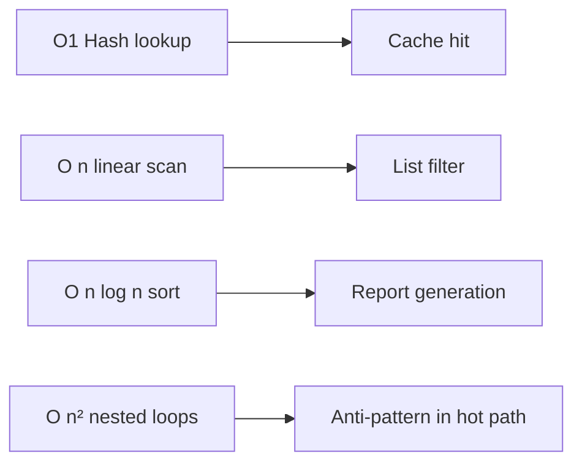
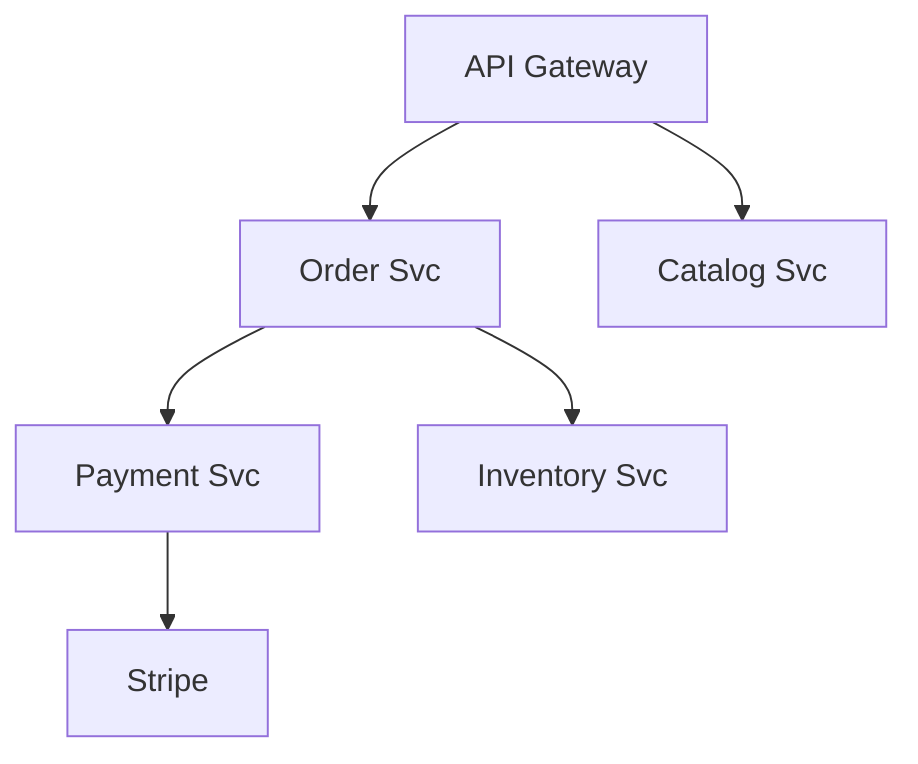
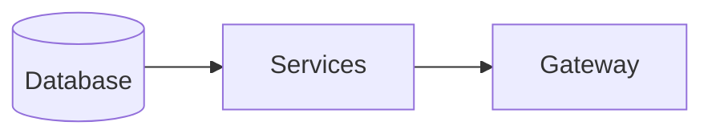
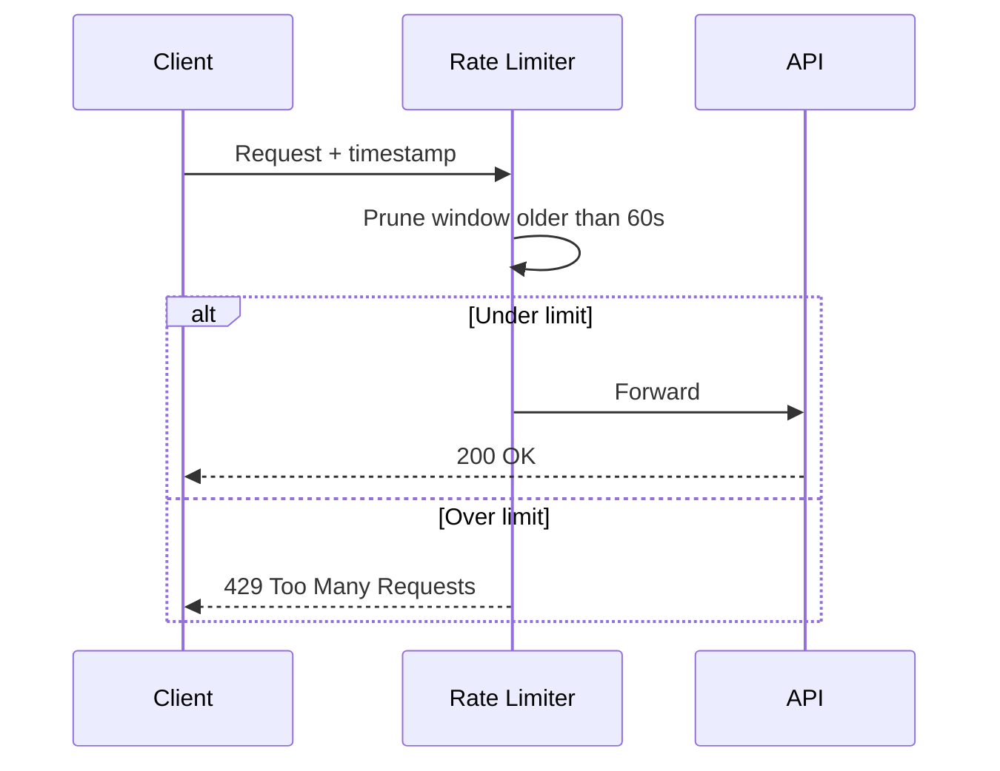
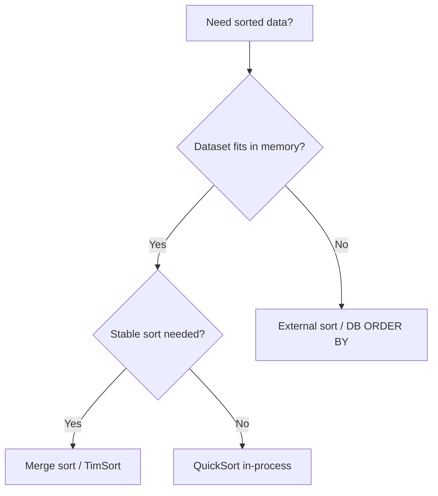

# Week 06 — Algorithms for Architects Diagrams

## 1. Big-O Comparison — API Operations

## 2. Graph Traversal — Service Dependency Map

> **Architect note:** BFS finds shortest dependency path for blast-radius analysis; DFS for cycle detection in build graphs.

## 3. Topological Sort — Deployment Order

## 4. Sliding Window Rate Limiter

## 5. Sorting Choice Decision Tree

## Practice Exercise

Given 3 nested loops over order lines, estimate complexity and propose one O(n) optimization.

---

[← Back to Week 06](../README.md)
