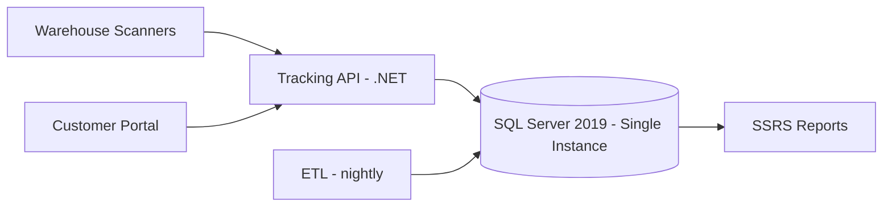
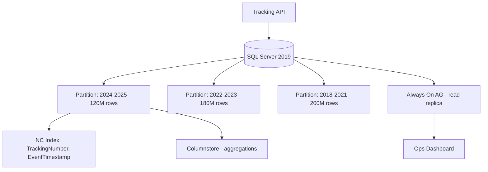

# Case Study: SQL Server Performance Crisis — 500M Row Table

| Attribute | Value |
|-----------|-------|
| **Industry** | Logistics / Supply Chain |
| **Scale** | 500M shipment events, 12K concurrent warehouse users |
| **Week** | 07 |
| **Difficulty** | Advanced |

## Business Context

A global logistics company tracks every shipment event — scan, sort, load, delivery — in a central SQL Server database. The `ShipmentEvents` table has grown to 500M rows over 7 years with minimal indexing discipline. Critical operational dashboards and customer tracking APIs now time out consistently during business hours.

Last week, the customer-facing tracking API exceeded its 30-second timeout on 40% of requests. Support ticket volume tripled. The operations VP has declared a P1 incident and wants a fix within 6 weeks that does not require a full platform migration.

You are the architect brought in to diagnose the indexing and query strategy failures and produce a remediation plan.

## Current State



**Current implementation issues (from `sys.dm_exec_query_stats` analysis):**
- `ShipmentEvents` — 500M rows, clustered index on `EventId` (identity) only
- Most queries filter on `TrackingNumber` + `EventTimestamp` — **no supporting index**
- Customer tracking query does a **clustered index scan** — 45 seconds average
- Dashboard aggregation queries use `SELECT *` with `NOLOCK` — inconsistent results + blocking
- Table is not partitioned — index maintenance takes 6 hours nightly, overlaps with ETL
- TempDB spills on sort operations — insufficient memory grants
- 340GB data file on a single 1TB SSD — 78% full

## Requirements

### Functional
- Customer tracking: return full shipment timeline by tracking number
- Operations dashboard: shipment counts by hub, status, date range
- Warehouse API: insert event + return last 10 events for a shipment (< 200ms)
- Compliance: 7-year data retention, auditable queries

### Non-Functional
| NFR | Target |
|-----|--------|
| Availability | 99.9% |
| Latency (p99) — tracking lookup | < 500ms |
| Latency (p99) — event insert | < 100ms |
| Dashboard queries | < 5 seconds |
| RTO | 2 hours |
| RPO | 15 minutes |

## Constraints

- SQL Server 2019 Enterprise — license renewal in 18 months (no immediate migration)
- Cannot take > 30 minutes downtime for index creation
- Budget: $50K for infrastructure improvements this quarter
- DBA team: 2 DBAs, overloaded with ETL issues
- 6-week deadline before peak holiday shipping season
- Tracking API contract cannot change (external partners integrated)

## Your Task

1. Identify the top 3 query/index problems causing timeouts
2. Propose an indexing strategy for `ShipmentEvents` (include columnstore consideration)
3. Design table partitioning aligned with query patterns and maintenance windows
4. Address the `NOLOCK` misuse and blocking issues
5. Define an online index rebuild approach that fits the 30-minute downtime constraint

> **Attempt your solution before reading the reference below.**

---

## Reference Solution

### Top 3 Issues

1. **Missing composite index on query predicates** — `TrackingNumber` + `EventTimestamp` filters cause full table scans on 500M rows
2. **No partitioning** — maintenance, ETL, and queries all compete on one monolithic heap-like structure
3. **`NOLOCK` masking blocking** — dirty reads create support confusion; real blocking from scan-induced lock escalation

### Revised Data Architecture



### Key Decisions

| Decision | Choice | Rationale |
|----------|--------|-----------|
| Primary lookup index | `NONCLUSTERED (TrackingNumber, EventTimestamp) INCLUDE (Status, HubId, Location)` | Covers 95% of tracking queries; seek + ordered scan |
| Partitioning | Monthly range on `EventTimestamp` | Partition elimination on date-range dashboards; sliding window maintenance |
| Aggregation queries | Columnstore index on recent partitions | 10-50x faster hub/status counts |
| Read routing | Always On readable secondary for dashboards | Offload reporting from primary insert path |
| `NOLOCK` removal | `READ COMMITTED SNAPSHOT ON` | Consistent reads without dirty data |
| Index creation | `ONLINE = ON` with `MAXDOP = 4` | Zero downtime; throttled to avoid IO saturation |

### Index & Partition Plan

```sql
-- Partition function: monthly on EventTimestamp
CREATE PARTITION SCHEME ps_ShipmentEvents AS PARTITION pf_Monthly ALL TO ([PRIMARY]);

-- Covering index for tracking API
CREATE NONCLUSTERED INDEX IX_ShipmentEvents_Tracking
ON ShipmentEvents (TrackingNumber, EventTimestamp)
INCLUDE (Status, HubId, Location, EventType)
ON ps_ShipmentEvents(EventTimestamp)
WITH (ONLINE = ON, SORT_IN_TEMPDB = ON);

-- Columnstore for dashboard aggregations (recent 12 months only)
CREATE NONCLUSTERED COLUMNSTORE INDEX NCCI_ShipmentEvents
ON ShipmentEvents (HubId, Status, EventTimestamp, TrackingNumber)
WHERE EventTimestamp >= '2025-01-01';
```

### Expected Outcome

- Tracking query: 45s → ~120ms (index seek on 500M table)
- Dashboard aggregations: 30s → ~2s (columnstore + read replica)
- Index maintenance: 6 hours → ~45 minutes (partition-level rebuild)
- Cost: ~$8K/month for read replica (within $50K quarter budget)

## Discussion Questions

1. At what row count would you archive cold partitions to cheaper storage (S3/Blob) instead of keeping them online?
2. When does a columnstore index hurt OLTP insert performance, and how do you mitigate it?
3. Would GraphQL or API-level caching reduce the need for database optimization here?

## Interview Story Angle

**STAR prompt:** "Tell me about a database performance crisis you resolved under pressure."

Use this case study: emphasize evidence-based diagnosis (`dm_exec_query_stats`), composite index design aligned to query patterns, and partitioning for operability — not just raw query speed.
