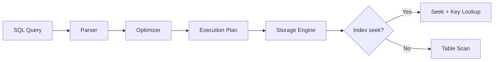
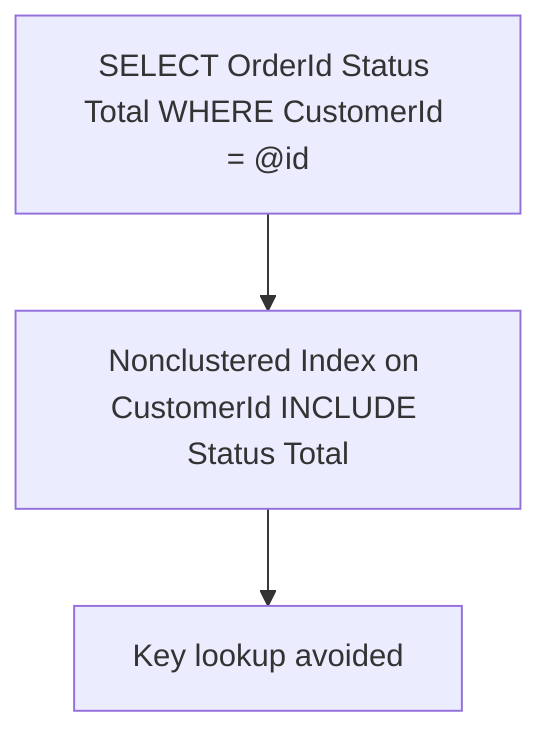
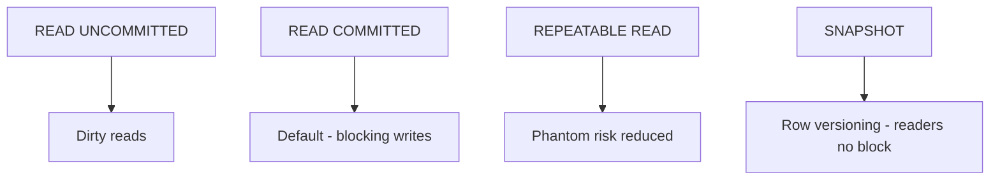
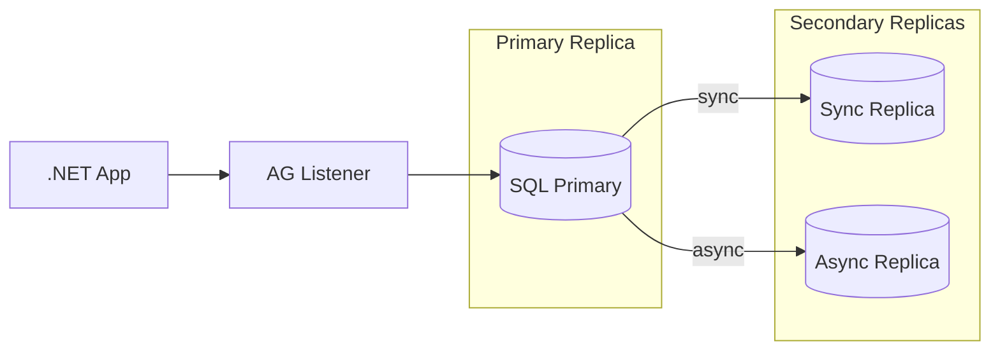
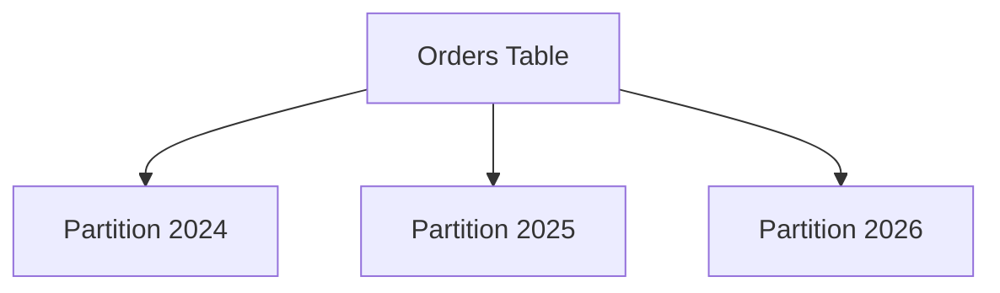

# Week 07 — SQL Server Architecture Diagrams

## 1. Query Execution Path

## 2. Index Design — Covering Index

## 3. Isolation Levels Trade-off

## 4. Always On Availability Group

## 5. Partitioning Large Tables

> **Architect note:** Partition elimination requires query filter on partition key (e.g., `OrderDate`).

## Practice Exercise

Draw AG failover flow. When would you choose SNAPSHOT isolation for a reporting API?

---

[← Back to Week 07](../README.md)
