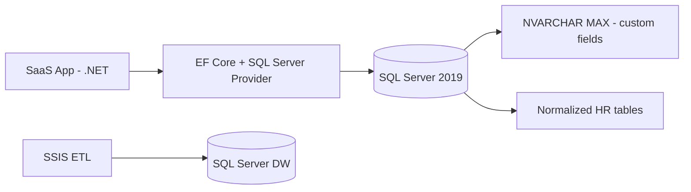
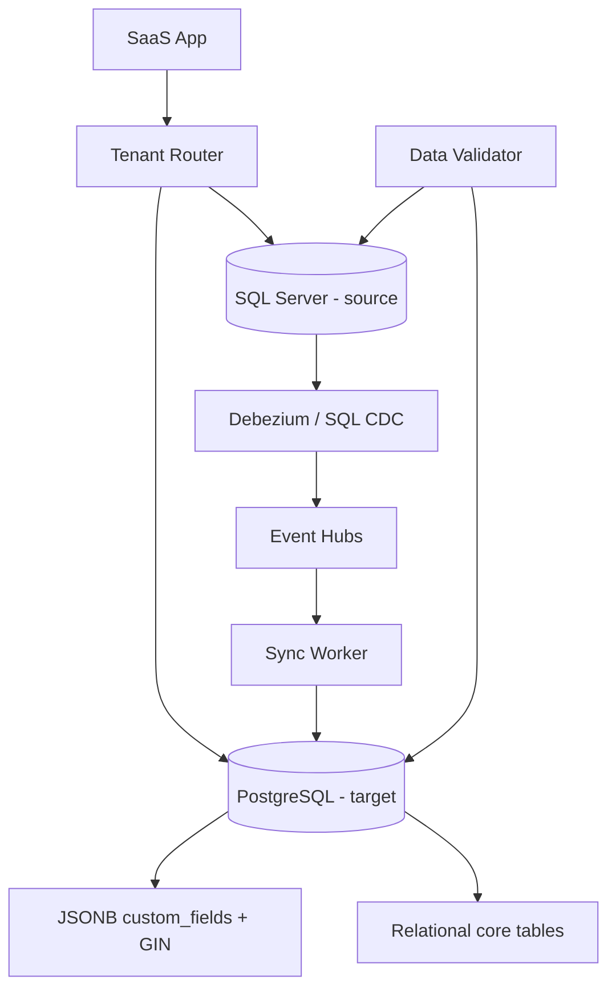

# Case Study: PostgreSQL Migration from SQL Server — Zero Downtime

| Attribute | Value |
|-----------|-------|
| **Industry** | SaaS / HR Tech |
| **Scale** | 2,400 tenants, 180M employee records, 40TB total data |
| **Week** | 08 |
| **Difficulty** | Expert |

## Business Context

An HR SaaS platform has run on SQL Server for 12 years. Licensing costs have tripled, and the product team wants PostgreSQL-native features — JSONB for flexible custom fields, better full-text search, and PostGIS for workforce location analytics. The board approved migration to reduce licensing by $1.2M/year.

The catch: 2,400 enterprise tenants require **zero-downtime migration** during business hours, and 30% of schemas use semi-structured `NVARCHAR(MAX)` JSON blobs that must become a hybrid relational + JSONB model in PostgreSQL.

A failed migration attempt 18 months ago (big-bang cutover, 6-hour outage) cost two major accounts. The CEO will not approve any plan with planned downtime.

## Current State



**Current implementation issues (from migration assessment):**
- 340 tables, 40% with `TenantId` filter — multi-tenant but not schema-per-tenant
- Custom fields stored as JSON strings in SQL Server — validated only at app layer
- 15 stored procedures used by reporting — T-SQL specific, no PostgreSQL equivalent
- EF Core migrations tightly coupled to SQL Server column types (`uniqueidentifier`, `datetime2`)
- SSIS packages run nightly — cannot pause for more than 1 hour
- Full copy of 40TB takes 72 hours over current network link

## Requirements

### Functional
- Migrate all tenant data with referential integrity preserved
- Convert custom field JSON to JSONB with GIN indexing for tenant-specific queries
- Maintain SSIS/warehouse feed during transition (dual-write period acceptable)
- Support tenant-by-tenant cutover (largest tenants last)

### Non-Functional
| NFR | Target |
|-----|--------|
| Availability during migration | 99.99% — zero planned downtime |
| Data consistency at cutover | Zero data loss |
| Latency regression | < 10% increase post-migration |
| Migration window | 6 months phased |
| Rollback | < 15 minutes per tenant |
| RPO | 0 at cutover |
| RTO | 15 minutes |

## Constraints

- Team: 10 .NET engineers, 2 DBAs (SQL Server background, 1 learning PostgreSQL)
- Budget: $200K migration project budget (tools, consultants, dual-run infra)
- Compliance: SOC 2, GDPR — data residency in EU must remain in EU PostgreSQL region
- Cannot change external API contracts
- Largest tenant: 8M employee records (migrate last)
- Azure Database for PostgreSQL Flexible Server as target

## Your Task

1. Design a zero-downtime migration strategy (logical replication, CDC, or dual-write)
2. Define the JSONB hybrid model for custom fields with indexing strategy
3. Plan the EF Core provider switch without a big-bang deployment
4. Address the 40TB data volume and 72-hour copy problem
5. Define per-tenant cutover and rollback procedures

> **Attempt your solution before reading the reference below.**

---

## Reference Solution

### Top 3 Issues

1. **Big-bang cutover risk** — monolithic migration caused previous failure; need incremental tenant-by-tenant approach
2. **JSON as opaque strings** — missing JSONB indexing means PostgreSQL advantage unrealized without schema redesign
3. **40TB bulk copy impractical** — need continuous replication, not offline dump/restore

### Revised Migration Architecture



### Key Decisions

| Decision | Choice | Rationale |
|----------|--------|-----------|
| Migration pattern | Phased dual-write with CDC replication | Zero downtime; tenant-level cutover |
| Custom fields model | `custom_fields JSONB` column + generated columns for hot keys | Flexibility + indexable frequently-queried fields |
| Data sync | Azure DMS continuous replication + Event Hubs CDC | Handles 40TB incrementally; no 72-hour bulk |
| EF Core switch | `IDbProviderRouter` per tenant migration status | Single codebase, route to SQL or PG |
| Cutover | Per-tenant: stop writes → verify row counts → flip router → monitor | 15-minute rollback window |
| Stored procedures | Rewrite 15 as PostgreSQL functions during Phase 1 | Parallel track; not on critical path |

### JSONB Hybrid Model

```sql
CREATE TABLE employees (
    id          UUID PRIMARY KEY,
    tenant_id   UUID NOT NULL,
    name        TEXT NOT NULL,
    department  TEXT,
  custom_fields JSONB NOT NULL DEFAULT '{}',
    -- Generated column for frequent filter
    job_level   TEXT GENERATED ALWAYS AS (custom_fields->>'jobLevel') STORED
);

CREATE INDEX idx_employees_custom ON employees USING GIN (custom_fields);
CREATE INDEX idx_employees_job_level ON employees (tenant_id, job_level);
```

### Cutover Runbook (per tenant)

1. Enable CDC replication for tenant → verify lag < 5 seconds for 48 hours
2. Run automated row-count + checksum validation
3. Enable dual-write in app (write to both SQL Server and PostgreSQL)
4. Flip read path to PostgreSQL; monitor p99 latency for 24 hours
5. Disable SQL Server writes for tenant; archive tenant data from SQL Server after 30 days

### Expected Outcome

- Downtime: 0 minutes planned (previous attempt: 6 hours)
- Licensing savings: $1.2M/year starting month 7
- Custom field query performance: 3x improvement with GIN index
- Migration cost: ~$180K (dual-run infra + DMS + 1 PostgreSQL consultant)

## Discussion Questions

1. When would you choose schema-per-tenant in PostgreSQL vs shared schema with `tenant_id`?
2. How do you test EF Core against two database providers in CI without doubling test time?
3. At what point during migration do you decommission SQL Server Always On AG?

## Interview Story Angle

**STAR prompt:** "Tell me about a complex database migration you led with strict uptime requirements."

Use this case study: emphasize phased CDC replication over big-bang, JSONB hybrid modeling, and learning from the previous 6-hour outage that cost enterprise accounts.
