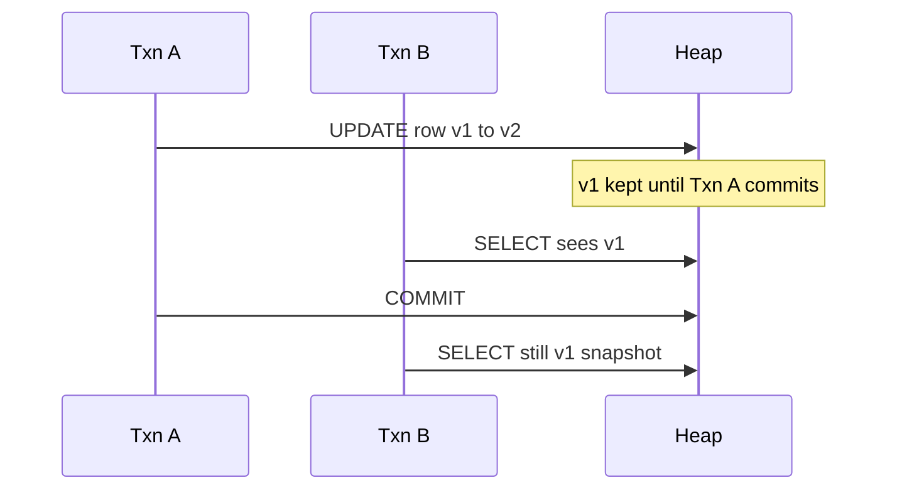
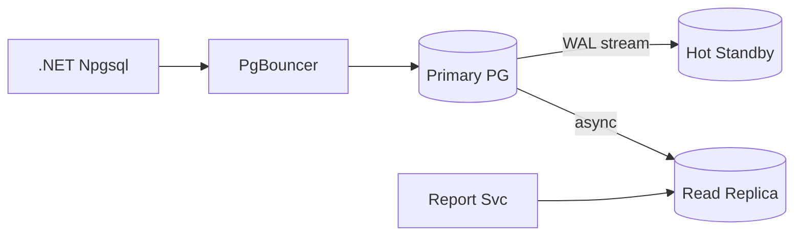
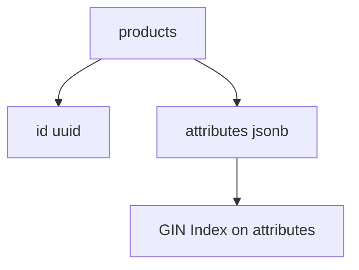
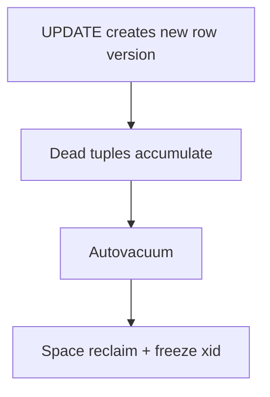
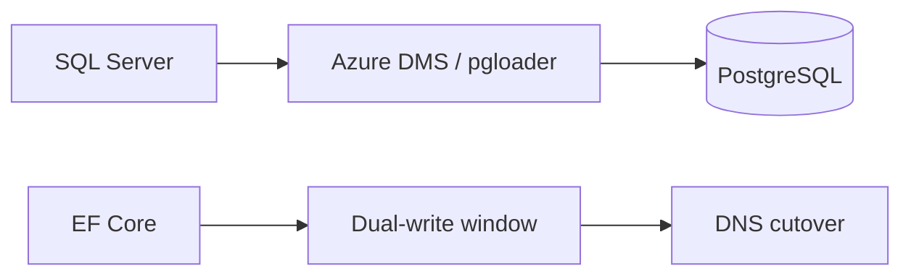

# Week 08 — PostgreSQL Architecture Diagrams

## 1. MVCC Read Consistency

## 2. Streaming Replication

## 3. JSONB Document Model

## 4. Vacuum / Bloat Lifecycle

## 5. Migration from SQL Server

## Practice Exercise

Explain why long-running transactions block vacuum. Design read/write split for 500 RPS API.

---

[← Back to Week 08](../README.md)
