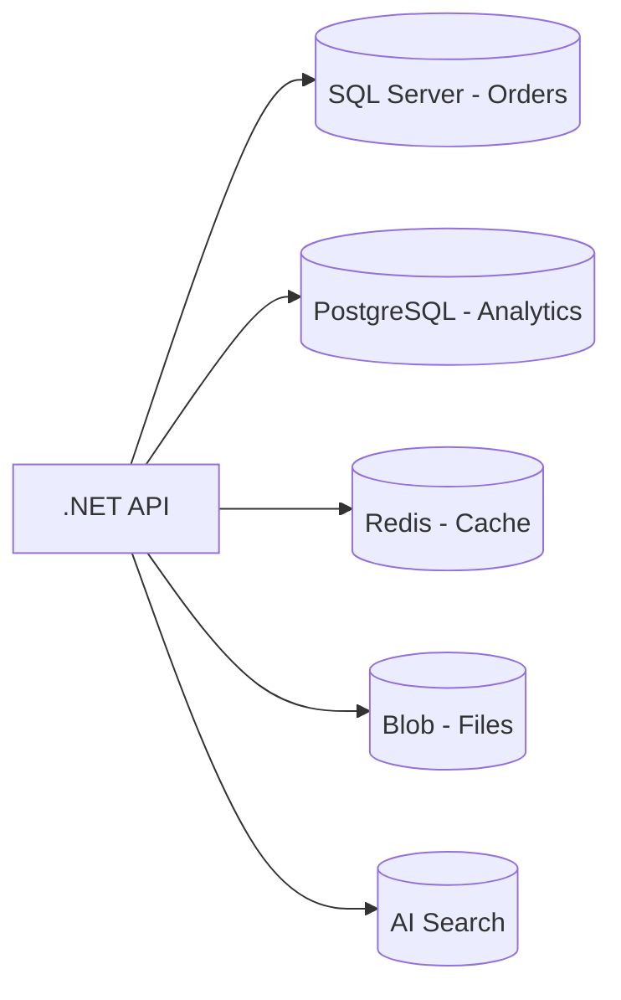

# PostgreSQL & Polyglot Persistence

> **Week 08** | **Module:** [postgresql](../../../modules/postgresql/README.md)

## Learning Objectives
- Compare PostgreSQL vs SQL Server for architect decisions
- Design polyglot persistence strategies
- Understand PostgreSQL-specific features (JSONB, extensions)

---

## 1. PostgreSQL vs SQL Server

| Factor | PostgreSQL | SQL Server |
|--------|------------|------------|
| License | Open source | Commercial |
| Platform | Cross-platform | Windows/Linux |
| JSON | JSONB (indexed) | JSON (SQL 2016+) |
| Extensions | Rich (PostGIS, pgvector) | Limited |
| .NET ecosystem | Npgsql, EF Core | Native Microsoft stack |
| Enterprise support | Cloud vendors | Microsoft |

**Choose PostgreSQL when:** Open source mandate, Linux-first, JSONB-heavy, PostGIS/geo, pgvector for AI embeddings, cost sensitivity on cloud.

**Choose SQL Server when:** Microsoft stack, SSIS/SSRS legacy, Windows AD integration depth, team expertise.

---

## 2. PostgreSQL Architecture (MVCC)

**Multi-Version Concurrency Control:** Readers don't block writers. Each transaction sees snapshot.

**Implications:**
- `VACUUM` required — dead tuple cleanup (autovacuum usually sufficient)
- Long transactions block vacuum — cause bloat
- Architects monitor table bloat, autovacuum lag

---

## 3. JSONB for Semi-Structured Data

```sql
CREATE TABLE products (
    id UUID PRIMARY KEY,
    attributes JSONB
);
CREATE INDEX idx_attrs ON products USING GIN (attributes);
SELECT * FROM products WHERE attributes @> '{"color": "red"}';
```

**Use when:** Schema varies per entity, rapid iteration, document-like data without full document DB.

---

## 4. Polyglot Persistence Pattern



| Store | Data | Why |
|-------|------|-----|
| SQL Server | Transactions, ACID | Team expertise, EF Core |
| PostgreSQL | Analytics, reporting | Cost, extensions |
| Redis | Session, cache | Speed |
| Cosmos/JSONB | Flexible catalog | Schema evolution |

**Anti-pattern:** 5 databases on day one without scaling pain.

---

## 5. PostgreSQL on Azure

| Option | Use Case |
|--------|----------|
| Azure Database for PostgreSQL Flexible Server | Managed, recommended |
| Cosmos DB for PostgreSQL (Citus) | Distributed/sharded PostgreSQL |
| PostgreSQL on AKS/VM | Full control |

**Flexible Server:** Burstable for dev, General Purpose for prod, Memory Optimized for analytics.

---

## 6. Replication & HA

- **Streaming replication:** Async or sync standby
- **Read replicas:** Scale read traffic
- **Azure:** Zone-redundant HA, geo-redundant backup

---

## 7. pgvector for AI Architectures

```sql
CREATE EXTENSION vector;
CREATE TABLE documents (
    id SERIAL PRIMARY KEY,
    embedding vector(1536)
);
CREATE INDEX ON documents USING ivfflat (embedding vector_cosine_ops);
```

**Architect:** PostgreSQL + pgvector for small-medium RAG workloads before dedicated vector DB (Pinecone, Azure AI Search).

---

## Decision Framework

1. Start with one primary RDBMS
2. Add second store when measurable pain (read scale, schema flexibility, specialized queries)
3. Document data ownership per store
4. Avoid distributed transactions — use saga/eventual consistency

**Next:** [diagrams/](../diagrams/) | [case-studies/](../case-studies/)
