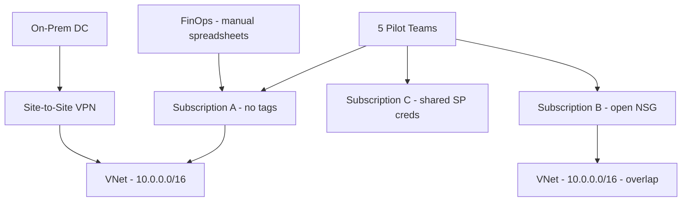
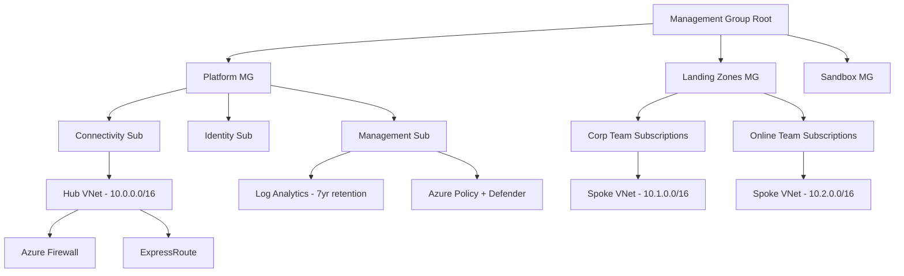

# Case Study: Enterprise Azure Landing Zone for 50 Teams

| Attribute | Value |
|-----------|-------|
| **Industry** | Financial Services |
| **Scale** | 50 product teams, 800 engineers, 2,400 Azure subscriptions (projected) |
| **Week** | 09 |
| **Difficulty** | Expert |

## Business Context

A financial services enterprise is accelerating cloud adoption after a successful pilot with 5 teams on Azure. The CIO wants 50 product teams onboarded within 18 months, each with autonomy to deploy applications while security, compliance, and cost governance remain centralized.

The pilot exposed chaos: teams created subscriptions without tagging, peered VNets ad hoc creating routing loops, service principals shared via email, and a $180K/month surprise bill from orphaned GPU VMs. Internal audit flagged 14 policy violations against PCI-DSS and SOC 2 controls.

You are the cloud architect tasked with designing the Azure landing zone that balances team velocity with enterprise guardrails.

## Current State



**Current implementation issues (from cloud center of excellence review):**
- No management group hierarchy — flat subscription sprawl
- Identity: local subscription owners instead of Entra ID PIM
- Networking: overlapping CIDR blocks prevent hub-spoke peering
- No Azure Policy — public storage accounts and open RDP NSGs exist
- No centralized logging — each team configures diagnostics differently
- Service principals created manually; secrets stored in team Slack channels
- No self-service portal — provisioning takes 3-4 weeks via ticket queue

## Requirements

### Functional
- Self-service subscription provisioning for new teams (< 24 hours)
- Centralized identity, networking, logging, and policy enforcement
- Team autonomy to deploy apps within guardrails
- Cost allocation and chargeback by team/cost center
- Support dev, staging, production environments per team

### Non-Functional
| NFR | Target |
|-----|--------|
| Subscription provisioning | < 24 hours automated |
| Policy compliance | 100% PCI/SOC 2 controls enforced |
| Network isolation | Zero cross-team traffic without approval |
| Audit log retention | 7 years (regulatory) |
| Platform availability | 99.99% for shared services |
| Cost visibility | Per-team dashboards within 24 hours |

## Constraints

- Must follow Microsoft Cloud Adoption Framework (CAF) landing zone principles
- Existing ExpressRoute to on-premises — cannot re-IP production VLANs
- Budget: $2M/year platform engineering team (12 FTEs)
- Regulatory: PCI-DSS Level 1, SOC 2 Type II, data residency in US East + US West
- 50 teams onboarded over 18 months (not all at once)
- Cannot block teams from using approved Azure PaaS services

## Your Task

1. Design the management group and subscription vending model for 50 teams
2. Define the hub-spoke network topology with IP address management
3. Specify Azure Policy initiatives for PCI/SOC 2 compliance
4. Design the identity model (PIM, managed identities, service principal lifecycle)
5. Propose a self-service onboarding workflow and platform team operating model

> **Attempt your solution before reading the reference below.**

---

## Reference Solution

### Top 3 Issues

1. **No subscription governance** — flat structure prevents policy inheritance and cost allocation
2. **Network anarchy** — overlapping CIDRs and ad hoc peering create security and routing risk
3. **Identity sprawl** — shared service principal secrets violate SOC 2 access controls

### Revised Landing Zone Architecture



### Key Decisions

| Decision | Choice | Rationale |
|----------|--------|-----------|
| Subscription model | Vending via ALZ + ARM/Bicep templates | Consistent, auditable, < 24hr provisioning |
| Management groups | Platform / Landing Zone / Sandbox / Decommissioned | CAF-aligned policy inheritance |
| Networking | Hub-spoke with Azure Firewall + VWAN | Centralized egress, no CIDR overlap |
| IPAM | Pre-allocated /16 per team from 10.0.0.0/8 plan | Eliminates overlap incidents |
| Identity | Entra ID PIM for subscription Owner; workload identities only | No long-lived secrets |
| Policy | PCI-DSS initiative + custom deny rules | Public storage, open RDP blocked at MG level |
| Logging | Diagnostic settings → central Log Analytics via policy | 7-year retention, single audit trail |
| Self-service | Backstage/ServiceNow → Bicep subscription vending pipeline | Team autonomy within guardrails |

### Subscription Vending Flow

```
Team request → ServiceNow approval → Bicep module:
  1. Create subscription in Landing Zone MG
  2. Assign RBAC (Contributor to team group, not individuals)
  3. Deploy spoke VNet with pre-allocated CIDR
  4. Peer to hub (automated)
  5. Apply policy initiative
  6. Enable diagnostic settings
  7. Register in FinOps cost allocation tag schema
```

### Expected Outcome

- Provisioning time: 3-4 weeks → < 24 hours automated
- Policy violations: 14 active → 0 (prevented at creation)
- Orphaned resource cost: $180K/month → <$10K/month (tagging + auto-shutdown policies)
- Team onboarding: 5 teams/quarter sustainable with 12 FTE platform team

## Discussion Questions

1. When would you choose Azure Virtual WAN over traditional hub-spoke with manual peering?
2. How do you handle a team that needs a non-standard service blocked by Azure Policy?
3. Should sandbox subscriptions have internet egress, and how do you prevent sandbox → production data leakage?

## Interview Story Angle

**STAR prompt:** "Tell me about establishing cloud governance at enterprise scale."

Use this case study: emphasize CAF landing zone principles, subscription vending automation, and converting a $180K/month cost leak into governed self-service for 50 teams.
