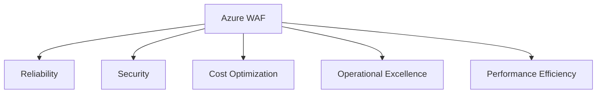
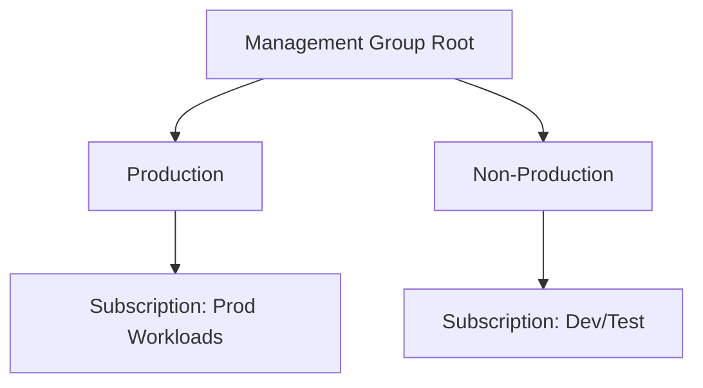
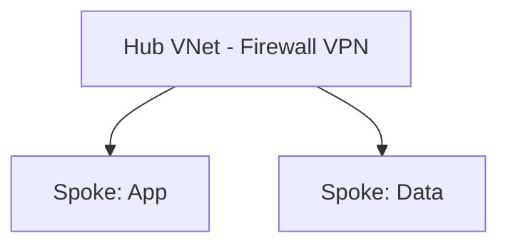
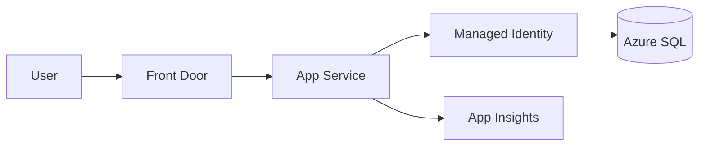
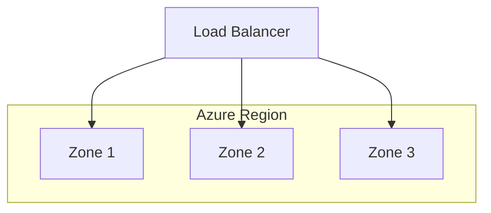

# Week 09 — Azure Fundamentals & WAF Diagrams

## 1. Well-Architected Pillars

## 2. Landing Zone — Management Groups

## 3. Hub-Spoke (Intro)

## 4. .NET App on Azure — Baseline

## 5. Resilience — Availability Zones

> **Architect note:** Zone-redundant ≠ region-redundant. Document RTO/RPO per tier.

## Practice Exercise

Sketch a 3-subscription landing zone for a 50-person startup scaling to enterprise.

---

[← Back to Week 09](../README.md)
