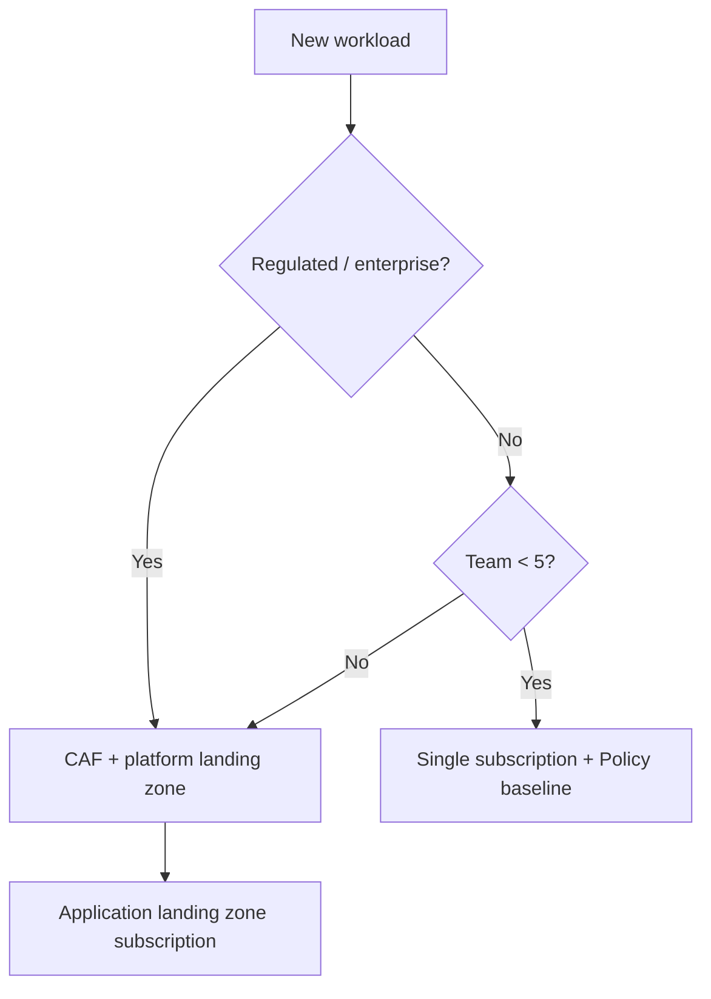

# Azure Fundamentals & Well-Architected Framework

> **Week 09** | **Level:** Fundamentals

## Azure Hierarchy
- **Management Groups** → **Subscriptions** → **Resource Groups** → **Resources**
- **Regions** and **Availability Zones** (3+ per region for zone-redundant services)

## Well-Architected Framework (5 Pillars)
1. **Reliability** — Resiliency, HA, DR
2. **Security** — Defense in depth, identity, encryption
3. **Cost Optimization** — Right-sizing, reserved capacity
4. **Operational Excellence** — DevOps, monitoring, IaC
5. **Performance Efficiency** — Scaling, caching, CDN

## Landing Zone Concepts
- **Platform landing zone** — shared services (networking, identity, policy)
- **Application landing zone** — workload-specific subscriptions
- **CAF (Cloud Adoption Framework)** — migration methodology

## Key Services Overview
| Category | Services |
|----------|----------|
| Compute | VM, App Service, AKS, Functions, Container Apps |
| Data | SQL Database, Cosmos DB, Blob, Data Lake |
| Identity | Entra ID, Managed Identity, RBAC |
| Networking | VNet, NSG, App Gateway, Front Door, Private Link |
| Integration | Service Bus, Event Grid, Event Hubs, Logic Apps |

## Architect Decisions
- Start with **subscription strategy** (prod/nonprod/dev per workload)
- Enable **Azure Policy** from day one
- Use **Infrastructure as Code** (Bicep/Terraform)
- Tag all resources: Environment, CostCenter, Owner, Application

## Architect Deep Dive: Subscription & Governance

### Subscription strategy (production pattern)
| Subscription | Purpose | Example naming |
|--------------|---------|----------------|
| Platform | Hub VNet, Firewall, DNS, Log Analytics | `sub-platform-prod` |
| Landing zone — prod | Workload production | `sub-lz-orders-prod` |
| Landing zone — nonprod | Dev/test/staging | `sub-lz-orders-nonprod` |
| Sandbox | Experimentation, auto-delete policy | `sub-sandbox-{team}` |

**Rule of thumb:** One production workload (or product line) per subscription — blast radius and cost attribution.

### WAF pillar → Azure service mapping
| Pillar | Key questions | Azure levers |
|--------|---------------|--------------|
| Reliability | What fails first? RTO/RPO? | Availability Zones, paired regions, Traffic Manager |
| Security | Who can access what? | Entra ID, RBAC, Private Link, Defender |
| Cost | What's driving spend? | Reservations, budgets, right-sizing Advisor |
| Ops Excellence | Can we deploy safely daily? | IaC, App Insights, Automation |
| Performance | Where is latency? | CDN, caching, scale-out |

### Landing zone decision tree

### Common interview mistakes
- Proposing one subscription for all environments without cost or blast-radius isolation
- Ignoring Azure Policy until after resources are deployed
- Selecting region without checking service availability and data residency

### Interview angle
*"We standardized on management groups + subscription per product line, enforced tagging via Policy deny, and cut orphaned resource spend 18% in quarter one."*

**Next:** 02-intermediate.md
