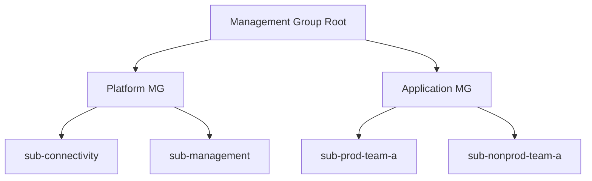

# Azure Fundamentals — Advanced

> **Week 09** | **Level:** Advanced

## Multi-Subscription Strategy for Enterprise

## CAF Migration Stages

1. **Strategy** — Business justification, skills
2. **Plan** — Landing zone, migration plan
3. **Ready** — Landing zone deployed
4. **Adopt** — Migrate workloads
5. **Govern** — Policy, cost, security
6. **Manage** — Operate, optimize

## Architect Interview Scenarios

- Design subscriptions for 5 teams with SOC 2
- Justify zone redundancy vs cost for 99.9% SLA
- Map WAF pillars to a specific workload trade-off

**Premium Q&A:** [Azure Top 50](../../../interview-prep/azure-top-50-index.md)

**Previous:** [02-intermediate.md](02-intermediate.md) | [Week 09](../README.md)

## Architect Deep Dive: Enterprise Adoption

### CAF migration waves
| Wave | Workloads | Risk |
|------|-----------|------|
| 1 | Dev/test, internal tools | Low |
| 2 | Non-critical customer-facing | Medium |
| 3 | Revenue-critical, data-heavy | High — requires landing zone maturity |

### Multi-region active-active (when justified)
Justify with business RTO/RPO and revenue at risk — not "best practice." Start active-passive with Front Door failover; evolve to active-active only when failover drill proves RTO gap.

### FinOps integration
Architect owns **unit economics**: cost per order, per API call, per tenant. Tag at deploy time via IaC — retroactive tagging fails at scale.

