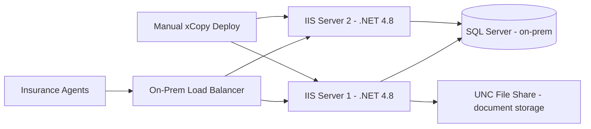
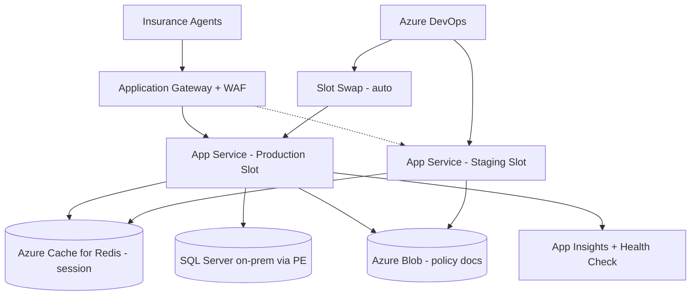

# Case Study: Monolith to Azure App Service with Deployment Slots

| Attribute | Value |
|-----------|-------|
| **Industry** | Insurance |
| **Scale** | 3.2M policyholders, 12K concurrent users, 45-minute deploy windows |
| **Week** | 10 |
| **Difficulty** | Intermediate |

## Business Context

An insurance company's policy management system is a .NET Framework 4.8 monolith hosted on two IIS servers in an on-premises data center. Deployments require a 45-minute maintenance window every two weeks, during which agents cannot quote or bind policies. Last quarter, a bad deployment rolled back manually took 90 minutes — during peak morning hours — and generated 340 support calls.

The CTO approved migration to Azure App Service to enable zero-downtime deployments, auto-scaling for month-end quoting spikes, and a path toward .NET 8 modernization. You must migrate without rewriting the monolith.

## Current State



**Current implementation issues (from migration assessment):**
- Deployments stop IIS app pool on both servers sequentially — 45-minute window
- No health checks — bad deploy discovered by agents calling support
- Session state stored in-memory — sticky sessions required, prevents single-server deploy
- Document uploads to UNC path `\\fileserver\policies` — not cloud-compatible
- Connection strings in `web.config` — transformed manually per environment
- Month-end quoting spike: 12K concurrent users crashes IIS at ~8K (no auto-scale)
- .NET Framework 4.8 — cannot run on Linux App Service

## Requirements

### Functional
- Quote, bind, and endorse policies (existing workflows unchanged)
- Document upload and retrieval for policy PDFs
- Agent session persistence across requests
- Scheduled batch jobs for premium calculations (nightly)

### Non-Functional
| NFR | Target |
|-----|--------|
| Availability | 99.95% |
| Deployment downtime | 0 minutes |
| Latency (p99) | < 800ms (current baseline) |
| Auto-scale | 4K → 12K concurrent users |
| RTO | 30 minutes |
| RPO | 5 minutes |
| Rollback time | < 5 minutes |

## Constraints

- Team: 8 .NET developers, limited Azure experience
- Budget: $25K/month Azure spend cap
- Must stay on .NET Framework 4.8 for Phase 1 (modernization is Phase 2)
- SQL Server stays on-premises initially (Azure SQL migration is separate project)
- ExpressRoute connectivity already provisioned
- 14-week migration timeline
- Regulatory: state insurance filings require audit trail of deployments

## Your Task

1. Design the App Service architecture with deployment slots for zero-downtime releases
2. Solve session state and sticky session problem for multi-instance scaling
3. Migrate UNC file share document storage to Azure-compatible solution
4. Define the deployment pipeline with slot swap and automated rollback
5. Plan connectivity from App Service to on-premises SQL Server securely

> **Attempt your solution before reading the reference below.**

---

## Reference Solution

### Top 3 Issues

1. **In-memory session state** — blocks multi-instance scaling and slot swaps
2. **UNC file share dependency** — App Service cannot access on-prem SMB without hybrid complexity
3. **Manual deployment with no health validation** — 90-minute rollback incident preventable with slots

### Revised Architecture



### Key Decisions

| Decision | Choice | Rationale |
|----------|--------|-----------|
| App Service plan | Premium P2v3 (Windows) | Deployment slots, auto-scale, VNet integration |
| Deployment slots | Staging → Production swap | Zero-downtime; instant rollback by reverse swap |
| Session state | Azure Cache for Redis (ASP.NET session provider) | Stateless instances; slot swap safe |
| File storage | Azure Blob Storage with SDK replace | No SMB dependency; geo-redundant |
| SQL connectivity | VNet integration + Private Endpoint to on-prem SQL | No public SQL exposure |
| Health check | App Service health check on `/health` endpoint | Auto-remove unhealthy instances pre-swap |
| CI/CD | Deploy to staging → warm up → swap → smoke test | 5-minute rollback via reverse swap |

### Deployment Slot Workflow

```
1. Build .NET 4.8 package in Azure DevOps
2. Deploy to staging slot (production unaffected)
3. Run integration tests against staging URL
4. Warm up staging (App Service auto-warm + manual smoke tests)
5. Swap staging ↔ production (zero downtime)
6. Monitor App Insights for 15 minutes
7. If error rate > threshold → reverse swap (< 2 minutes)
```

### Expected Outcome

- Deployment downtime: 45 minutes → 0 minutes
- Rollback time: 90 minutes → < 5 minutes (slot swap)
- Concurrent user capacity: 8K → 12K+ (auto-scale 2-6 instances)
- Cost: ~$4K/month App Service + $800/month Redis (within $25K cap)

## Discussion Questions

1. When would you use blue-green deployment with two separate App Services instead of slots?
2. How does slot swap interact with database schema migrations?
3. What triggers moving from .NET Framework 4.8 on Windows to .NET 8 on Linux App Service?

## Interview Story Angle

**STAR prompt:** "Tell me about migrating a legacy application to the cloud with zero downtime."

Use this case study: emphasize deployment slots for instant rollback, externalizing session state, and converting a 90-minute incident into a 5-minute automated swap.
