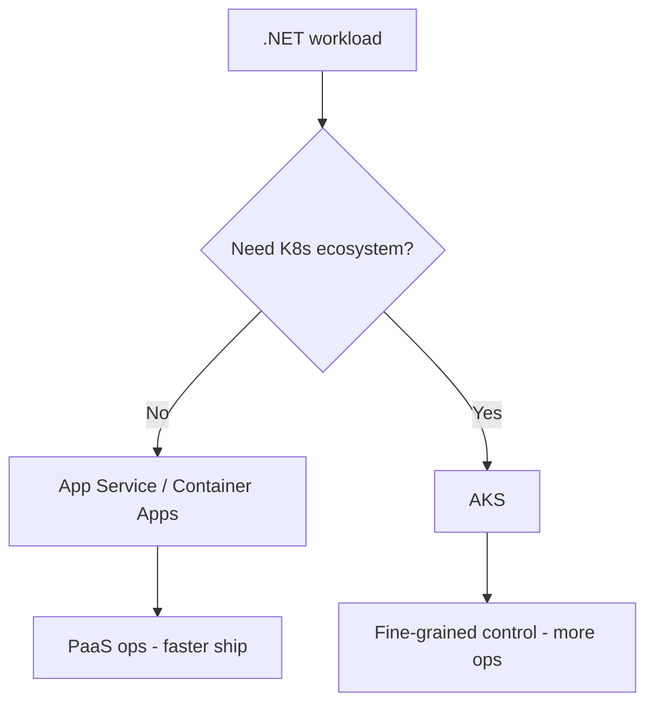
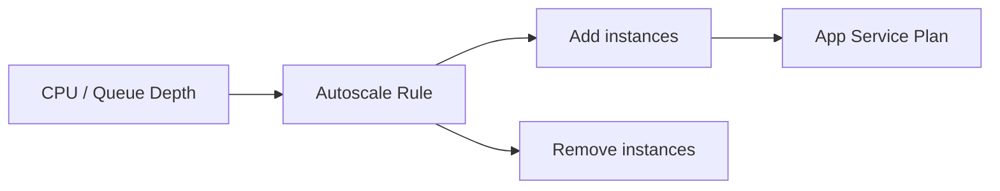
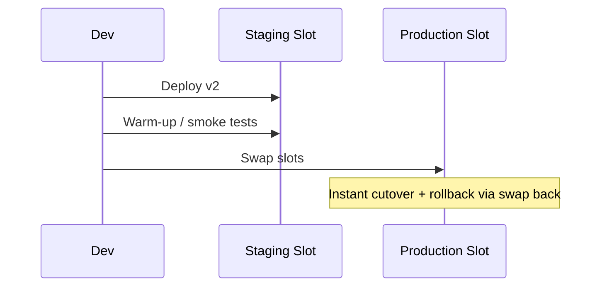
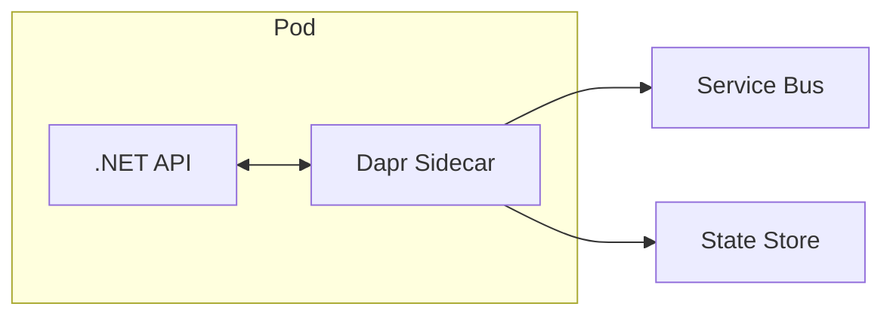
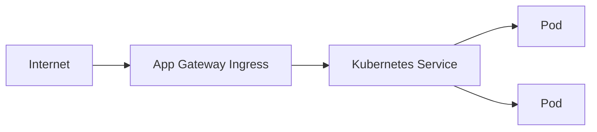

# Week 10 — Azure Compute & App Services Diagrams

## 1. App Service vs AKS Decision

## 2. App Service Scaling

## 3. Deployment Slots

## 4. Container Apps — Dapr Sidecar

## 5. AKS Ingress Path

## Practice Exercise

When would you choose Container Apps over App Service for a .NET 8 microservice with KEDA scaling on Service Bus queue depth?

---

[← Back to Week 10](../README.md)
