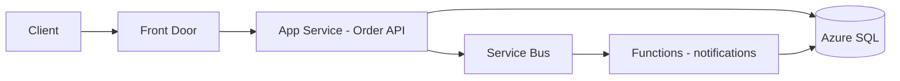

# Azure Compute — Advanced

> **Week 10** | **Level:** Advanced

## Autoscale Patterns

| Signal | App Service | AKS |
|--------|-------------|-----|
| CPU | Built-in rules | HPA + metrics server |
| Queue depth | Custom metric | KEDA |
| Schedule | Scale up before business hours | CronHPA |

## Cold Start Mitigation

- **Functions:** Premium plan with pre-warmed instances
- **Container Apps:** min replicas > 0 for latency-sensitive
- **App Service:** Always On (non-consumption plans)

## Multi-Region Compute

- Front Door → regional App Services
- Session affinity implications for stateful apps
- Deployment slots per region vs global slot swap

**Previous:** [02-intermediate.md](02-intermediate.md) | **Lab:** [week-10 labs](../labs/)

## Architect Deep Dive: Multi-Compute Topologies

### Hybrid example: order platform

API stays on App Service for team familiarity; bursty notification fan-out on Functions consumption/premium.

### Scale trigger review
Before Black Friday: load test 2× peak, verify autoscale rules, SQL DTU/vCore headroom, and connection pool limits on App Service plan instance count.

