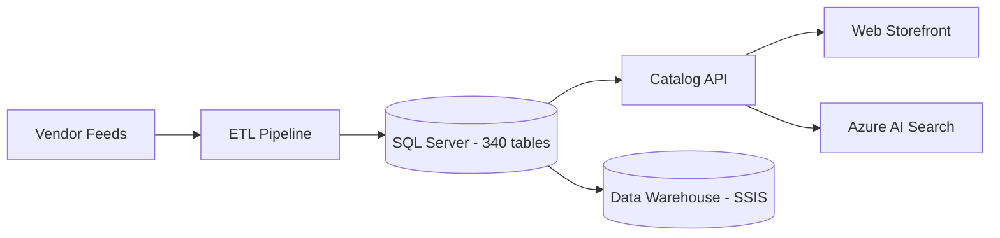
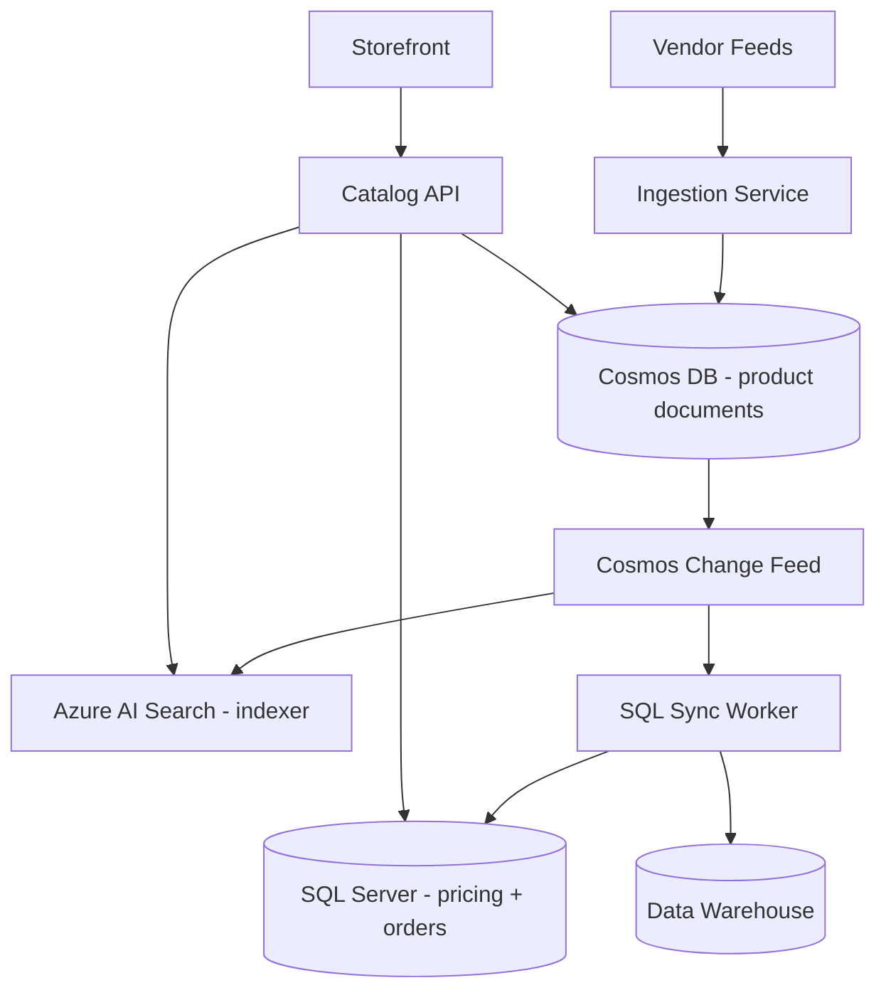

# Case Study: Product Catalog — Cosmos DB vs SQL Polyglot Decision

| Attribute | Value |
|-----------|-------|
| **Industry** | Retail / E-commerce |
| **Scale** | 12M SKUs, 180K updates/hour, 50K catalog reads/second peak |
| **Week** | 11 |
| **Difficulty** | Advanced |

## Business Context

A global retailer is rebuilding its product catalog service. The current SQL Server database struggles with schema variability — vendors submit product data in 40+ different attribute schemas (apparel sizes, electronics specs, grocery nutrition facts). Adding a new category requires a DBA-led schema migration that takes 2-3 weeks.

The catalog team wants a document model. The enterprise data team insists transactional data stays in SQL Server for reporting consistency. The argument has stalled the project for 4 months.

The VP of Engineering wants a polyglot persistence decision documented with clear boundaries: what lives in Cosmos DB, what stays in SQL Server, and how they stay consistent.

## Current State



**Current implementation issues (from architecture review):**
- 340 tables with EAV (Entity-Attribute-Value) anti-pattern for flexible attributes
- Category schema change: `ALTER TABLE` + 3-week regression test cycle
- Read path: 12 JOINs for a single product detail page — p99 1.2 seconds
- Write path: vendor bulk import of 50K SKUs takes 4 hours (row-by-row upsert)
- Global distribution: single SQL Server in US East — EU customers see 280ms catalog latency
- Search index rebuilt nightly — new products invisible for up to 24 hours

## Requirements

### Functional
- Store product core data + category-specific flexible attributes
- Support 12M SKUs with 180K updates/hour from vendor feeds
- Product detail page: full product with attributes, images, pricing
- Category browse with faceted search (brand, size, color, price range)
- Real-time inventory status (sourced from separate inventory service)

### Non-Functional
| NFR | Target |
|-----|--------|
| Availability | 99.99% |
| Latency (p99) — product read | < 50ms globally |
| Latency (p99) — vendor bulk write | < 5 minutes for 50K SKUs |
| Schema flexibility | New category deployable in < 1 day |
| Consistency | Eventual (search) + strong (pricing) |
| RTO | 1 hour |
| RPO | 5 minutes |

## Constraints

- Enterprise mandate: financial/transactional data remains in SQL Server
- Budget: $30K/month for catalog infrastructure
- Team: 6 backend engineers (strong SQL, 1 engineer with Cosmos DB experience)
- Must integrate with existing Azure AI Search for faceted browse
- GDPR: EU product data must be stored in EU region
- Cannot break existing warehouse SSIS feed (migrate incrementally)

## Your Task

1. Draw the boundary between Cosmos DB and SQL Server data
2. Design the Cosmos DB container/partition key strategy for 12M SKUs
3. Explain consistency model for catalog reads vs pricing/inventory
4. Define the vendor ingestion pipeline for 180K updates/hour
5. Document the sync mechanism between Cosmos DB and SQL Server warehouse feed

> **Attempt your solution before reading the reference below.**

---

## Reference Solution

### Top 3 Issues

1. **EAV in SQL Server** — flexible attributes forced into 340-table JOIN nightmare
2. **Wrong database for read pattern** — product detail is document-shaped, not relational
3. **No global distribution** — single-region SQL cannot meet 50ms global p99

### Revised Polyglot Architecture



### Key Decisions

| Decision | Choice | Rationale |
|----------|--------|-----------|
| Product attributes | Cosmos DB (document per SKU) | Schema flexibility; single-read product detail |
| Pricing & promotions | SQL Server (normalized) | ACID required; existing warehouse integration |
| Orders & inventory refs | SQL Server | Transactional; enterprise mandate |
| Partition key | `/categoryId` | Even distribution; category-scoped queries efficient |
| Consistency (catalog) | Session consistency in Cosmos | Read-your-writes for vendor upload confirmation |
| Consistency (pricing) | Strong in SQL Server | No stale price on checkout |
| Search sync | Cosmos change feed → AI Search indexer | Near real-time; replaces nightly rebuild |
| Warehouse sync | Change feed → SQL sync worker (denormalized flat table) | Preserves SSIS feed without EAV |

### Cosmos Document Model

```json
{
  "id": "SKU-12345",
  "categoryId": "apparel-mens-shoes",
  "name": "Trail Runner X",
  "brand": "Alpine",
  "attributes": {
    "sizes": ["8", "9", "10", "11"],
    "color": "navy",
    "material": "mesh"
  },
  "images": ["https://..."],
  "priceRef": "PRC-12345",
  "updatedAt": "2026-06-15T10:30:00Z"
}
```

### Data Boundary Rules

| Data | Store | Why |
|------|-------|-----|
| Product attributes, images, descriptions | Cosmos DB | Flexible schema, global read |
| Price, promotions, tax rules | SQL Server | ACID, audit, warehouse |
| Order lines, payment | SQL Server | Transactional |
| Search facets | Azure AI Search | Derived from Cosmos change feed |

### Expected Outcome

- Product read p99: 1.2s → ~35ms (single Cosmos point read)
- New category launch: 3 weeks → < 1 day (new document shape, no migration)
- Vendor bulk import: 4 hours → ~8 minutes (Cosmos bulk executor)
- Cost: ~$8K/month Cosmos (autoscale 10K RU) + existing SQL (within $30K cap)

## Discussion Questions

1. When would Cosmos DB be the wrong choice despite flexible schema needs?
2. How do you handle a product that spans multiple categories (partition key conflict)?
3. Should pricing be denormalized into the Cosmos document for read performance?

## Interview Story Angle

**STAR prompt:** "Tell me about a polyglot persistence decision you made."

Use this case study: emphasize clear data boundaries (not "Cosmos for everything"), partition key design, and resolving a 4-month architecture stalemate with documented trade-offs.
