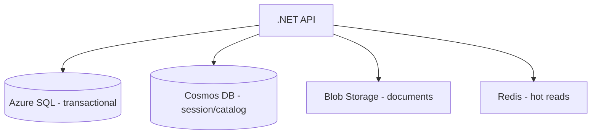
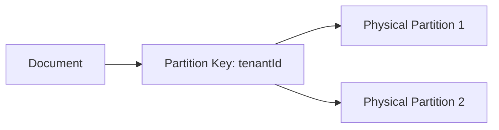
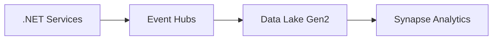
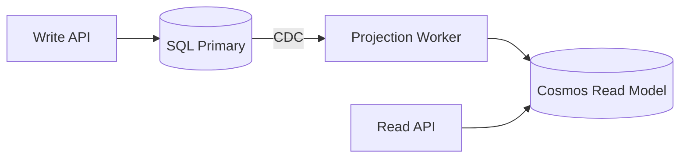
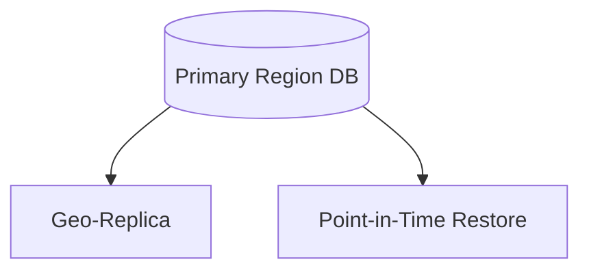

# Week 11 — Azure Data Platform Diagrams

## 1. Polyglot Persistence

## 2. Cosmos DB Partition Strategy

> **Architect note:** Avoid hot partitions — shard high-traffic tenants.

## 3. Event Ingestion to Lake

## 4. CQRS Read/Write Split

## 5. Backup & DR for Data Tier

## Practice Exercise

Design partition keys for multi-tenant SaaS orders in Cosmos DB (10K tenants, uneven sizes).

---

[← Back to Week 11](../README.md)
