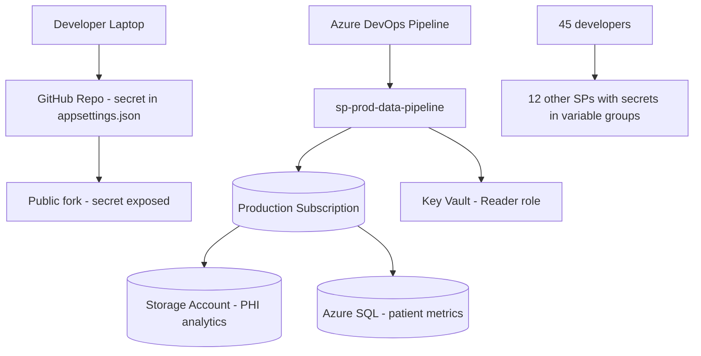

# Case Study: Service Principal Secret Leak — Identity Remediation

| Attribute | Value |
|-----------|-------|
| **Industry** | Healthcare SaaS |
| **Scale** | 800 Azure resources, 45 microservices, 120 developers |
| **Week** | 12 |
| **Difficulty** | Advanced |

## Business Context

A healthcare SaaS company's security team detected a service principal client secret committed to a public GitHub repository during a routine secret-scanning alert. The secret belonged to `sp-prod-data-pipeline` with `Contributor` role on the production subscription containing PHI-adjacent patient analytics data.

The secret was exposed for an estimated 72 hours before detection. GitHub's secret scanning triggered the alert, but internal CI/CD pipelines had been using the same secret for 14 months. HIPAA breach assessment is underway; legal requires documented remediation within 48 hours.

You are the architect leading the incident response and long-term identity hardening.

## Current State

**Current implementation issues (from incident forensics):**
- Service principal `sp-prod-data-pipeline` has `Contributor` on production subscription
- Client secret stored in: GitHub repo, Azure DevOps variable group, 3 developer `.env` files
- 12 of 18 service principals use client secrets (not managed identities / federated credentials)
- No Conditional Access policies on service principal authentication
- Key Vault access policies grant `sp-prod-data-pipeline` Reader — can list all secret names
- No automated secret rotation — oldest secret is 14 months old
- Audit logs show 2 unknown IP addresses accessed Azure Resource Manager API during exposure window

## Requirements

### Functional
- Immediately revoke compromised credentials and block unauthorized access
- Rotate all service principal secrets without breaking production pipelines
- Migrate workloads to managed identities or workload identity federation
- Maintain pipeline deployments during remediation (no multi-day deploy freeze)

### Non-Functional
| NFR | Target |
|-----|--------|
| Credential revocation | < 1 hour from incident declaration |
| Full secret rotation | < 48 hours |
| Secret elimination | 0 client secrets in production within 90 days |
| Audit trail | Complete incident timeline for HIPAA/legal |
| Pipeline availability | Deployments resume within 4 hours of revocation |
| RPO | 0 — no data loss during remediation |

## Constraints

- HIPAA breach notification may be required — legal is evaluating
- 45 microservices deployed via Azure DevOps — cannot freeze all releases for a week
- 3 third-party integrations use service principal secrets (vendor APIs)
- Team: 4 platform engineers, 2 security engineers (incident response mode)
- Azure AD PIM available but not configured for service principals
- 48-hour legal deadline for initial remediation report

## Your Task

1. Define the immediate incident response steps (first 4 hours)
2. Design the secret rotation plan that keeps pipelines running
3. Propose the target identity architecture (managed identities + federation)
4. Specify Azure Policy and CI/CD guardrails to prevent recurrence
5. Document the HIPAA-relevant audit trail requirements

> **Attempt your solution before reading the reference below.**

---

## Reference Solution

### Top 3 Issues

1. **Over-privileged service principal** — `Contributor` on production subscription far exceeds pipeline needs
2. **Secret sprawl** — same credential in 5+ locations; rotation is non-atomic
3. **No prevention controls** — secret scanning was external (GitHub), not in internal CI/CD

### Incident Response Timeline

### Key Decisions

| Decision | Choice | Rationale |
|----------|--------|-----------|
| Immediate action | Disable `sp-prod-data-pipeline` credential in Entra ID | Stop active exploitation within minutes |
| Forensics | Query Azure Activity Log + Entra sign-in logs for unknown IPs | HIPAA breach assessment evidence |
| Pipeline continuity | Deploy temporary managed identity with scoped RBAC | Unblock deployments in < 4 hours |
| Target identity | System-assigned MI per App Service + federated credentials for DevOps | Eliminate secrets entirely |
| RBAC scope | `Storage Blob Data Contributor` on specific container only | Least privilege replaces `Contributor` |
| Prevention | GitHub Advanced Security + `credscan` in Azure DevOps + pre-commit hooks | Defense in depth |
| Policy | Azure Policy deny: no client secrets > 90 days; require MI where supported | Automated enforcement |

### Rotation Plan (48 hours)

**Hour 0-1:** Revoke compromised secret. Audit all ARM operations from unknown IPs during 72-hour window.

**Hour 1-4:** Create managed identity `mi-prod-data-pipeline` with scoped `Storage Blob Data Contributor` on `patient-analytics` container only. Update pipeline service connection. Verify deploy + smoke test.

**Hour 4-48:** Inventory all 18 service principals. Classify: (A) can use MI immediately, (B) needs federated credential, (C) third-party (vault with auto-rotation). Rotate class B and C. Revoke all secrets for class A.

**Day 1-90:** Migrate remaining services. Azure Policy audit mode → deny mode at day 60.

### Expected Outcome

- Exploitation window closed: < 1 hour from incident declaration
- Pipeline downtime: < 4 hours (not days)
- Production secrets: 12 → 0 within 90 days
- RBAC blast radius: full subscription → single storage container

## Discussion Questions

1. How do you handle third-party vendors that require client secrets and cannot use federation?
2. Should you rotate all secrets simultaneously or sequentially during a breach?
3. When does a service principal secret exposure trigger HIPAA breach notification vs security incident?

## Interview Story Angle

**STAR prompt:** "Tell me about a security incident you responded to and how you prevented recurrence."

Use this case study: emphasize speed of credential revocation, least-privilege RBAC redesign, and systematic elimination of secrets — not just rotation of the compromised one.
