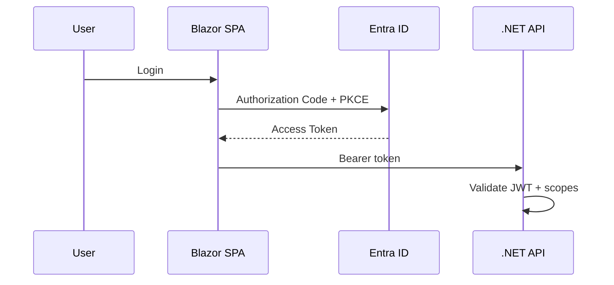
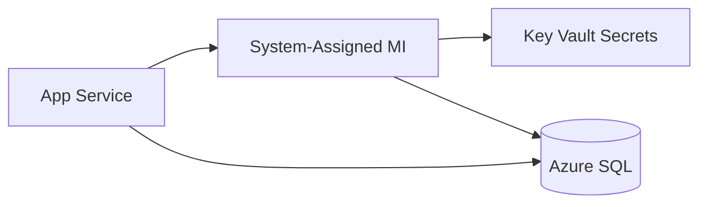
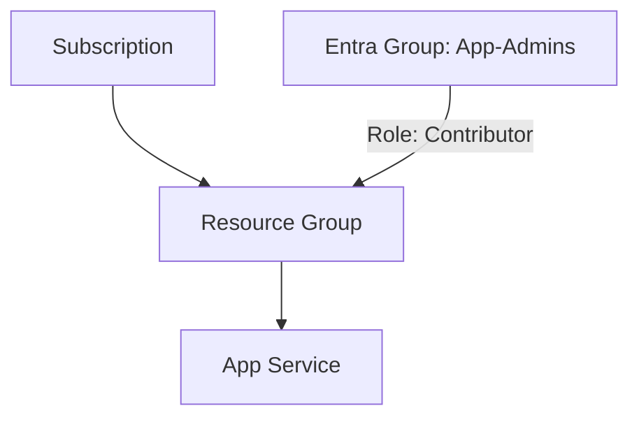
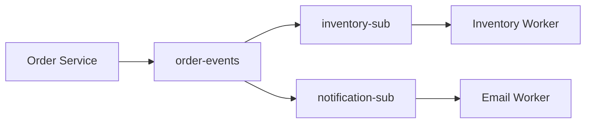
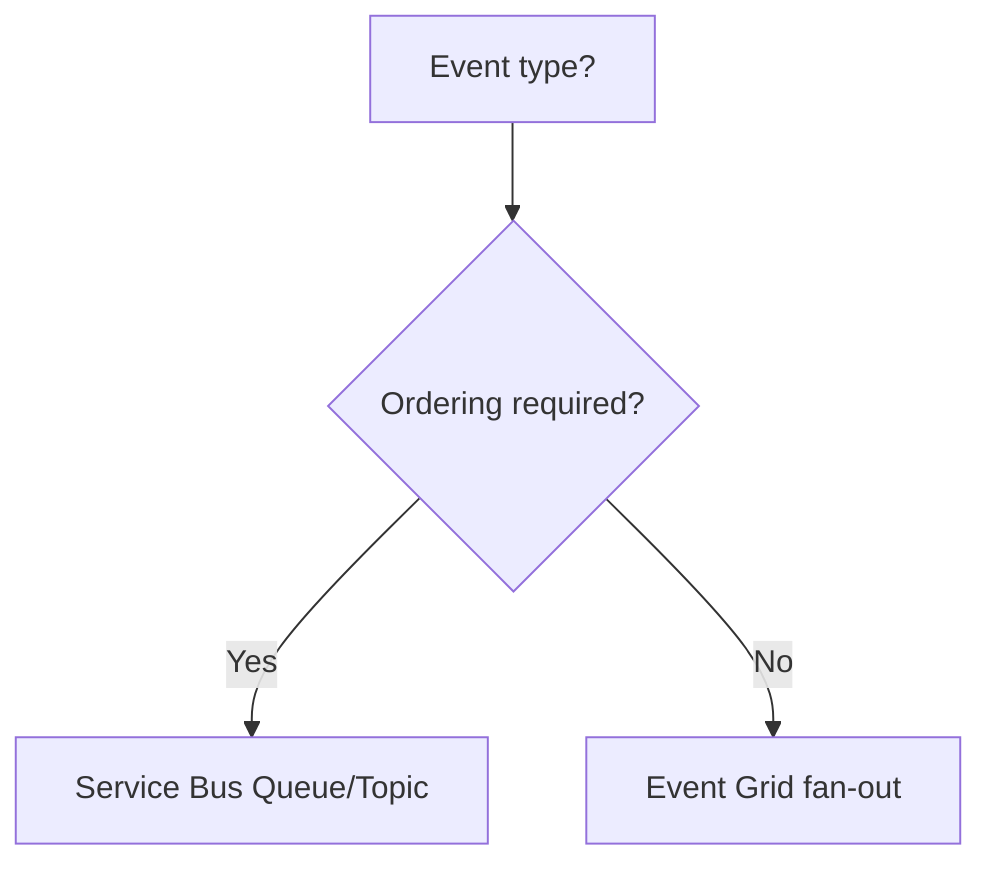

# Week 12 — Azure Identity & Integration Diagrams

## 1. Entra ID — OAuth Flow for .NET API

## 2. Managed Identity to Key Vault

## 3. RBAC Layers

## 4. Service Bus — Topics & Subscriptions

## 5. Event Grid vs Service Bus

## Practice Exercise

Draw identity flow for a multi-tenant API using `tenantId` claim + per-tenant Key Vault references.

---

[← Back to Week 12](../README.md)
