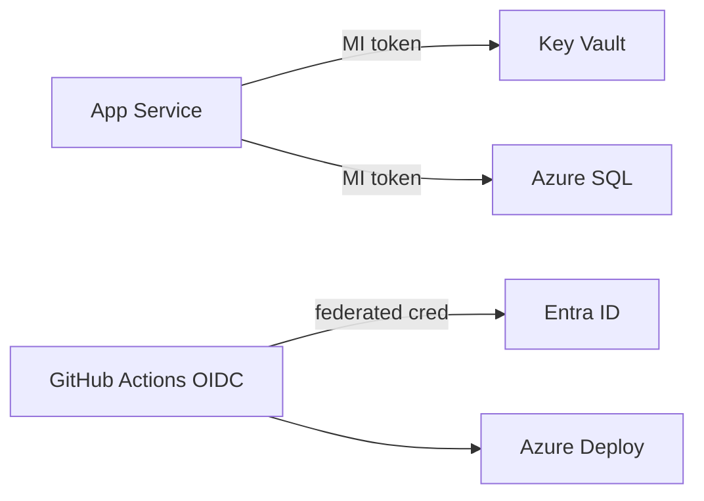

# Azure Identity — Intermediate

> **Week 12** | **Level:** Intermediate

## Conditional Access Policies

| Control | Example |
|---------|---------|
| Require MFA | All users except break-glass |
| Block legacy auth | POP/IMAP/SMTP AUTH |
| Require compliant device | Production admin portals |
| Sign-in risk | Block high risk, require MFA medium |

## Managed Identity Patterns

## OBO (On-Behalf-Of) Flow

User token → API → downstream API with user context preserved. Required for delegated permissions across microservices.

## Architect Deep Dive: Auth Patterns for .NET APIs

### Recommended API auth stack
1. **Entra ID** — workforce and B2B
2. **Entra External ID / B2C** — customer identity
3. **JWT validation** — `Microsoft.Identity.Web` in ASP.NET Core
4. **APIM** — optional central JWT validation + rate limit

### Service-to-service
App Service MI → gets token for `api://downstream-app/.default` → calls Payment API with bearer token. No shared API keys in config.

### Least privilege example
CI/CD federated credential scoped to `repo:org/app:environment:production` — not subscription Contributor.

**Next:** [03-advanced.md](03-advanced.md)
