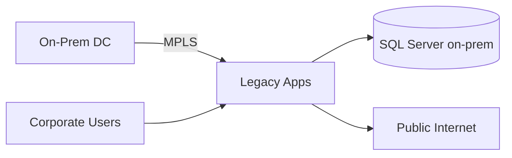
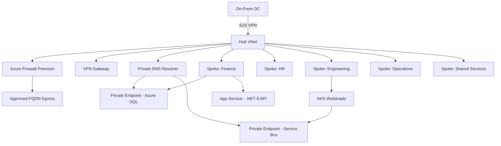

# Case Study: Enterprise Hub-Spoke Azure Networking

| Attribute | Value |
|-----------|-------|
| **Industry** | Financial services (multi-BU enterprise) |
| **Scale** | 20 applications, 5 business units, 2,400 employees |
| **Week** | 13 |
| **Difficulty** | Advanced |

## Business Context

A global financial services firm is migrating 20 legacy .NET applications from on-premises data centers to Azure. The CISO has mandated zero-trust networking: no direct internet access for databases, all egress filtered by FQDN, and mandatory connectivity to on-premises Active Directory and mainframe settlement systems.

The platform team has proposed a flat VNet with public endpoints and IP allowlists. Security rejected it. You are the lead cloud architect asked to design a hub-spoke topology that satisfies security, operations, and a 9-month migration timeline.

## Current State



**Current implementation issues (from architecture review):**
- Single flat on-prem network with no workload segmentation
- Applications use public SQL endpoints with IP allowlists
- Egress traffic exits directly to internet with no FQDN filtering
- No Private Link for Azure PaaS services
- DNS resolution for hybrid workloads is inconsistent
- Terraform state is per-team with no shared network module

## Requirements

### Functional
- Site-to-Site VPN connectivity between on-prem and Azure hub
- Five spoke VNets (Finance, HR, Engineering, Operations, Shared Services)
- Private Link for all PaaS data services (SQL, Storage, Key Vault, Service Bus)
- Centralized egress through Azure Firewall with FQDN allowlists
- Cross-spoke communication only via hub (no spoke-to-spoke peering)

### Non-Functional
| NFR | Target |
|-----|--------|
| Availability (hub) | 99.99% |
| VPN throughput | 2 Gbps aggregate |
| DNS resolution latency | < 50ms for Private Link FQDNs |
| RTO (hub failure) | 4 hours |
| RPO (network config) | 24 hours (IaC in Git) |
| Audit | All firewall deny logs retained 90 days |

## Constraints

- Team: 6 platform engineers, 3 network engineers (limited Azure Firewall experience)
- Budget: ~$4,500/month for hub networking (Firewall + VPN Gateway)
- Must integrate with existing Entra ID and on-prem DNS (split-horizon)
- Regulatory: PCI DSS scope for Finance spoke workloads
- Cannot use ExpressRoute in year one (procurement delay)
- All infrastructure defined in Terraform with Azure Landing Zone modules

## Your Task

1. Identify the top 3 architectural/networking issues with the proposed flat VNet approach
2. Propose a revised hub-spoke architecture with Private Link and DNS strategy
3. Explain NSG vs Azure Firewall responsibilities in this design
4. Define how spoke workloads (.NET APIs on App Service, AKS) reach PaaS privately
5. Estimate monthly hub cost and justify it to finance

> **Attempt your solution before reading the reference below.**

---

## Reference Solution

### Top 3 Issues

1. **Flat VNet with public PaaS endpoints** — violates zero-trust; expands attack surface and PCI scope
2. **No centralized egress control** — cannot enforce FQDN filtering or threat intelligence feeds
3. **Missing Private DNS integration** — Private Link endpoints won't resolve without `privatelink.*` zones linked to spokes

### Revised Architecture



### Key Decisions

| Decision | Choice | Rationale |
|----------|--------|-----------|
| Topology | Hub-spoke (5 spokes) | Centralized security, avoids full-mesh peering (10 links → 5) |
| Egress | Azure Firewall Premium | FQDN filtering, TLS inspection, threat intel (NSG cannot filter FQDN) |
| PaaS access | Private Link + Private DNS zones | No public endpoints; DNS resolves `*.privatelink.database.windows.net` |
| Spoke isolation | UDR to hub, no spoke peering | Enforce inspection path; Finance PCI scope contained |
| Hybrid DNS | Private DNS Resolver + conditional forwarders | On-prem resolves Azure private zones; Azure resolves on-prem AD DNS |
| IaC | Terraform ALZ module + policy assignments | Consistent landing zone; deny public IP on SQL/Storage |

### DNS Strategy

```csharp
// App Service VNet integration — connection string uses private FQDN
"Server=tcp:sql-finance.privatelink.database.windows.net,1433;..."
// No code change if DNS zone linked to spoke VNet
```

Private DNS zones required: `privatelink.database.windows.net`, `privatelink.blob.core.windows.net`, `privatelink.vaultcore.azure.net`, `privatelink.servicebus.windows.net`.

### Expected Outcome

- Security posture: public PaaS endpoints eliminated across all 20 apps
- PCI scope: reduced to Finance spoke only (network segmentation evidenced)
- Hub cost: ~$1,250/mo Firewall + ~$350/mo VPN Gateway + ~$200/mo DNS Resolver
- Migration: wave 1 (Shared Services) in month 2; Finance (PCI) in month 5 after pen test

## Discussion Questions

1. When would you add ExpressRoute alongside VPN, and how does routing change?
2. Should spoke-to-spoke traffic ever bypass the hub for performance-critical paths?
3. How do you test Private Link failover before cutover weekend?

## Interview Story Angle

**STAR prompt:** "Tell me about designing a secure cloud network for a regulated enterprise."

Use this case study: emphasize zero-trust trade-offs (cost vs security), Private Link + DNS as the non-obvious failure point, and measurable PCI scope reduction.
