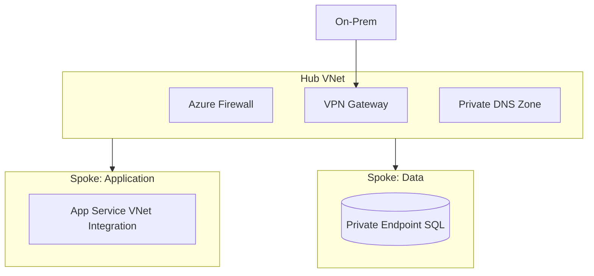
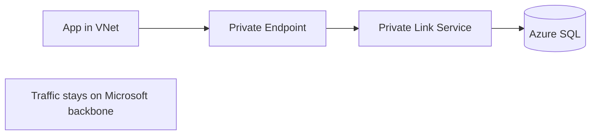
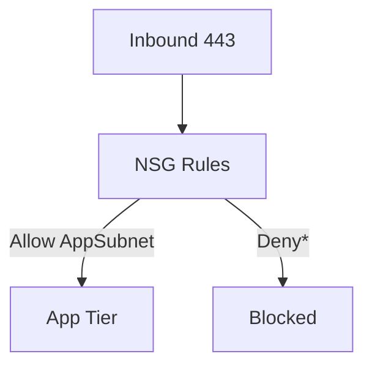
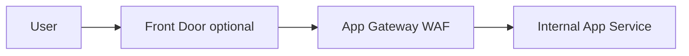
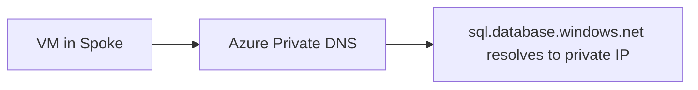

# Week 13 — Azure Networking Diagrams

## 1. Hub-Spoke Topology

## 2. Private Link Data Path

## 3. NSG Flow — Allow/Deny

## 4. Application Gateway + WAF

## 5. DNS Private Resolution

> **Architect note:** Hub owns centralized egress via Firewall — avoid spoke-to-internet bypass.

## Practice Exercise

Compare hub-spoke vs virtual WAN for 15 spokes across 3 regions.

---

[← Back to Week 13](../README.md)
