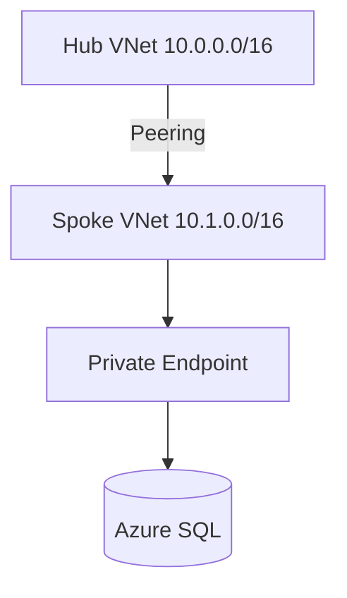

# Lab 13: Azure Hub-Spoke Network with Private Link

| **Week** | 13 | **Duration** | 120 min | **Requires** | Azure subscription

## Objectives

- [ ] Deploy hub VNet with Azure Firewall subnet (or NSG-only for cost)
- [ ] Deploy spoke VNet peered to hub
- [ ] Deploy SQL with Private Endpoint in spoke
- [ ] Configure Private DNS zone for `privatelink.database.windows.net`

## Architecture



## Step 1: Hub VNet

```bash
az group create -n rg-net-lab-13 -l eastus
az network vnet create -g rg-net-lab-13 -n vnet-hub \
  --address-prefix 10.0.0.0/16 \
  --subnet-name AzureFirewallSubnet --subnet-prefix 10.0.1.0/26
az network vnet subnet create -g rg-net-lab-13 --vnet-name vnet-hub \
  -n snet-shared --address-prefix 10.0.2.0/24
```

## Step 2: Spoke VNet + Peering

```bash
az network vnet create -g rg-net-lab-13 -n vnet-spoke-app \
  --address-prefix 10.1.0.0/16 --subnet-name snet-app --subnet-prefix 10.1.1.0/24
az network vnet peering create -g rg-net-lab-13 -n hub-to-spoke \
  --vnet-name vnet-hub --remote-vnet vnet-spoke-app --allow-vnet-access
az network vnet peering create -g rg-net-lab-13 -n spoke-to-hub \
  --vnet-name vnet-spoke-app --remote-vnet vnet-hub --allow-vnet-access
```

## Step 3: SQL + Private Endpoint

```bash
az sql server create -g rg-net-lab-13 -n sql-lab-13-$RANDOM \
  -l eastus -u sqladmin -p 'ComplexP@ssw0rd!' 
az sql db create -g rg-net-lab-13 -s sql-lab-13-* -n ordersdb --service-objective S0
# Create private endpoint in snet-app (see Azure Portal or Bicep module)
```

## Step 4: Private DNS

Link private DNS zone `privatelink.database.windows.net` to spoke VNet. Verify `nslookup sql-lab-13.database.windows.net` resolves to private IP from jump box in spoke.

## Lab Report

1. Service Endpoint vs Private Link — which did you use and why?
2. Draw traffic flow: App in spoke → SQL
3. Hub-spoke vs single VNet for 3 teams

## Cleanup

```bash
az group delete -n rg-net-lab-13 --yes --no-wait
```
