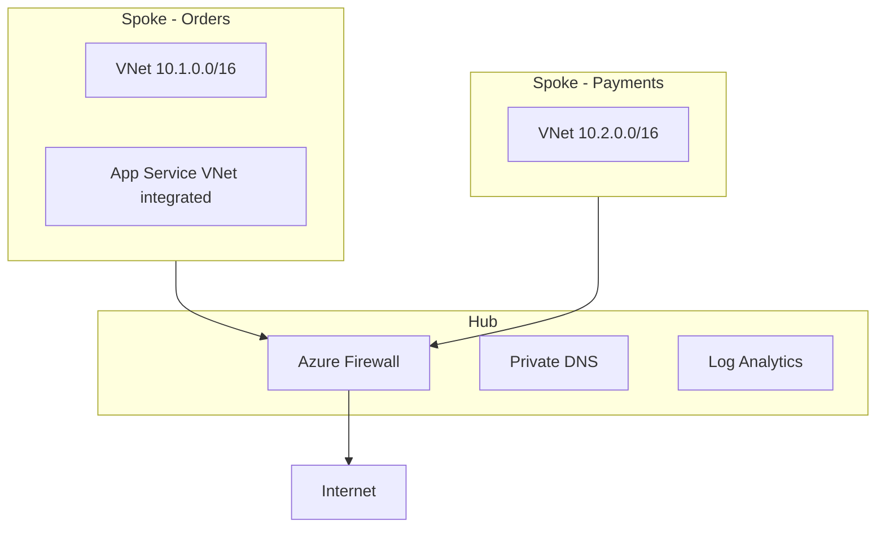

# Azure Networking Architecture

## Core Components
- **VNet** — isolated network (10.0.0.0/16 etc.)
- **Subnet** — segment within VNet
- **NSG** — network security rules (5-tuple)
- **Route Table** — custom routing (UDR)
- **Private Endpoint** — private IP for PaaS services

## Hub-Spoke Topology
```
        Hub VNet (shared)
       /    |    \
   Spoke1 Spoke2 Spoke3
   (App1) (App2) (App3)
```
- Hub: VPN Gateway, Firewall, DNS
- Spokes: workloads, peered to hub
- Azure Firewall for egress control

## Application Gateway vs Front Door
| Feature | App Gateway | Front Door |
|---------|-------------|------------|
| Scope | Regional | Global |
| WAF | Yes | Yes |
| SSL termination | Yes | Yes |
| Use | Regional apps | Global apps |

## Private Link
- Access PaaS over private IP
- No public internet exposure
- DNS integration required

## Architect Deep Dive: Hub-Spoke Networking

### Reference topology


### When to use Private Link
SQL, Storage, Key Vault, Service Bus — eliminate public endpoints. App Service routes via VNet integration to private endpoint NICs.

### NSG rules mindset
Default deny inbound; allow only required paths. Document east-west rules between spokes — avoid "allow all VNet" shortcuts.

