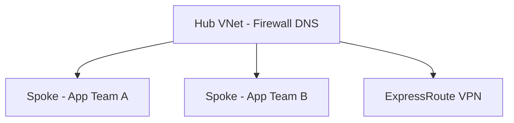

# Azure Networking — Intermediate

> **Week 13** | **Level:** Intermediate

## Hub-Spoke Topology

## Private Link vs Service Endpoints

| Feature | Service Endpoint | Private Endpoint |
|---------|------------------|------------------|
| Traffic | Stays on Azure backbone | Private IP in your VNet |
| DNS | Public endpoint | Private DNS zone required |
| Exfiltration protection | Partial | Stronger |

**Architect default:** Private Link for SQL, Storage, Key Vault in production.

## Architect Deep Dive: Ingress & Egress

### Front Door vs Application Gateway
| | Front Door | App Gateway |
|---|------------|-------------|
| Scope | Global, multi-region | Regional |
| WAF | Global WAF | Regional WAF |
| Use | Public SaaS, global users | Single-region VNet ingress |

### Egress control
Force outbound via Azure Firewall in hub — required for URL filtering and logging in regulated industries. App Service regional VNet integration sends outbound through spoke UDR to firewall.

**Next:** [03-advanced.md](03-advanced.md)
