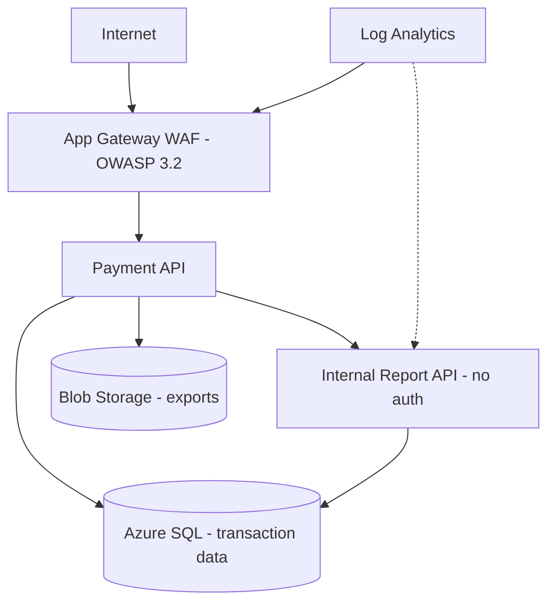
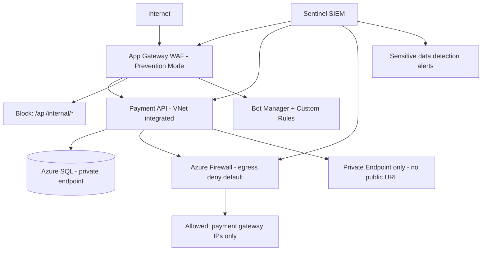

# Case Study: WAF Bypass and Data Exfiltration Response

| Attribute | Value |
|-----------|-------|
| **Industry** | FinTech / Payments |
| **Scale** | 2M active users, $4B annual transaction volume |
| **Week** | 14 |
| **Difficulty** | Expert |

## Business Context

A payment processing platform detected anomalous outbound traffic at 3:14 AM: 2.3GB of customer transaction records transferred to an unknown IP in Eastern Europe over 47 minutes. Initial investigation revealed the attacker bypassed Azure Application Gateway WAF using encoded SQL injection payloads and exfiltrated data through an unmonitored API endpoint intended for internal reporting.

PCI-DSS forensic investigation is mandatory. The card brands have been notified. The platform must demonstrate containment, root cause remediation, and controls to prevent recurrence within 30 days or face processing suspension.

You are the security architect leading the technical response alongside the incident response team.

## Current State



**Current implementation issues (from forensic analysis):**
- WAF in **Detection** mode (not Prevention) — attacks logged but not blocked
- SQL injection via double URL-encoded payload: `%2527%20OR%201=1--` bypassed OWASP ruleset
- Internal Report API (`/api/internal/export`) has **no authentication** — "internal only" via network trust
- Report API not behind WAF — accessible via App Service default URL (`.azurewebsites.net`)
- No egress filtering — compromised API freely outbound to any IP
- DLP: none — no inspection of outbound response payloads
- WAF logs retained 30 days — attacker reconnaissance from 3 weeks ago may be lost

## Requirements

### Functional
- Contain active exfiltration immediately
- Identify full scope of compromised data (which records, which customers)
- Restore secure payment processing within SLA
- Remediate vulnerabilities without 24-hour platform outage

### Non-Functional
| NFR | Target |
|-----|--------|
| Containment | < 2 hours from detection |
| Forensic evidence preservation | Chain of custody maintained |
| WAF effectiveness | Block 99.9% OWASP Top 10 after remediation |
| PCI-DSS remediation report | 30 days |
| Platform availability post-containment | 99.95% |
| Egress control | Deny-by-default outbound |

## Constraints

- PCI-DSS QSA (Qualified Security Assessor) engaged — all changes documented
- Cannot take full platform offline — $12M/day transaction volume
- Card brand deadline: 30 days for remediation evidence
- Team: 3 security engineers, 6 backend engineers, external IR firm
- Legal hold on all logs and affected systems
- Regulatory notification to 2M users may be required depending on scope

## Your Task

1. Define immediate containment actions (first 2 hours)
2. Explain how the WAF bypass worked and how to fix it
3. Design egress controls to prevent future data exfiltration
4. Propose the WAF rule hardening and mode change strategy
5. Define the internal API security remediation and network segmentation plan

> **Attempt your solution before reading the reference below.**

---

## Reference Solution

### Top 3 Issues

1. **WAF in Detection mode** — attacks visible but never blocked; false sense of security
2. **Unauthenticated internal API exposed to internet** — network trust model failed
3. **No egress filtering** — compromised service exfiltrated 2.3GB unchecked

### Containment & Remediation Architecture



### Key Decisions

| Decision | Choice | Rationale |
|----------|--------|-----------|
| WAF mode | Switch to Prevention immediately | Stop active attacks; accept false positive risk with tuning |
| Encoding bypass | Custom rule: normalize double URL-decode before inspection | Blocks `%2527` → `%27` → `'` attack chain |
| Internal API | Remove public access; require Entra ID + managed identity auth | Eliminates unauthenticated export |
| Network | Disable App Service public access; Application Gateway only entry | Closes `.azurewebsites.net` bypass |
| Egress | Azure Firewall deny-default; allowlist payment gateway + Azure services | Prevents exfiltration to unknown IPs |
| DLP | Sentinel analytics rule: response > 10MB with PII patterns → auto-block | Detect bulk data export |
| Forensics | Snapshot affected VMs/containers; preserve WAF + App Service logs to immutable storage | PCI chain of custody |

### WAF Hardening

```
1. OWASP 3.2 → 3.2 with CRS 3.3.2 (latest managed rules)
2. Custom rule: RequestUri decode twice → match SQLi patterns
3. Custom rule: Block /api/internal/* at WAF (defense in depth)
4. Rate limiting: 100 req/min per IP on API endpoints
5. Geo-filter: block traffic from non-operating countries (except CDN)
6. Bot Manager: challenge suspicious user agents
```

### Incident Timeline

| Time | Action |
|------|--------|
| T+0 | Disable Report API; block attacker IP at Firewall |
| T+30min | Switch WAF to Prevention; enable egress deny-default |
| T+1h | Disable App Service public access |
| T+2h | Forensic snapshot; scope assessment begins |
| T+24h | WAF custom rules deployed; internal API behind Entra auth |
| T+7d | Full egress allowlist; Sentinel DLP rules active |
| T+30d | PCI remediation report submitted |

### Expected Outcome

- Exfiltration contained: < 2 hours
- Attack vector closed: internal API + WAF bypass + egress
- Scope: 47K transaction records confirmed (not full 2M user base)
- Recurrence prevention: Prevention mode + egress deny-default + auth on all APIs

## Discussion Questions

1. How do you tune WAF Prevention mode to avoid blocking legitimate payment traffic?
2. Should internal APIs ever exist, or should all APIs require authentication regardless of network position?
3. How does zero-trust networking change the response to this incident?

## Interview Story Angle

**STAR prompt:** "Tell me about a security breach you helped contain and remediate."

Use this case study: emphasize layered defense failure analysis (WAF detection-only, no egress control, trust-based internal API), rapid containment, and PCI-driven remediation discipline.
