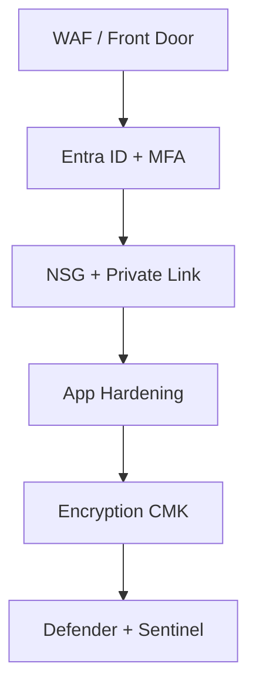
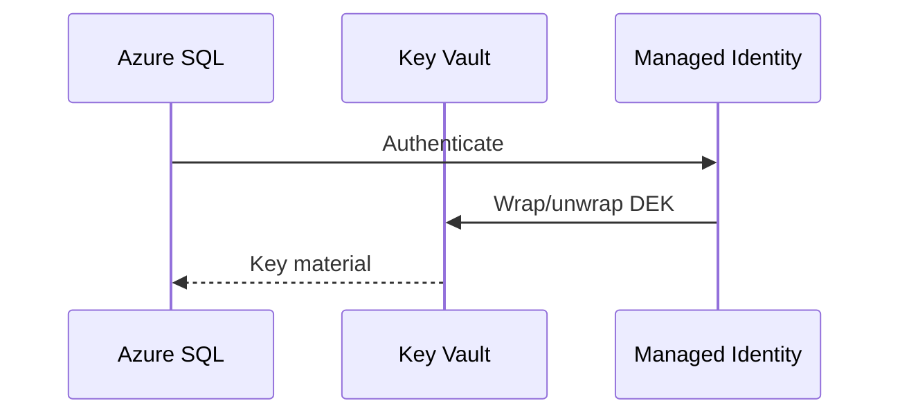
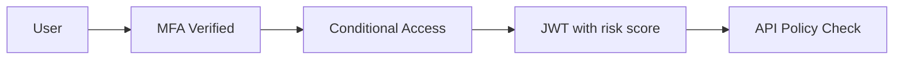
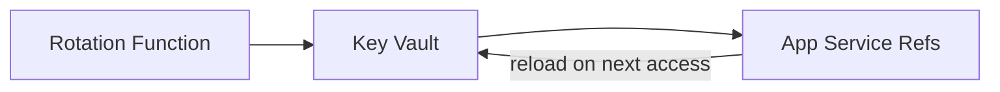
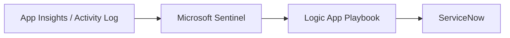

# Week 14 — Azure Security Architecture Diagrams

## 1. Defense in Depth

## 2. Key Vault — CMK for SQL

## 3. Zero Trust Request Flow

## 4. Secret Rotation

## 5. Threat Detection Pipeline

## Practice Exercise

Map OWASP API Top 10 controls to Azure services for a public .NET API.

---

[← Back to Week 14](../README.md)
