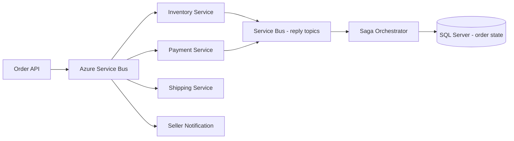
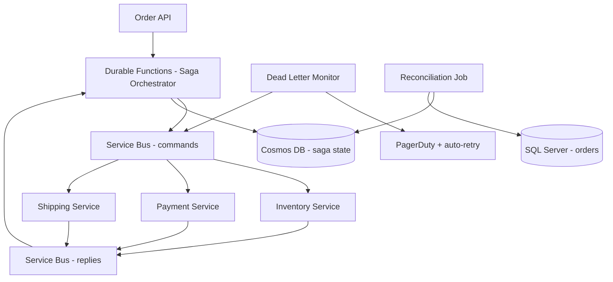

# Case Study: Order Saga Compensation Failure Across Service Bus

| Attribute | Value |
|-----------|-------|
| **Industry** | E-commerce / Marketplace |
| **Scale** | 25K orders/hour peak, 8 saga steps, 4 external services |
| **Week** | 15 |
| **Difficulty** | Advanced |

## Business Context

A marketplace platform processes orders through a choreographed saga across inventory, payment, shipping, and seller notification services. During a payment gateway outage last Tuesday, 1,847 orders entered a partially completed state: inventory reserved, payment failed, but compensation (inventory release) did not execute for 312 orders.

Sellers shipped 89 orders that were never paid. Customer support logged 1,200 tickets. Finance discovered $340K in unreconciled inventory holds blocking Q3 close. The platform team had assumed Azure Service Bus dead-letter queues would catch failures — they did not.

You are the architect asked to redesign saga reliability and compensation guarantees.

## Current State



**Current implementation issues (from post-mortem):**
- Saga orchestrator uses **choreography** (no central coordinator) — compensation logic scattered across 4 services
- Payment failure publishes `PaymentFailed` event — Inventory service subscription had a **bug** ignoring events when `correlationId` format changed
- No saga timeout — orders stuck in `PaymentPending` indefinitely
- Dead-letter queue monitored manually — 312 messages sat undetected for 6 days
- No idempotency keys — retry of payment caused 23 double charges before manual fix
- Order state in SQL Server updated asynchronously — orchestrator state diverged from service state
- Service Bus sessions not used — message ordering not guaranteed for same order

## Requirements

### Functional
- Order saga: reserve inventory → charge payment → create shipment → notify seller → confirm order
- On any step failure: compensate all completed steps in reverse order
- Support payment gateway timeout (30-second SLA) with automatic retry
- Provide order status query showing current saga step and history

### Non-Functional
| NFR | Target |
|-----|--------|
| Availability | 99.95% |
| Saga completion | 99.9% within 60 seconds |
| Compensation execution | 100% within 5 minutes of failure detection |
| Duplicate order prevention | Zero double charges |
| Message durability | Zero message loss |
| RTO | 30 minutes |
| RPO | 0 for order state |

## Constraints

- Must use Azure Service Bus (existing Standard tier, 4 topics, 12 subscriptions)
- Cannot replace payment gateway (Stripe) — 30-second timeout is fixed
- Team: 8 .NET microservice developers
- 6-week fix timeline before holiday peak (40K orders/hour)
- Budget: moderate — can add Azure Functions, Durable Functions, or Cosmos DB
- Existing choreography must be migrated incrementally (no big-bang rewrite)

## Your Task

1. Diagnose why compensation failed for 312 orders
2. Design a reliable saga pattern (orchestration vs improved choreography)
3. Define idempotency and message ordering strategy on Service Bus
4. Specify saga timeout, dead-letter monitoring, and alerting
5. Propose reconciliation tooling for the 312 stuck orders and future prevention

> **Attempt your solution before reading the reference below.**

---

## Reference Solution

### Top 3 Issues

1. **Scattered compensation logic** — choreography without a coordinator means no guaranteed compensating transaction
2. **Silent message loss** — correlation ID format change broke subscription filter; DLQ unmonitored for 6 days
3. **No idempotency** — retries caused double charges; no deduplication across saga steps

### Revised Saga Architecture



### Key Decisions

| Decision | Choice | Rationale |
|----------|--------|-----------|
| Saga pattern | Orchestration via Durable Functions | Central compensation logic; guaranteed reverse execution |
| State store | Cosmos DB saga instance per order | Single source of truth; queryable status |
| Idempotency | `Idempotency-Key` header + Cosmos dedup table | Prevent double charges on retry |
| Message ordering | Service Bus sessions keyed by `orderId` | Ordered processing per order |
| Timeout | 90-second saga timeout with auto-compensate | No indefinite `PaymentPending` |
| DLQ monitoring | Azure Function triggered on DLQ → PagerDuty + auto-retry once | 312 orders would have alerted in minutes |
| Reconciliation | Hourly job: compare Cosmos saga state vs SQL order state | Catch divergence before finance impact |

### Compensation Flow

```
Payment fails at T+30s:
1. Orchestrator receives PaymentFailed reply
2. Read saga state: [InventoryReserved ✓, PaymentCharged ✗]
3. Execute compensation: ReleaseInventory(orderId) — idempotent
4. Update saga state: Compensated
5. Update SQL order status: Cancelled
6. Publish OrderCancelled event for analytics
```

### Stuck Order Remediation

```
For each of 312 orders:
1. Query Cosmos saga state + SQL order state
2. If inventory reserved + payment not charged → ReleaseInventory
3. If shipped without payment → escalate to manual (89 orders)
4. Update reconciliation report for finance
```

### Expected Outcome

- Compensation reliability: 0% (312 failures) → 100% within 5 minutes
- Double charges: 23 incidents → 0 (idempotency keys)
- DLQ detection: 6 days → < 5 minutes (automated alert)
- Cost: +$400/month Durable Functions + $200/month Cosmos (saga state)

## Discussion Questions

1. When is choreography acceptable vs when must you use orchestration?
2. How do you test saga compensation paths without affecting production payment?
3. Should saga state live in Cosmos DB or SQL Server for this scale?

## Interview Story Angle

**STAR prompt:** "Tell me about a distributed systems failure you diagnosed and fixed."

Use this case study: emphasize saga compensation guarantees, the $340K finance impact of silent message loss, and moving from hope-based DLQ monitoring to orchestrated reliability.
