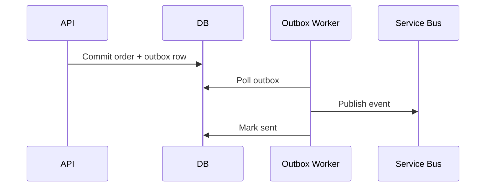
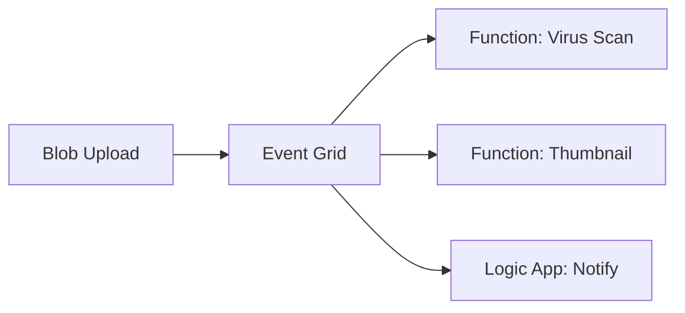
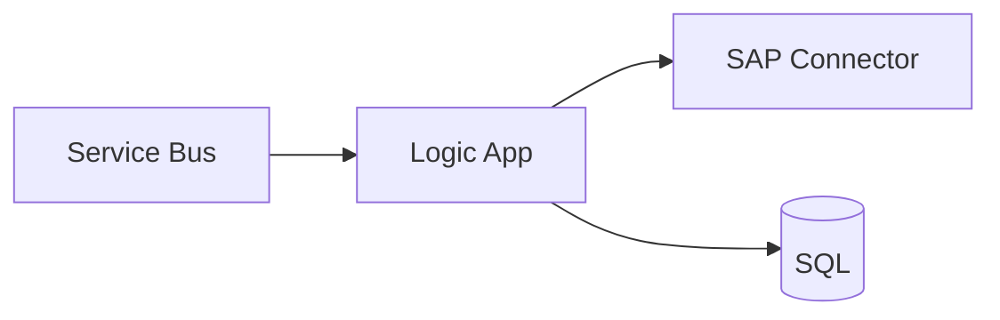
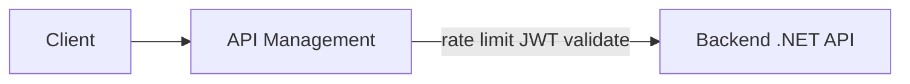
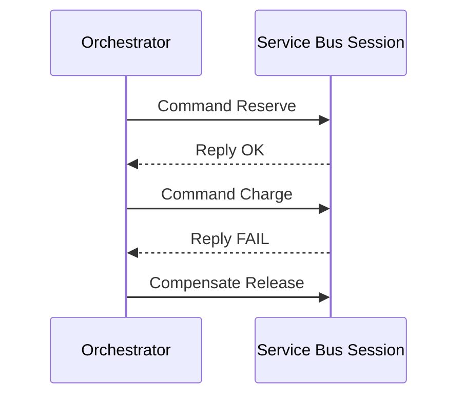

# Week 15 — Azure Integration Patterns Diagrams

## 1. Async Messaging — Outbox

## 2. Event Grid Fan-Out

## 3. Logic Apps — Enterprise Integration

## 4. API Management Gateway

## 5. Saga via Service Bus Sessions

## Practice Exercise

Choose Event Grid vs Service Bus for order-created notifications to 5 downstream systems.

---

[← Back to Week 15](../README.md)
